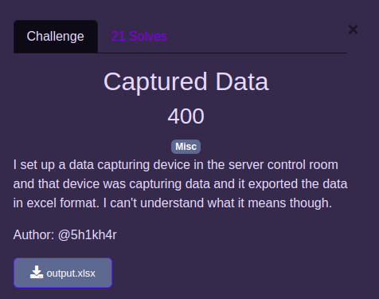
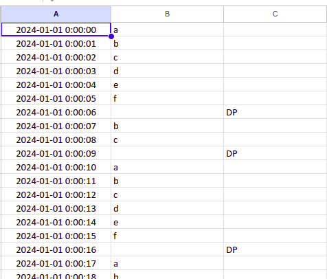
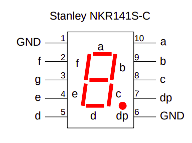

---
tags:
  - OSCTF
  - OSCTF-2024
  - Misc
---

# چالش Captured Data
---

<center>

</center>

فایل اکسل ضمیمه چلنج رو که باز می‌کنیم، می‌بینیم که در ستون اول یکسری زمان متوالی، در ستون دوم حروف a, b, c, d, e, f در گروه‌های دوتایی و شش‌تایی و در ستون سوم در برخی از سطر‌ها DP نوشته شده. در نگاه اول شاید چیز آشنایی به چشم نیاد. 

<center>

</center>

با سرچ کردن abcdef DP در گوگل میفهمیم که این‌ها در واقع pinout های یک مدار 7segment هستند که همون مدار نمایش ارقام دهدهی دیجیتال هستند و در واقع با توجه به اینکه هر pin مسئول روشن‌کردن کدام بخش هست میفهمیم که توالی abcdef عدد 0 و توالی bc عدد ۱ و DP یک نقطه را نشان می‌دهد.

<center>

</center>

یک اسکریپت پایتون می‌نویسیم که این اکسل را به یکسری  صفر و یک متوالی تبدیل کند. سپس با بررسی ۸ بیت اول و ۸ بیت دوم مشاهده می‌کنیم که در واقع هر ۸ بیت کد اسکی یک حرف از فلگ را نشان می‌دهد. بنابراین بعد از تجزیه ۸ بیتی و تبدیل به حروف اسکی، به فلگ نهایی می‌رسیم.

```python
import pandas as pd

df = pd.read_excel('output.xlsx', header=None)

result = []

for i in range(len(df)):
    if df.iloc[i, 2] == 'DP':
        if df.iloc[i-3, 2] == 'DP':
            start = max(0, i - 2)
        else:
            start = max(0, i - 6)
        sequence = ''.join(df.iloc[start:i, 1].dropna().tolist())
        print(sequence)
        
        if sequence == 'abcdef':
            result.append('0')
        elif sequence == 'bc':
            result.append('1')

binary_string = ''.join(result)
ascii_text = ''.join(chr(int(binary_string[i:i+8], 2)) for i in range(0, len(binary_string), 8))

print("Flag:", ascii_text)
```

فلگ زیر پس از اجرای کد به نمایش در می‌آید.

---
??? success "FLAG :triangular_flag_on_post:"
    <div dir="ltr">`OSCTF{1nf0_d1spl4c3d}`</div>


!!! نویسنده
    [Sadegh](https://github.com/sadegh-majidi)

