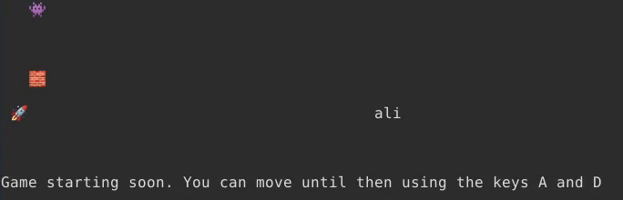
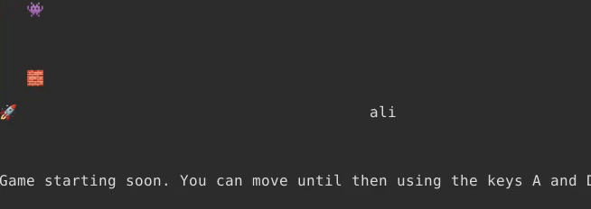

---
tags:
  - TFCCTF
  - The Few Chosen CTF
  - The Few Chosen CTF 2024
  - Misc
---


   [این چالش](bad-invaders-files/bad_invaders.zip) یه گیم کامندلاینی هستش که برای گرفتن فلگ باید توش برنده شیم

* دسترسی سورس کد اینا بهمون داده شده
	* کلاینت پلیر
	* ربات بازی
	* بازی و سرور
	* فایل داکر که برای ران کردن سرور استفاده شده

موشکه ماییم و باید به ربات شلیک کنیم که فلگو بگیریم

مشکل اینجاست که 10 ثانیه اول بازی کسی نمیتونه شلیک کنه و بات توی این تایم میره پشت سنگر و دیگه تکون نمیخوره




خب چیکار کنیم؟

بریم در مورد بازی بیشتر بفهمیم

##فرمت پیام های کلاینت به سرور
اوقتی کد بازی و کلاینت پلیر رو میخونیم میبینیم که برای هر عملی که انجام میدیم پیامی به این فرمت به سمت سرور فرستاده میشه

```python
f"{PLAYER_ID}|{action}|{option_for_action};"
```

و ربات بازی هم با همین روش با بازی ارتباط برقرار میکنه

##تولید شماره پلیر

بیشتر که داخل کد بازی میگردیم تابع تولید شماره پلیر رو پیدا میکنیم

```go
player id generation:
this is happening at server side in the GenerateId() function:
func GenerateId() int {
	return rand.Intn(100)
}
```

این نشون میده که رنج شماره پلیر بین 0 تا 100 هست و همچین رنج کوچیکی حدس زدن شماره بقیه پلیرا رو برامون راحت میکنه

##ارتباط گیری کلاینت و سرور

این چک شدن فرمت پیام کلاینت و چک کردن شماره پلیر داخل این تابع اتفاق میوفته
handleConnection()

این تابع 4 مرحله اصلی داره

**1.خوندن از کانکشن تا وقتی به کاراکتر ; برسیم**

```go
for {
	tempN, err := conn.Read(tempBuffer)
	if tempN == 0 || err != nil {
		return
	}
	if tempBuffer[0] == ';' {
		break
	}
	buffer = append(buffer, tempBuffer[0])
	n += 1
}
```

**2.چک کردن وجود کلاینت در لیست پلیر ها بر اساس ایپی و پورت کلاینت**
```go
playerExists := false
for _, player := range g.Players {
	if player.Conn == conn {
		playerExists = true
		break
	}
}
```

**3.صدا زدن تابع مربوط که عمل خوسته شده توسط کلاینت(اگه کلاینت جزو پلیر ها نباشه فقط عمل رجیستر کار میکنه)**

**4.اجرای دوباره 1**


##حل

با توجه به اینکه عمل از کلاینت پذیرفته میشه اگه کلاینت جزو پلیر ها باشه منطقیه که سعی کنیم شماره پلیر بات رو حدس بزنیم و بزاریم داخل پیامای خودمون که سرور فکر کنه بات میخواد کاری کنه

میتونیم این تیکه کد رو بزاریم داخل کلاینت پلیر که تمام ایدی های 0 تا 100 رو تست کنه و سعی کنه به جاشون حرکت کنه

```python3
for i in range (101):
	socket.send(f"{i}|M|0;".encode())
	print(f"sent with player id: {i}")
```

 این باعث میشه دوتا از اون ایدی ها رو سرور قبول کنه و حرکتشون بده که اون دو تا ما و بات هستیم



---
??? success "FLAG :triangular_flag_on_post:"
    <div dir="ltr">`TFCCTF{this_might_have_a_race_condition}`</div>


!!! نویسنده
    [Ali](https://github.com/AliGhaffarian)