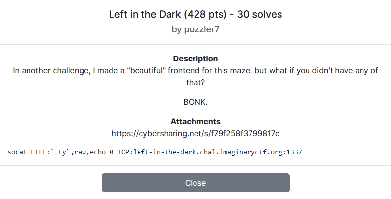

---
tags:
  - ImaginaryCTF
  - ImaginaryCTF 2024
  - Misc
  - algorithm
  - Depth-first search
  - DFS
  - graph
---

# چالش Left in the Dark [:material-cloud-download-outline:](https://github.com/ImaginaryCTF/ImaginaryCTF-2024-Challenges-Public/blob/main/Misc/left_in_the_dark/challenge/maze.py)


<center>
 
</center>

## آشنایی با مساله

تو این سوال به ما فایل `maze.py` داده شده است. بیایید نگاهی بیاندازیم به محتویاتش:


<details>
<summary>مشاهده کد</summary>

```python title="maze.py" linenums="1"
#!/usr/bin/env python3

from random import choice
from copy import deepcopy
# https://pypi.org/project/console/
from console.utils import wait_key

class Maze:
    def __init__(self, dim, size):
        self.dim = dim
        self.size = size
        self.maze = '#'
        self.loc = tuple([0]*dim)
        for i in range(dim):
            self.maze = [deepcopy(self.maze) for _ in range(size)]
        self.gen()

    def __str__(self):
        if type(self.maze[0]) == str:
            return ''.join(self.maze)+'\n'
        ret = ''
        for i in self.maze:
            temp = deepcopy(self)
            temp.dim -= 1
            temp.maze = i
            ret += str(temp)
        ret += "\n"
        return ret

    @staticmethod
    def fromstr(s):
        dim = 0
        for i in s[-max(len(s), 50):][::-1]:
            if i == '\n':
                dim += 1
            else:
                break
        size = 0
        for i in s[:max(len(s), 50):]:
            if i == '\n':
                break
            size += 1

        ret = Maze(2, 2)
        ret.maze = Maze.fromstrhelp(s, dim, size)
        ret.dim = dim
        ret.size = size
        ret.loc = tuple([0]*dim)
        return ret

    @staticmethod
    def fromstrhelp(s, dim, size):
        s = s.strip()
        if dim == 1:
            return list(s)
        return [Maze.fromstrhelp(i+'\n'*(dim-1), dim-1, size) for i in s.split('\n'*(dim-1))]


    def get(self, *pt):
        ret = self.maze
        for idx in pt:
            ret = ret[idx]
        return ret

    def set(self, *pt, **kwargs):
        temp = self.maze
        for idx in pt[:-1]:
            temp = temp[idx]
        temp[pt[-1]] = kwargs['val']

    def check(self, *pt):
        for i in pt:
            if i >=self.size or i < 0:
                return False
        return True

    def adj(self, *pt):
        ret = set()
        for i in range(len(pt)):
            newpt = [i for i in pt]
            newpt[i] += 1
            if self.check(*newpt):
                ret = ret | {tuple(newpt)}
            newpt[i] -= 2
            if self.check(*newpt):
                ret = ret | {tuple(newpt)}
        return ret

    def neighbors(self, *pt, typ=None):
        ret = set()
        for pt in self.adj(*pt):
            if typ is None or self.get(*pt) in typ:
                ret = ret | {pt}
        return ret

    def gen(self):
        self.set(*self.loc, val=' ')
        walls = self.adj(*self.loc)

        while len(walls) > 0:
            rand = choice(list(walls))
            nbhd = self.neighbors(*rand, typ=' ')
            if len(nbhd) == 1:
                self.set(*rand, val=' ')
                walls = walls | self.neighbors(*rand, typ='#')
            walls = walls - {rand}

        self.set(*([0]*self.dim), val='@')
        for i in self.neighbors(*([0]*self.dim)):
            self.set(*i, val=' ')

        self.set(*([self.size-1]*self.dim), val='F')
        for i in self.neighbors(*([self.size-1]*self.dim)):
            self.set(*i, val=' ')

    def move(self, mv):
        newLoc = (self.loc[0] + mv[0], self.loc[1] + mv[1])
        if (
            newLoc[0] < 0 or newLoc[0] >= self.size or
            newLoc[1] < 0 or newLoc[1] >= self.size or
            self.get(*newLoc) == '#'
        ):
            print("BONK")
            return
        if self.get(*newLoc) == 'F':
            print(open("flag.txt").read())
            wait_key()
            exit(0)
        self.set(*self.loc, val=' ')
        self.set(*newLoc, val='@')
        self.loc = newLoc

def getKey():
    key = wait_key()
    if key == chr(3): # Ctrl-C
        exit(1)
    return key

moveDict = {
    'w': (-1, 0),
    's': (1, 0),
    'd': (0, 1),
    'a': (0, -1),
}

def waitForMove():
    key = None
    while key not in moveDict:
        key = getKey()

    return moveDict[key]
    

def main():
    maze = Maze(2, 40)
    print("Find the flag in this maze. Good luck!")
    print("WASD to move.")
    while True:
        # print(maze)
        move = waitForMove()
        maze.move(move)

if __name__ == '__main__':
    main()
```

</details>

خط `159` رو از کامنت در میاریم و برنامه رو اجرا میکنیم و میبینیم با یک بازی 
[هزارتو](https://fa.wikipedia.org/wiki/%D8%A8%D8%A7%D8%BA_%D9%87%D8%B2%D8%A7%D8%B1%D8%AA%D9%88)
 مواجه هستیم، با این تفاوت که در سمت سرور به ما صفحه هزارتو نمایش داده نمیشود و باید کورکورانه جابجا شویم و تنها درصورتیکه به دیوار برخورد کنیم پیام `BONK` نمایش داده میشود.

در ابتدا بازی ما در مختصات `(0, 0)` هستیم و میتوانیم با دکمه های `w`, `s`, `a`, `d` در صفحه جابجا شویم و برای بدست آوردن فلگ باید به مختصات `(40, 40)` برسیم تا فلگ برای ما نمایش داده شود.


## راه حل

برای حل این مساله میتوانیم از الگوریتم DFS استفاده کنیم تا به مختصات فلگ برسیم. برای آشنایی بیشتر با الگوریتم جستجوی عمق اول(DFS) میتوانید 
[این لینک](https://fa.wikipedia.org/wiki/%D8%A7%D9%84%DA%AF%D9%88%D8%B1%DB%8C%D8%AA%D9%85_%D8%AC%D8%B3%D8%AA%D8%AC%D9%88%DB%8C_%D8%B9%D9%85%D9%82_%D8%A7%D9%88%D9%84)
را مطالعه کنید.

کد حل مساله در ادامه پیوست شده‌است:

```py
from pwn import *
import numpy as np

context.log_level = "critical"

moveDict = {
    'w': (-1, 0),
    's': (1, 0),
    'd': (0, 1),
    'a': (0, -1),
}
reverse = {'w':'s', 's':'w','a':'d', 'd':'a'}

def show(x, y):
    for i in range(42):
        for j in range(42):
            if i==x and j == y:
                print('@', end='')
            else:
                print(maze[i, j] if maze[i, j] else '*' ,end='')
        print()

def rec(x, y, move):
    show(x, y)
    p.send(move.encode())
    if (res:=p.clean(0.5)):
        if x==40 and y==40:
            print(res)
            exit(0)
        maze[x, y] = '#'
        return
    maze[x, y] = ' '
    for mv, (a, b) in moveDict.items():
        if not maze[x+a, y+b] :
            rec(x+a, y+b, mv)
    p.send(reverse[move].encode())

maze = np.zeros([42, 42], dtype = str) 
maze[0] = maze[-1] = maze[:,0] = maze[:,-1] = '#'

p = remote(*'left-in-the-dark.chal.imaginaryctf.org 1337'.split())
p.clean(2)

x, y = 1, 1
maze[x, y] = ' '
for mv, (a, b) in moveDict.items():
    if not maze[x+a, y+b] :
        rec(x+a, y+b, mv)
```


---
??? success "FLAG :triangular_flag_on_post:"
    <div dir="ltr">`ictf{glad_you_f0und_the_right_way_to_the_exit}`</div>


!!! نویسنده
    [mheidari98](https://github.com/mheidari98)


