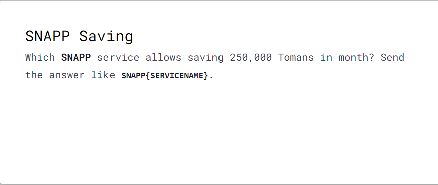
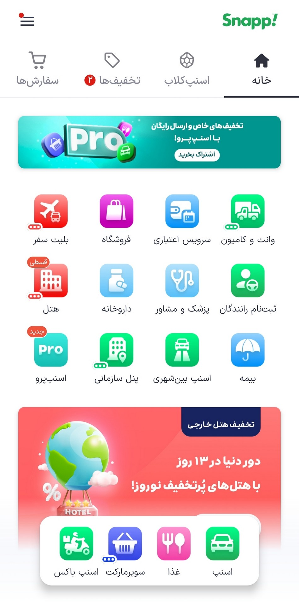
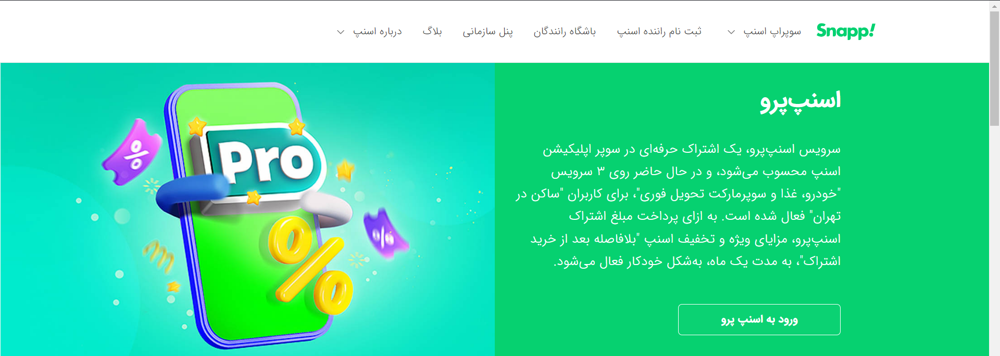
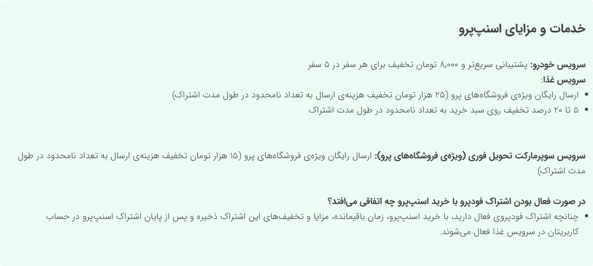
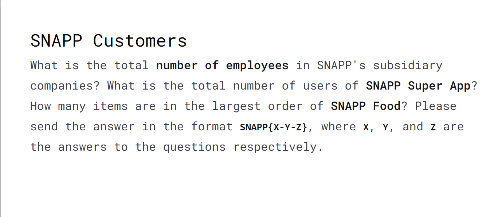
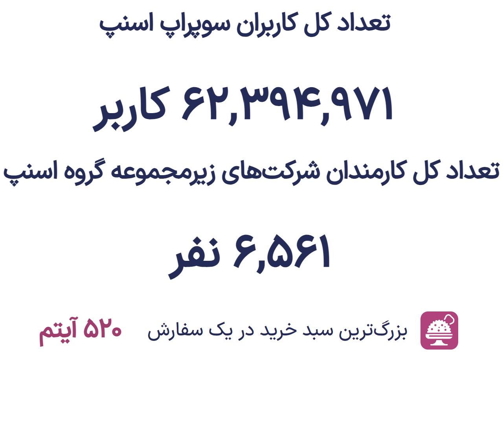
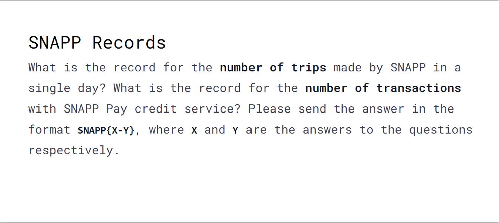
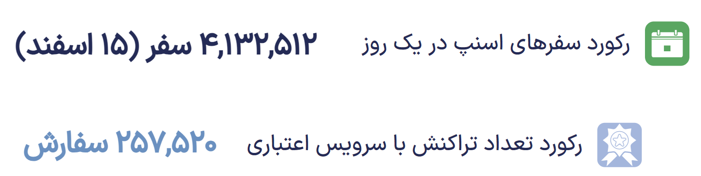
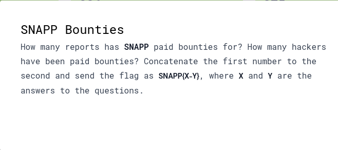

---
tags:
  - SnappCTF
  - SnappCTF-2024
  - OSINT  
---

# چالش‌های Osint

##  چالش SNAPP Saving

این چالش یکی از چالش‌های موجود در دسته **OSINT** در مسابقه **SNAPP CTF 2024** و با سطح دشواری ساده بود. هدف از این چالش پیدا کردن یکی از سرویس‌های ارائه شده توسط اسنپ هست که کاربران با استفاده از اون می‌تونند تا 250 هزار تومان رو در ماه ذخیره کنند. 

!!! info
    برای حل این چالش از اپلیکیشن اندروید اسنپ استفاده شده است.

دلیل استفاده از اپلیکیشن اندروید اسنپ این هست که تمام سرویس‌های ارائه شده توسط اسنپ به صورت دسته بندی شده در این اپلیکیشن به همراه توضیحات مربوط به هر سرویس وجود دارند و این موضوع پیدا کردن سرویس مورد نظر رو ساده تر میکنه.
 ابتدا به  ترتیب سرویس‌های مختلف  که بیشترین ارتباط رو با توضیحات چالش دارند بررسی می‌کنیم. معیار ما این هست که هر سرویسی که به کاربر تخفیف ارائه میده یا امکان پرداخت اعتباری رو برای کاربر فراهم میکنه میتونه جواب ما باشه چون تمام این سرویس‌ها به کاربر اجازه میدن که مبلغی رو در ماه ذخیره کنند.
 
 1- سرویس پرداخت اعتباری اسنپ (به دلیل امکان پرداخت مبلغ سفر در پایان ماه تا سقف 200 هزار تومان)
 2- سرویس اسنپ کلاب (به دلیل ارائه کد‌های تخفیف)
3- سرویس رزرو هتل  و بلیت اسنپ (به دلیل کد‌های تخفیف 25 هزار تومانی که به توضیحات چالش شباهت دارد)

> **نتیجه بررسی این سرویس ها این بود که هیچ کدام پاسخ چالش نبودند**.
> 
درا ین مرحله یک سوال به وجود اومد و اون هم این بود که اگر اسامی اصلی سرویس‌ها اون چیزی که حدس میزنیم نباشند چی؟ برای همین و برای ایجاد اطمینان علاوه بر اسم سرویس‌‌های مربوطه که ممکن هست جواب باشند، درخواست‌های ارسال شده از سمت اون‌ها رو با استفاده از ابزار **BurpSuite**  شنود کردیم تا نام دقیق سرویس ها رو از روی API های مربوطه تشخیص بدیم. اما متاسفانه در نهایت این کار هم نتیجه‌ای نداشت. 

بعد از این مرحله متوجه شدم که نسخه اپلیکیشن اسنپ که در حال استفاده از اون بودم منطبق با آخرین به ‌روز رسانی نیست. از اینجا حدسی که به وجود اومد این بود که شاید در آپدیت‌های اخیر، سرویس جدیدی به برنامه اضافه شده که در نسخه‌ فعلی وجود نداره و بنابراین برنامه به آخرین نسخه به روز رسانی شد.

همونطور که  در تصویر مشخص هست، بعد از به روز رسانی اپلیکیشن اندروید اسنپ یک سرویس جدید با نام **اسنپ پرو** به برنامه اضافه شده و با تگ **جدید** مشخص شده. 
برای اطلاع از مشخصات این سرویس جدید با سرچ  اسم اون در گوگل به صفحه مربوط به این سرویس در سایت اسنپ با این   [آدرس](https://snapp.ir/pro/) میرسیم.

همونطور که در تصویر دیده می‌شه، در بخش ابتدایی این صفحه توضیحاتی در رابطه با سرویس اسنپ پرو داده شده. به عبارات **اشتراک**  و **تخفیف** در متن ارائه شده دقت کنید. از این دو عبارت این نکته برداشت میشه  که کاربران با استفاده از این سرویس قادر هستند مبلغی رو در ماه ذخیره کنند. برای آشنایی بیشتر با این سرویس مقداری به پایین صفحه اسکرول می‌کنیم و در بخش میانی سایت توضیحات جالی رو در رابطه با سرویس اسنپ پرو مشاهده میکنیم. 

همونطور که در تصویر مشخص هست، در بخشی از توضیحات ارائه شده گفته شده که  با فعال سازی این سرویس امکان استفاده از **25 هزار تومان تخفیف** برای هر ارسال در طول مدت اشتراک وجود دارد. عبارت 25 هزار تومان آشنا نیست؟ در توضیحات چالش گفته شده بود که سرویس مورد نظر امکان ذخیره مبلغ **250 هزار تومان** رو در اختیار کاربران قرار میده. این دو مقدار به هم شبیه هستند و حدسی که اینجا به وجود میاد این هست که شاید در توضیحات چالش قصد طراح این بوده که مبلغ رو یه صورت **ریال** بنویسه و نه تومان و در واقع ما دنبال مبلغ **25 هزار تومان** میگردیم. علاوه بر اون با توجه به اینکه این سرویس به تازگی به اسنپ اضافه شده ممکن هست که این چالش یک جنبه تبلیغاتی برای معرفی این سرویس هم داشته باشه پس حدس بر این هست که نام این سرویس ممکنه جواب چالش باشه. 

**و دقیقا درست حدس زدیم!**  عبارت SNAPPPRO همون فلگ هست. 

??? success "FLAG :triangular_flag_on_post:"
    
`SNAPP{SNAPPPRO}`

---   

!!! info
        نکته‌ای که در رایتاپ به اون اشاره شد و در آخر درست بود این هست که گویا هدف طراح  در توضیحات چالش نوشتن عبارت  25 هزار تومان بوده که به اشتباه 250 هزار تومان عنوان شده.
    
	
!!! نویسنده
    [EnZ404](https://x.com/OnlyEnZ404?s=09)
    $~~~~~~~~~~~~~~~~~~~~~~~~~~~~~~~~~~~~~~~~~~~~~~~~~~~~~~~~~~~~~~~~~~~~~~~~~~~~~~~~~~~~~~~~~~~~~~~~~~~~~~~~~~~~~~~~~~~~~~~~~~~$تاریخ نگارش ۱۴۰۲/۱۲/۰۵	
	
---

## چالش SNAPP Customer

برای این چالش ما  با یک جستجو در اینترنت به  [لینک](https://snapp.ir/1401-annual-report) گزارش عملکرد  سال 1401 اسنپ رسیدیم که مجموعه ای از اطلاعات مربوط به این شرکت در آن بود.  برای این چالش که از  ما **تعداد کارمندان**،  **تعداد کل کاربران  سوپراپ اسنپ** و **تعداد آیتم‌های غذا در بزرگترین سفارش غذا** را از ما خواسته بود از همین لینک بدست آوردیم.

??? success "FLAG :triangular_flag_on_post:"
    
`SNAPP{6561-62394971-520}`

	
	
!!! نویسنده
    [HIGHer](https://twitter.com/HIGH01012)
    $~~~~~~~~~~~~~~~~~~~~~~~~~~~~~~~~~~~~~~~~~~~~~~~~~~~~~~~~~~~~~~~~~~~~~~~~~~~~~~~~~~~~~~~~~~~~~~~~~~~~~~~~~~~~~~~~~~~~~~~~~~~$ تاریخ نگارش ۱۴۰۲/۱۲/۰۵

---

## چالش SNAPP Records

 برای این چالش هم می توانیم با استفاده از همان گزارش عملکرد سالانه اسنپ به میزان رکورد تراکنش اسنپ‌پی و تعداد سفرهای روزانه با اسنپ برسیم.

??? success "FLAG :triangular_flag_on_post:"
    
`SNAPP{4132512-257520}`

	
!!! نویسنده
    [HIGHer](https://twitter.com/HIGH01012)
    $~~~~~~~~~~~~~~~~~~~~~~~~~~~~~~~~~~~~~~~~~~~~~~~~~~~~~~~~~~~~~~~~~~~~~~~~~~~~~~~~~~~~~~~~~~~~~~~~~~~~~~~~~~~~~~~~~~~~~~~~~~~$ تاریخ نگارش ۱۴۰۲/۱۲/۰۵

## چالش SNAPP Bounties

در این چالش نیز نیاز به بررسی اخبار اخیر مربوط به [افزایش پاداش های برنامه باگ بانتی](https://snapp.ir/blog/latest-bug-bounty-news/#:~:text=%D8%AA%DB%8C%D9%85%20%D8%A7%D9%85%D9%86%DB%8C%D8%AA%20%D8%B3%D8%A7%DB%8C%D8%A8%D8%B1%DB%8C%20%DA%AF%D8%B1%D9%88%D9%87%20%D8%A7%D8%B3%D9%86%D9%BE%20%D8%A7%D8%B2%20%D8%B3%D8%A7%D9%84%20%DB%B1%DB%B3%DB%B9%DB%B9%20%D8%A8%D8%B1%D9%86%D8%A7%D9%85%D9%87%E2%80%8C%20%D8%A8%D8%A7%DA%AF%E2%80%8C%D8%A8%D8%A7%D9%86%D8%AA%DB%8C,%D8%A8%D8%A7%DA%AF%20%D9%BE%D8%A7%D8%AF%D8%A7%D8%B4%E2%80%8C%D9%87%D8%A7%DB%8C%DB%8C%20%D8%AA%D8%B9%D9%84%D9%82%20%DA%AF%D8%B1%D9%81%D8%AA%D9%87%20%D8%A7%D8%B3%D8%AA) اسنپ بود

که فلگ به این صورت ساخته میشود

??? success "FLAG :triangular_flag_on_post:"
    
`SNAPP{80-36}`

!!! نویسنده
    [HIGHer](https://twitter.com/HIGH01012)
    $~~~~~~~~~~~~~~~~~~~~~~~~~~~~~~~~~~~~~~~~~~~~~~~~~~~~~~~~~~~~~~~~~~~~~~~~~~~~~~~~~~~~~~~~~~~~~~~~~~~~~~~~~~~~~~~~~~~~~~~~~~~$ تاریخ نگارش ۱۴۰۲/۱۲/۰۵
