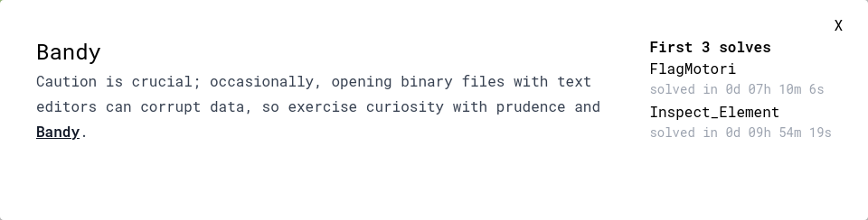
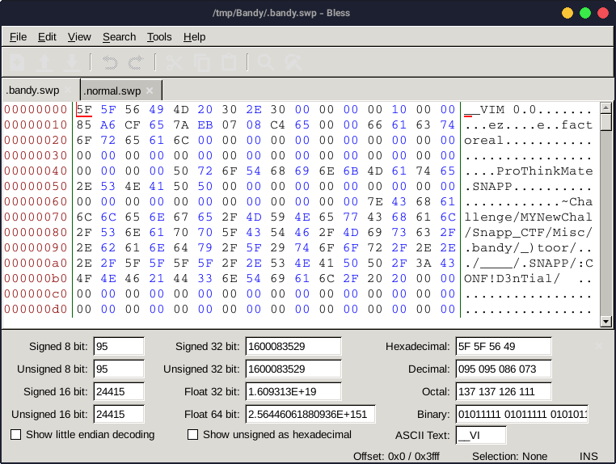
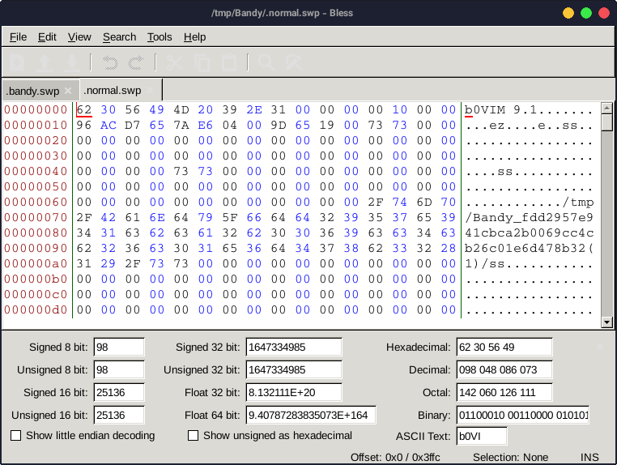

---
tags:
  - SnappCTF
  - SnappCTF-2023
  - Misc
  - Forensics
  - VIM
  - SWP
  - PNG
---



از من به شما نصیحت هرجا vim دیدید، برید سمت swp فایل ها =))





طبق تصویری که توسط برنامه bless نشان داده شده، میبینیم که قسمت [مجیک بایت](https://en.wikipedia.org/wiki/List_of_file_signatures) دو فایل با هم فرق داره

بعد از سر و کله زدن های فراوون برای تغییر فرمت و مسیر فایل ها توسط من و وحید جان و ناکامی در این زمینه، نیما جان بهمون گفت:
> چه نیازیه کل بایت ها رو تبدیل کنیم؟
> 
> دو بایت اول کافیه!!

```
vim -r .bandy.swp
```

با زدن این کامند و رد کردن وارنینگی که داده، میتونیم به فایل اصلی برسیم

در این قسمت باید فایل رو سیو کنیم

با دستور
`:w a.png`
میتونیم فایل رو سیو کنیم جایی که میخوایم (نه جایی که آقای فاکتوریل زده :joy:)

در آخر برای این که از فیکس کردن png زیر سیبیلی رد شیم، میتونیم از [سایبرچف](https://gchq.github.io/CyberChef) استفاده کنیم


??? success "FLAG :triangular_flag_on_post:"
    <div dir="ltr">`SNAPP{D0n7_Op3n_8!NarY_FII35_W1tH_VIM!!}`</div>
---
!!! نویسنده
    [SafaSafari](https://twitter.com/SafaSafari3)$~~~~~~~~~~~~~~~~~~~~~~~~~~~~~~~~~~~~~~~~~~~~~~~~~~~~~~~~~~~~~~~~~~~~~~~~~~~~~~~~~~~~~~~~~~~~~~~~~~~~~~~~~~~~~~~~~~~~~~~~~~~$تاریخ نگارش ۱۴۰۲/۱۲/۴