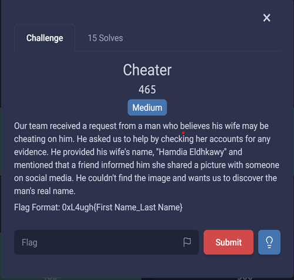
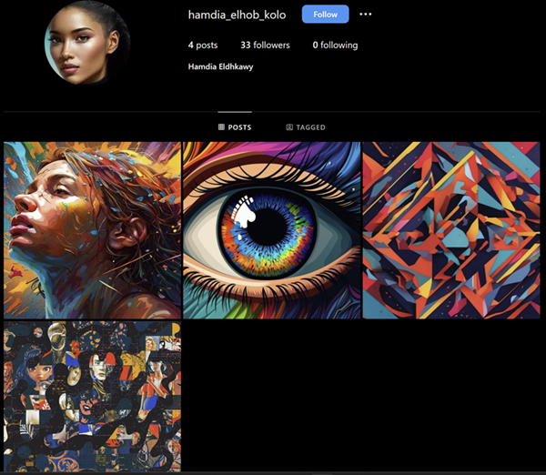
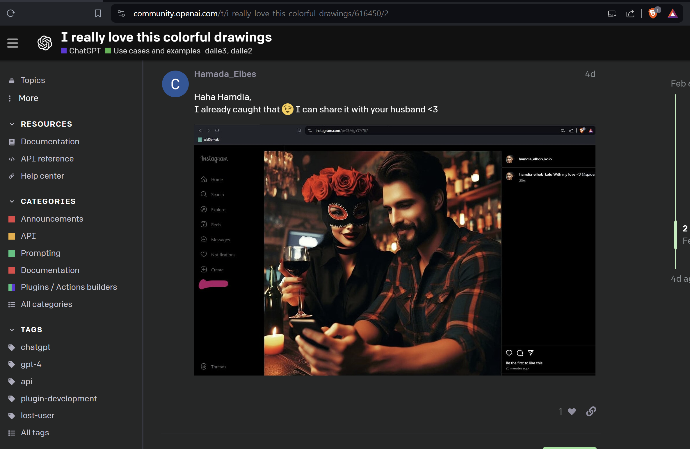
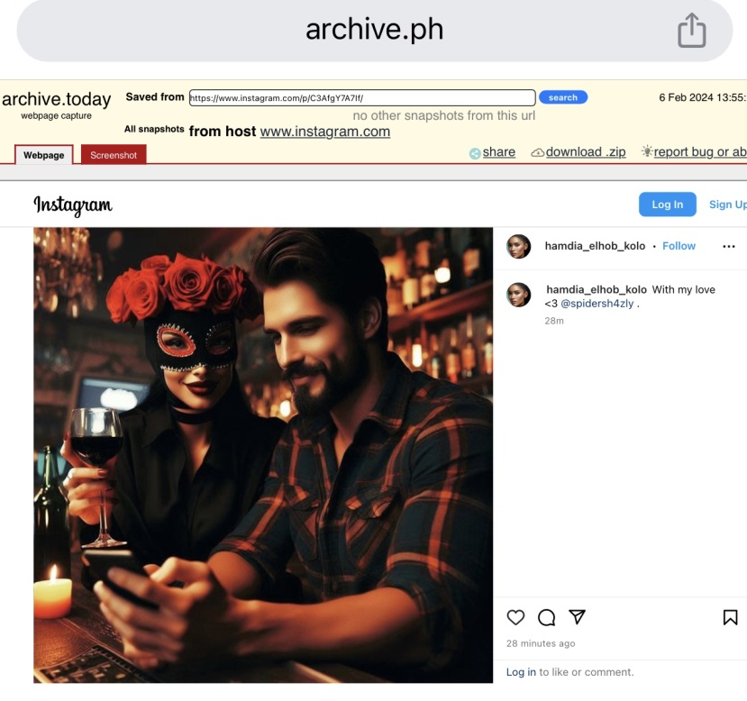
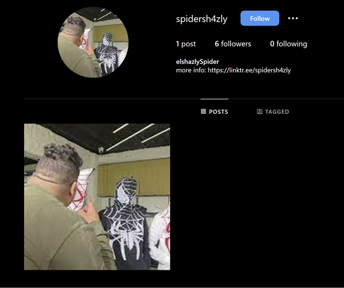
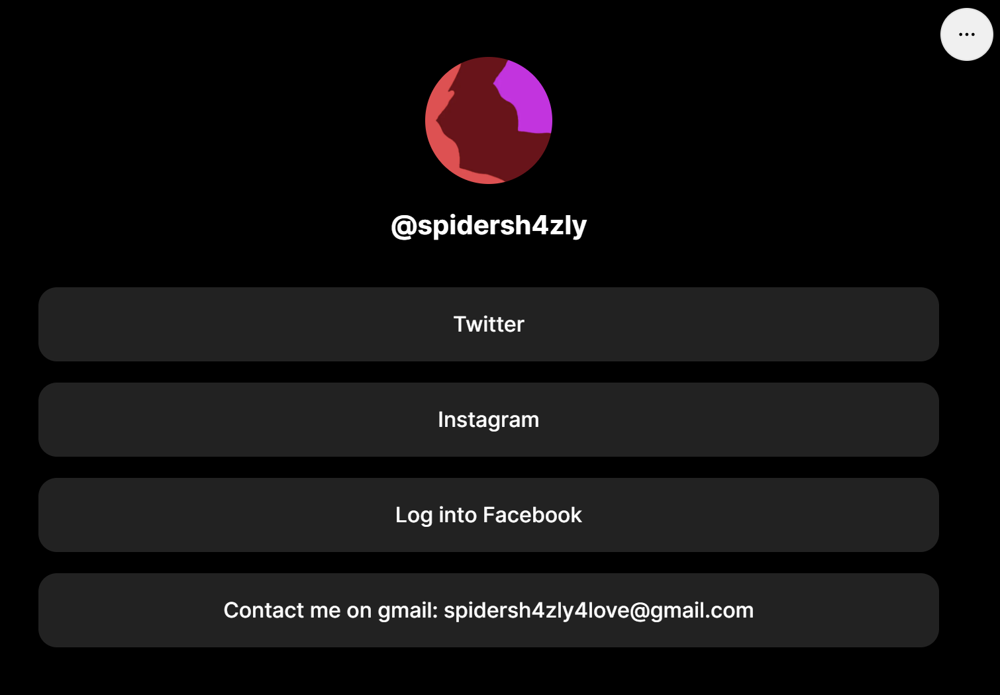

---
tags:
  - 0xL4ughCTF
  - 0xL4ughCTF-2024
  - Osint
  - instagram
  - archive.ph
  - gmail
  - Ghunt
---

# چالش Cheater

---

1- اسم Hamdia Eldhkawy در گوگل جستجو کردم که بعد تعدادی صفحه اینستاگرام، به [این](https://www.instagram.com/hamdia_elhob_kolo) آدرس رسیدم.
 

2- اسم اکانت hamdia_elhob_kolo در موتور جستجو DuckDuckgo جستجو کردم به یک فروم OpenAI می رسیم که عکس زیر آنجا بود.

3-  در متن کنار این عکس یک به نظر یک اکانت spider@ هست که اون رو زیاد جستجو کردم که نتیجه نداشت. بعد، آدرس url موجود در عکس جستجو کردم که فهمیدم این عکس اینستاگرام حذف شده است. توی سایت‌های آرشیو دنبال url گشتم که در سایت [archive.ph](https://www.archive.ph) زیر این صفحه ثبت شده بود. پس تکمیل شده اکانت spidersh4zly@ بدست آوردیم.

4- اسم اکانت spidersh4zly@ جستجوکردم که به مارو به صفحه اینستا زیر می بره.

5- آدرس url داخل این صفحه رو که بزنیم به صفحه زیر میریم که اکانت های توییتر، فیس بوک و یک آدرس جی‌میل (spidersh4zly4love@gmail.com) در اونجا هست.

6- حالا با استفاده از ابزار [Ghunt](https://github.com/mxrch/GHunt) اطلاعات مربوط به این ایمیل را بدست آوردیم که اسم و فامیل صاحب این ایمیل هم بدست آمد.

---
??? success "FLAG :triangular_flag_on_post:"
    
`0xL4ugh{Abdelfatah_ElCanaway}`

!!! نویسنده
    [HIGHer](https://twitter.com/HIGH01012)