---
tags:
  - PlatypwnCTF
  - PlatypwnCTF 2024
  - OSINT
  - Geo-locate 
  - image
  - تعیین زمان 
  - زاویه خورشید
---


# چالش Rise

 در این سوال متن و تصویر زیر به عنوان چالش داده شده بود

`This picture was taken on a sunny Saturday sightseeing trip earlier this year.Do you know when exactly?The flag contains information about day, month, hour (24-hour clock), and minute rounded down to five full minutes of the local time when the picture was taken.Additionally, there is the sun's altitude and azimuth at that time, both given in radians and rounded down to two decimal places. If the picture was taken on March 14, 20:17:25 local time with the sun's altitude of 1.4142 rad and azimuth of 3.1415 rad, the flag would look like this:`
`PP{03-14_20-15_1-41_3-14}`

<center>

</center>

 قبل از شروع باید بگم که  فکر می کنم تیمی این سوال را حل نکرده بود و این نوشته ترجمه writeup تیم طراح سوال است که من اینجا قرار دادم. امیدوارم که قابل فهم ترجمه کرده باشم. :blush:

## راه‌حل

این چالش  نیاز دارد تا شرکت کنندگان مهارت‌های  مربوط به کشف موقعیت جغرافیایی و زمان‌بندی را ترکیب کنند.

گرچه اطلاعات زمان و تاریخ عکس در metadata  آن فایل وجود دارد، که ممکن است با پرچم مثال موجود در صورت سوال مطابقت داشته باشد و اما آن تاریخ metadata شنبه نیست، بنابراین باید آن را به عنوان اطلاعات غیر واقعی کنار گذاشت.

برای بدست آوردن فلگ و تعیین تاریخ گذاری تصویر نیاز به طول و زاویه سایه‌های موجود در آن عکس است که آن خود نیز  نیاز به تعیین موقعیت دقیق خورشید دارد. حال اول از همه باید مکان دقیق تصویر مشخص شود. هیچ اطلاعاتی در metadata  نیز در مورد مکان این عکس موجود نیست، بنابراین باید با جستجوی عکس مکان آن را تعیین کنیم. ابزار رایجی مانند Google Images تنها یک نتیجه اصلی دارد و آن کاخ Sanssouci در پوتسدام کشور آلمان است. با نگاهی به نقشه‌های ماهواره‌ای یا یکی از عکس‌های 360 درجه‌ای که Google Maps ارائه می‌دهد، می‌توان موقعیت دقیق آن یعنی `N52.40391، E13.03847` را به راحتی بدست آورد.

زاویه خورشید (زاویه بین بردار شمالی و بردار ستاره در صفحه افقی) یا در انگلیسی [azimuth](https://en.wikipedia.org/wiki/Azimuth#:~:text=The%20azimuth%20is%20the%20angle%20between%20the%20north%20vector%20and,180%C2%B0%20to%20%2B180%C2%B0.)  خورشید را می‌توان با جهت سایه‌ها در تصویر تعیین کرد. به عنوان مثال به درختچه بزرگ در سمت راست تصویر توجه کنید. لبه سایه آن مستقیماً از کنار دیوار کوچک رد می‌شود:

<center>

</center>

هم درختچه و هم دیوار در تصویر ماهواره‌ای Google Maps از این مکان قابل مشاهده هستند. این برای به دست آوردن جهت دقیق سایه مفید است، که سپس می توان بر همین اساس اندازه گیری کرد:

<center>
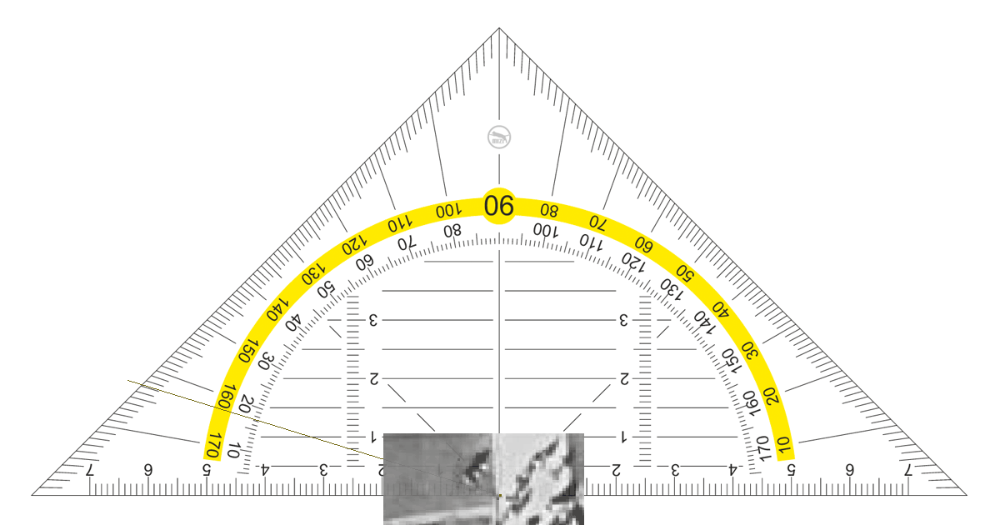
</center>

این مقدار زاویه (azimuth)  کمی بیشتر از 287 درجه (5.00091 راد) را نتیجه می‌دهد. با این حال به خاطر داشته باشید که این نتیجه هنوز نیاز به تأیید دارد - اندازه‌گیری‌های انجام‌شده به این شکل واضح است که دقت محدودی دارند.

برای ارتفاع (altitude) خورشید، نمودار زیر را در نظر بگیرید:

```txt
     /|  
    / |  
   /  |  o  
  /   |  
 /)a  |  
 ¯¯¯¯¯  
   s  
```

در اینجا، زاویه $a$ معادل ارتفاع خورشید است و ضلع  $o$ ارتفاع جسمی که سایه می‌اندازد و $s$ طول آن سایه است. با استفاده از مثلثات پایه می‌توان فرمول زیر را ساخت:

$$a = \arctan\left(\frac{o}{s}\right) $$


توجه داشته باشید که باید طول‌ها به شکل نسبی در نظر گرفته شود، زیرا واحدهای اندازه‌گیری کنار گذاشته خواهد شد. بنابراین می‌توانیم یک شی مرجع را با ارتفاع 1 فرض کنیم و فقط طول نسبی سایه آن را در نظر بگیریم.

بنابراین می‌توانیم تعدادی از اندازه‌‌های نسبی اشیاء موجود در تصویر و سایه‌های آن‌ها را جمع‌آوری کنیم.  برای به حداقل رساندن اعوجاج، روی اشیائی در تصویر تمرکز می‌کنیم که سایه و شی هر دو تقریباً عمود بر خط دید بیننده هستند. تعداد کمی از اشیاء مناسب برای این کار وجود دارد که برخی از اندازه‌گیری‌ها در شکل‌های زیر نشان داده شده  که با استفاده از [این سایت](https://eleif.net/photomeasure)   گرفته شده است:

<center>
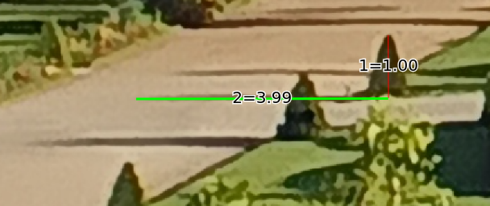
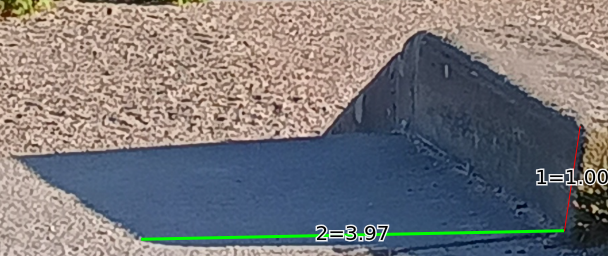
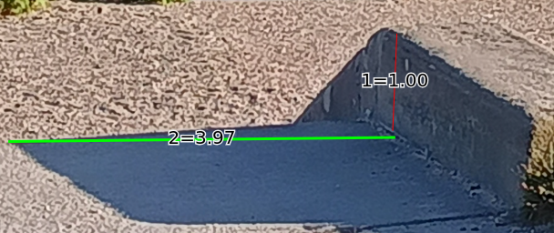
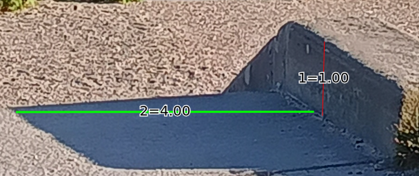
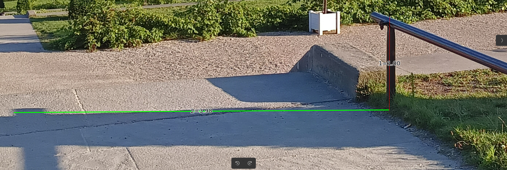
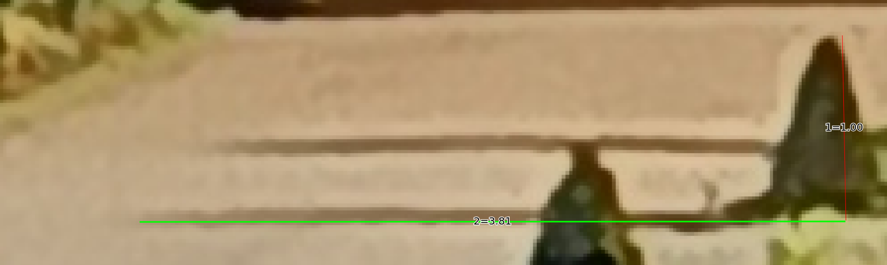
</center>


این اندازه‌گیری‌ها در تصویر کمی متفاوت هستند، که طیف تغییر این نمونه‌ اندازه‌ها در محدوده [3.81، 4.00] قرار دارند که تفاوت زیادی نیست. با این کار می‌توانیم زاویه ارتفاع تابش خورشید نیز محاسبه کنیم.

حال برای بدست آوردن زمان و تاریخ دقیق برای تصویر، سایت‌ها و ابزارهای شبیه‌سازی نجومی، به عنوان مثال سایت [SunCalc](https://www.suncalc.org)   یا کتابخانه [ephem](https://pypi.org/project/ephem/)  برای Python بهکار ما می آید. با استفاده دومی، کد پایتون زیر تمام شنبه‌ها، در ماه‌های مختلف سال و ساعت‌های قابل قبول را در داخل یک حلقه بررسی می‌کند (شب‌ها و زمستان برای بهبود زمان اجرا حذف می‌شوند، زیرا افراد در عکس با تی‌شرت هستند و خورشید قابل مشاهده است) و طول سایه را در این زمان و همچنین زاویه azimuth خورشید را با اندازه‌گیری‌های بالا مقایسه می‌کند.

با فرض طول سایه 3.95 واحد (میانگین اندازه‌گیری‌های بالا) و زاویه خورشید (azimuth) 287 درجه در حالی که 0.05> واحد و 0.02> رادیان انحراف وجود داشته باشد و  با فریم‌های زمانی تنها یک دقیقه، تنها سه روز باقی می‌ماند. توجه داشته باشید که این اسکریپت پایتون منطقه زمانی عکس را نسبت گرینویچ (UTC) در نظر نگرفته است، بنابراین باید دو ساعت به هر نتیجه اضافه شود.

<center>
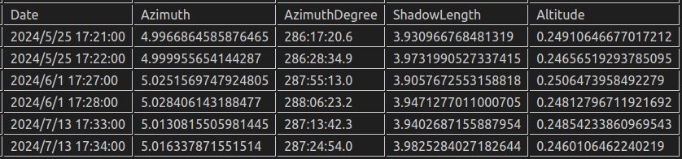
</center>

To verify which of those dates is correct, one can now take a look at the weather in Potsdam for the specific times. For May 25, it looks like this [4]:

برای تایید اینکه کدام یک از این تاریخ ها صحیح است، اکنون می‌توانید نگاهی به آب‌وهوای شهر پوتسدام برای زمان‌های مشخص شده بیندازید که برای 25 می در [این سایت](https://www.timeanddate.com/weather/germany/potsdam/historic?month=5&year=2024)، به این صورت است:

<center>
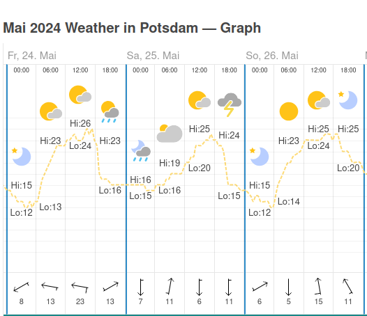
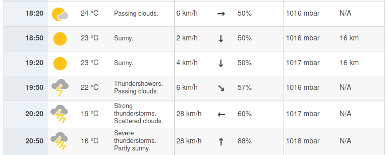
</center>


دمای هوا در این روز درست به نظر می رسد، اما در چند دقیقه آینده آن یک رعد و برق در راه است که بر اساس تصویر این روز قابل قبول به نظر نمی رسد و همچنین برای [2024 June 1](https://www.timeanddate.com/weather/germany/potsdam/historic?month=6&year=2024)  ، همین مسئله مشابه وجود دارد:
هیچ ابر بارانی یا رطوبتی روی زمین دیده نمی‌شود.

<center>
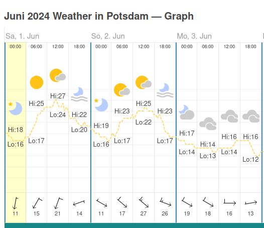
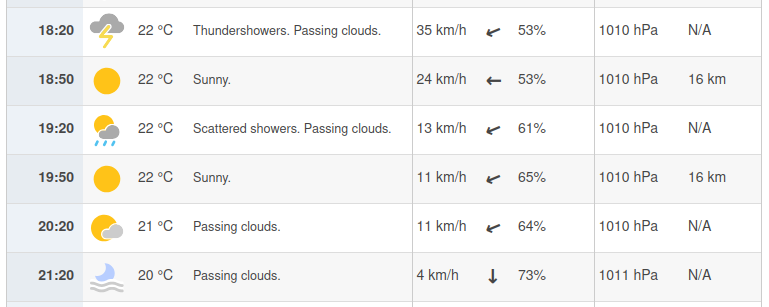
</center>


اما برای 13 [2024 July](https://www.timeanddate.com/weather/germany/potsdam/historic?month=7&year=2024) .وضعیت متفاوت به نظر می رسد:


<center>
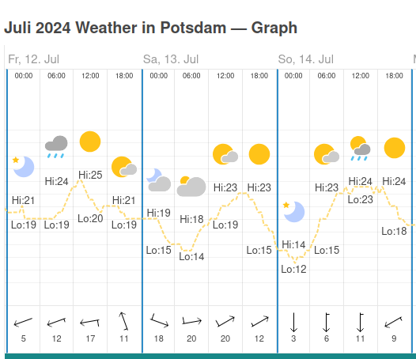
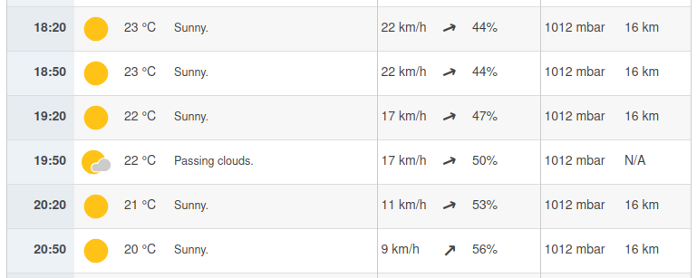
</center>

We see sun and only light clouds for the identified time (and some time before), which fits the image. It should be taken at about 19:33 or 19:34 on July 13, 2024 with the sun's azimuth of 5.01 (rounded down) and altitude of 0.24 (rounded down). The flag is therefore `PP{07-13_19-30_0-24_5-01}`.

ما خورشید و فقط ابرهای اندکی را برای زمان مدنظر (و مدتی قبل) می‌بینیم که با تصویر مطابقت دارد. باید در حدود 19:33 یا 19:34 در 13 ژوئیه 2024 با  زاویه خورشید 5.01 (گرد شده به پایین) و ارتفاع 0.24 (گرد شده به پایین) گرفته شود.


```py linenums="1" title="data.py"
import ephem
import math
# estimate date and time from given shadow length and azimuth
def estimate_date_time(shadow_length, azimuth, file):
    observer = ephem.Observer()
    # location taken from satellite image
    observer.lat = '52.40391'
    observer.lon = '13.03847'
    # accurate date for comparison
    # observer.date = ephem.Date("2024/7/13 17:33:32")
    # sun = ephem.Sun(observer)
    # sun.compute(observer)
    # shadow_length_calculated = 1 / math.tan(sun.alt)
    # file.write(str(observer.date) + "," + str(sun.az + 0.0) + "," + str(sun.az) + "," + str(shadow_length_calculated) + "," + str(sun.alt + 0.0) + "\n")
    # loop over all possible dates and times (starting in march, only saturdays, from 12:00 to 20:00)
    for d in range(2, 250, 7):
        for h in range(12,20):
            for m in range(60):
                # get the date and time
                observer.date = ephem.Date("2024/3/" + str(d) + " " + str(h) + ":" + str(m))
                sun = ephem.Sun(observer)
                sun.compute(observer)
                # calculate the shadow length
                shadow_length_calculated = 1 / math.tan(sun.alt)
                if abs(shadow_length_calculated - shadow_length) < 0.05 and abs(sun.az - math.radians(azimuth)) < 0.02:
                    file.write(str(observer.date) + "," + str(sun.az + 0.0) + "," + str(sun.az) + "," + str(shadow_length_calculated) + "," + str(sun.alt + 0.0) + "\n")
def main():
    file = open("dates.csv", "w")
    file.write("Date,Azimuth,AzimuthDegree,ShadowLength,Altitude\n")
    # estimate_date_time(3.81, 287, file)
    estimate_date_time(3.95, 287, file) # mean of measured shadow lengths
    # estimate_date_time(4.00, 287, file)
    file.close()
if "__main__" == __name__:
    main()
```

پس پرچم سوال به صورت زیر خواهد بود. 

---
??? success "FLAG :triangular_flag_on_post:"
    <div dir="ltr">`platypwn{PP{07-13_19-30_0-24_5-01}}`</div>


!!! نویسنده
    [HIGHer](https://twitter.com/HIGH01012)