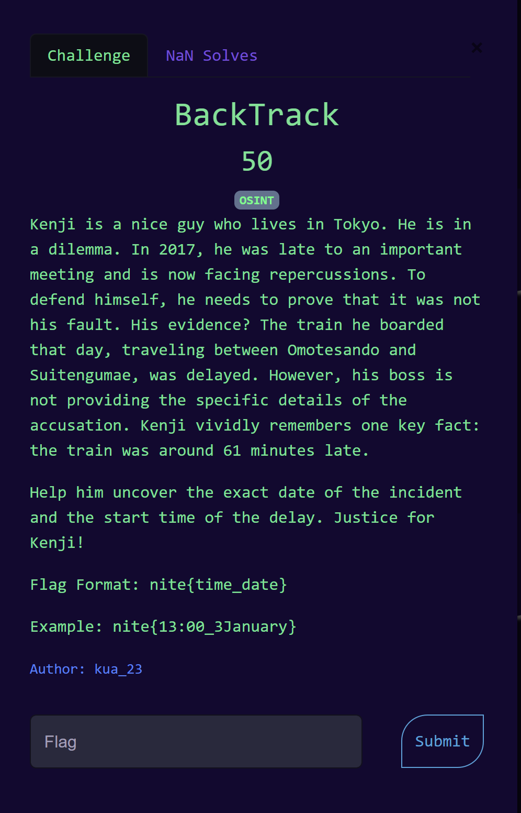
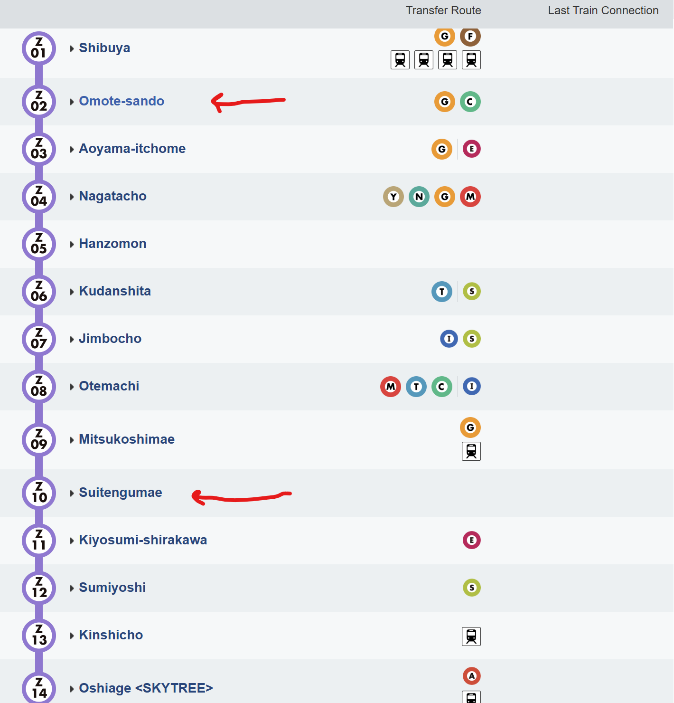
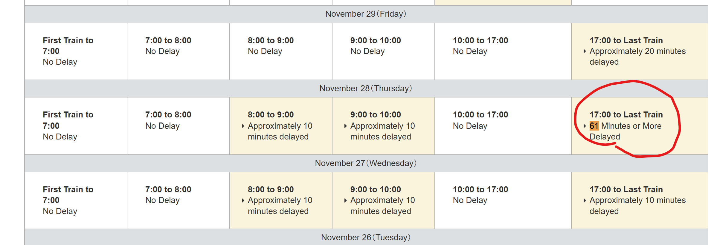
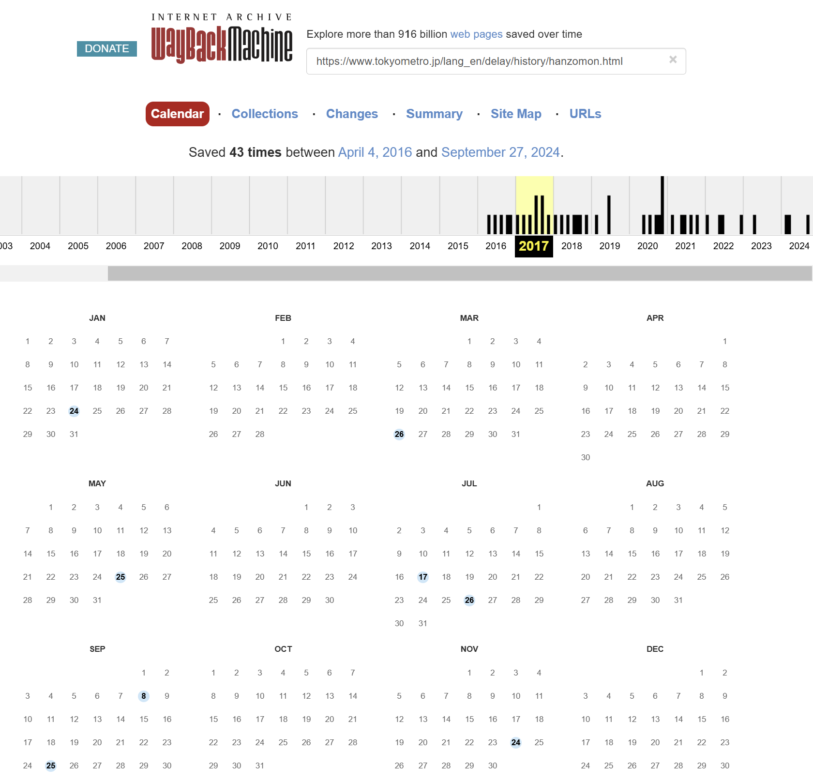
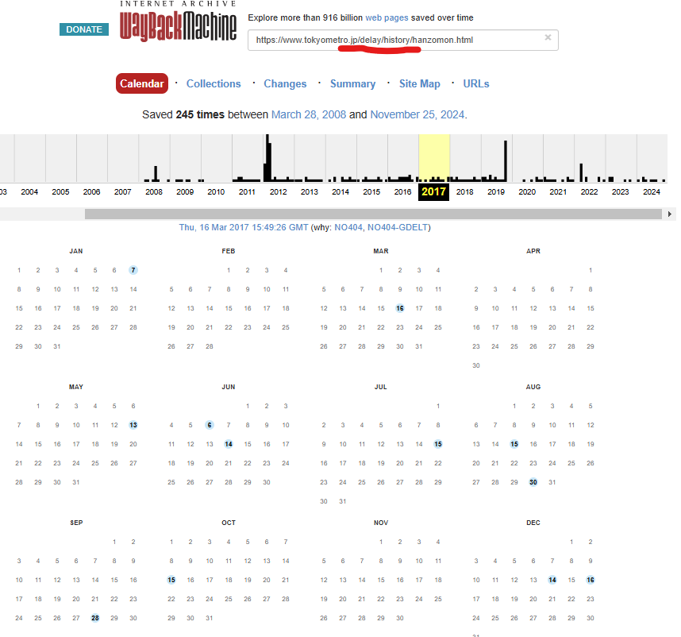
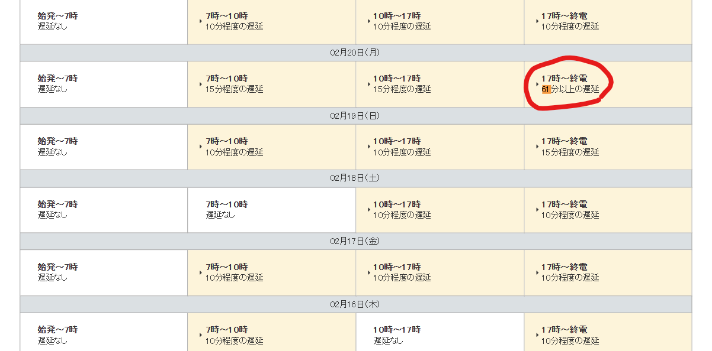

---
tags:
  - niteCTF
  - niteCTF 2024
  - OSINT
  - train delay 
  - Archive
---

# چالش Backtrack

{ width="400" }

خب طبق خواسته سوال ما باید ببینیم در چه تاریخ و ساعتی قطار بین دو شهر Omotesando و Suitengumae تاخیر داشته

## راه‌حل

خب با اندکی جستجو و بررسی سایت‌های مختلف متوجه شدم اول که این دو اسم شهر نیستن و اسم دو ایستگاه مترو خط Z توکیو هستند.

{ width="500" }

دوباره با جستجو با کلید واژه "daley" به دنبال سایتی بودم که اطلاعات مربوط به تاخیرهای قطار رو به ما بده که در نهایت به [این](https://www.tokyometro.jp/lang_en/delay/history/hanzomon.html)  سایت رسیدم.
شروع به گشتن توی این سایت کردم در تاریخ 5 نوامبر تاخیر  61 دقیقه ای داشته که فکر کردم کار تموم است ولی جواب درست نبود :cry:

{ width="500" }

عجیب بود برام و تاریخ‌ها و ساعت‌های همین حوالی رو امتحان کردم ولی درست نبود. بعد از مدتی چشم به تاریخ 2017 افتاد دیدم که کلا فراموش کردم که باید در این تاریخ دنبال تاخیر می‌گشتم اما این سایت تنها تاخیرهای 35 روز گذشته رو ذخیره داره

پس رفتم به توی سایت [آرشیو](https://www.tokyometro.jp/lang_en/delay/history/hanzomon.html)  همین لینک قبلی رو اونجا دنبال کردم ه دیدم بله توی سال 2017 چند تا مورد آرشیو ثبت شده از این سایت و تاخیرهاش هست 

{ width="500" }

همه این تاریخ‌هایی که توی سایت آرشیو بود هم بررسی کردم ولی توی هیچ کدام مقدار 61 دقیقه تاخیر وجود نداشت.:cry:
باز یک مدت زمانی دنبال این بودم که چه چیزی رو از قلم انداختم تا اینکه متوجه شدم با لینک  بدون زبان انگلیسی (ینی زبان ژاپنی سایت ) هم تاریخ‌های متفاوتی از نسخه انگلیسی وجود دارد. پس 

{ width="500" }

 در نهایت در تاریخ 20 فوریه همانند شکل زیر یک تاخیر 61 دقیقه‌ای در ساعت 17 وجود دارد که بلاخره درست بود.

{ width="500" }

!!! جالب
    در همین سایتی که اطلاعات تاخیر قطارها در ژاپن قرار گرفته قابلیت اینکه تاخیر آن روز را پرینت بگیرید لحاظ شده تا در صورتی که به کار خود نرسیدید بتوانید به عنوان علت تاخیر آن را ارائه دهید 

---
??? success "FLAG :triangular_flag_on_post:"
    
`nite{17:00_20February}`

!!! نویسنده
    [HIGHer](https://twitter.com/HIGH01012)