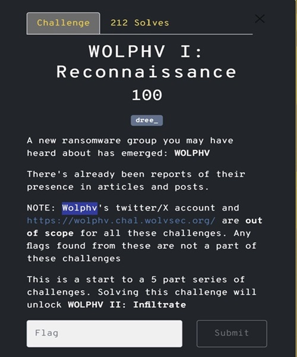
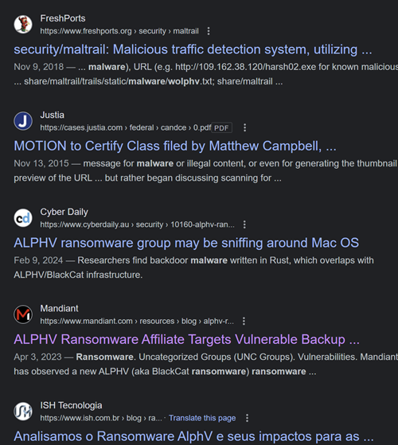
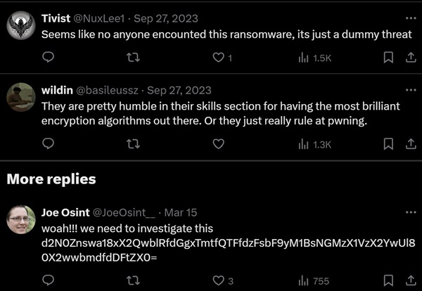

---
tags:
  - wCTF
  - wCTF-2024
  - Osint
  - twitter comments 
---

# چالش WOLPHV-I: Reconnaissance

---

## صورت مسئله
در این چالش یک لینک داده شده و بنظر باید با استفاده از این لینک به خواسته مسلله یعنی پرچم برسیم

## راه‌حل چالش
توی این چالش با اینکه گفته شده که برای پیدا کردن فلگ نباید دنبال آن در اکانت های توییتر خود گروه Wolphv باشیم ولی با یک جستجو توی اینترنت در مورد این باج‌افزار به یک [توییت](https://twitter.com/FalconFeedsio/status/1706989111414849989)  بر میخوریم که در مورد این باج افزار توییتی زده.

بعد از باز کردن و بررسی قسمت نظرات ، پایین ترین کامنت یک کد base64 هست که احتمالا باید فلگ باشه. بعد دیکد کردن آن  فلگ بدست میاد.

این سوال ساده‌ای بود اما نکته گمراه کننده این بود که در توضیحات چالش گفته بود که نباید به توییتر توجه کرد.

---
??? success "FLAG :triangular_flag_on_post:"
    
`wctf{0k_1_d0nT_th1Nk_A1_w1ll_r3Pl4c3_Us_f0R_4_l0ng_t1me}`

!!! نویسنده
    [HIGHer](https://twitter.com/HIGH01012)