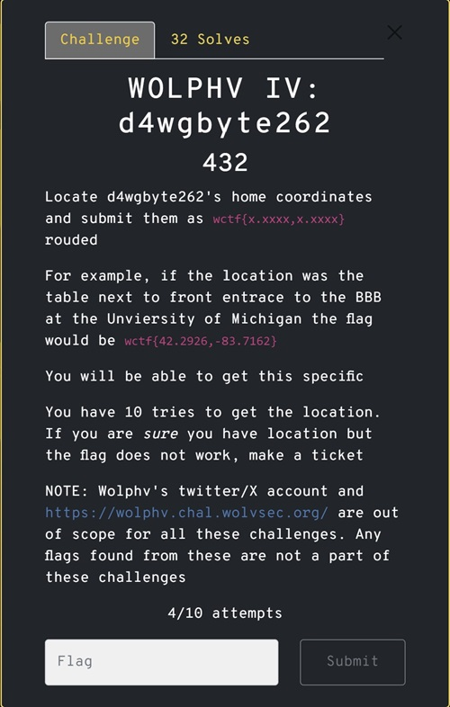
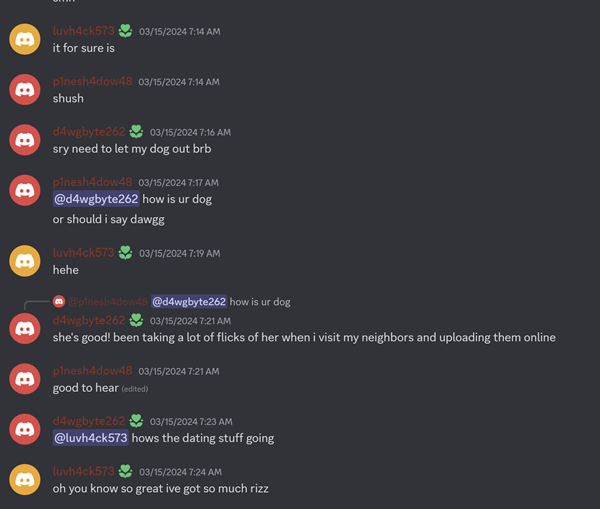
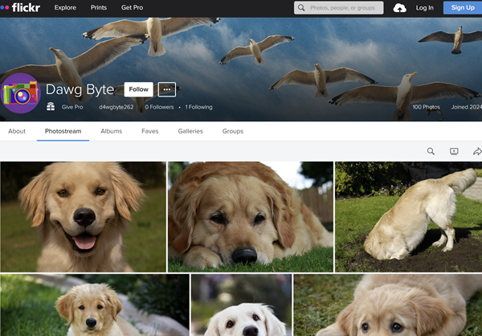
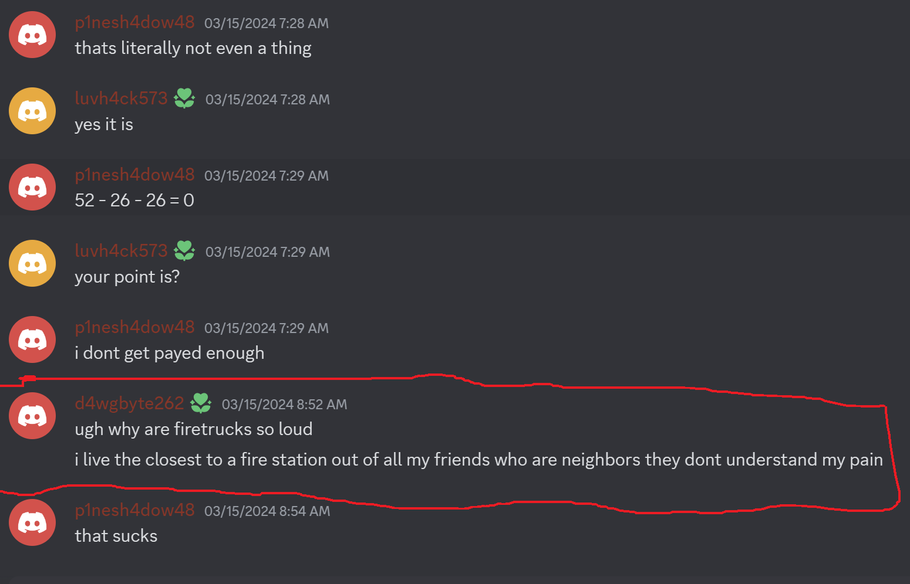
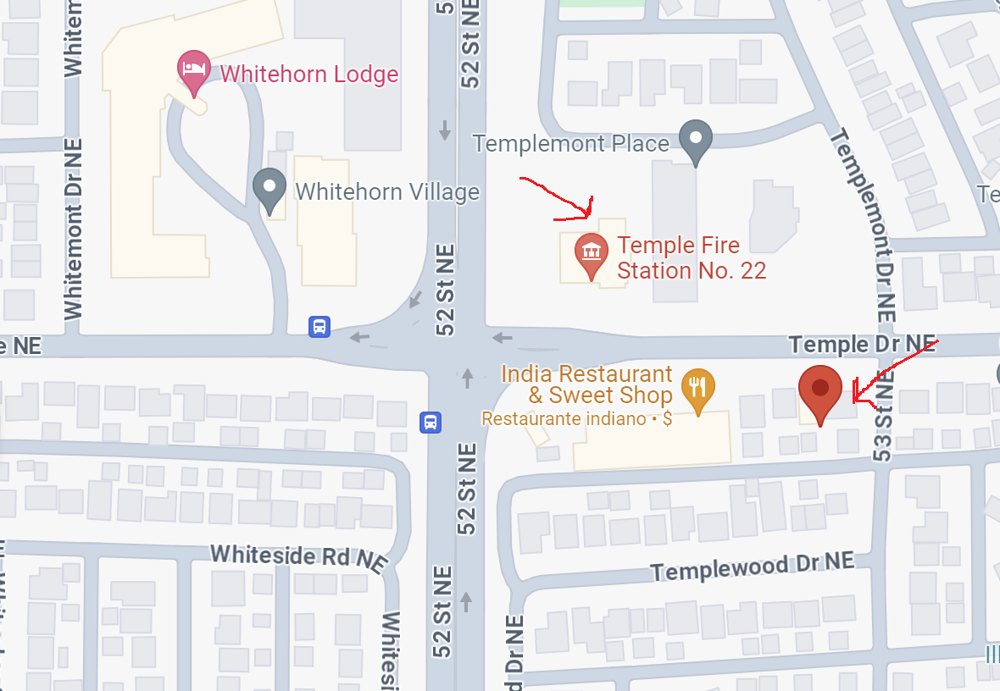

---
tags:
  - wctf
  - wctf-2024
  - Osint
  - image location 
  - flickr
  - google map
---

# چالش WOLPHV-IV: d4wgbyte262   
---

## صورت مسئله

در این چالش هم باید مثل قبلی محل سکونت یکی دیگه از اعضای گروه دیسکورد یعنی d4wgbyte262 پیدا کنیم.

## راه‌حل چالش

 با توجه به صحبت های که توی گروه داشتن نشون میده که ای شخص سگ دارهو در مورد یک چیزی به اسم flick می‌کنند.

با این اطلاعات اولین کاری که کردم این بود که ببینم آیا اکانت دیگه‌ای  با این اسم داخل  شبکه های اجتماعی دیگه هست یا نه. پس در سایت [discoverprofile](https://discoverprofile.com/) اکانت این شخص جستجو کردم که نتیجه بدرد بخوری نداشت. بعد توی موتور [DuckDuckgo](https://duckduckgo.com/) هم گشتم که یک سایت به اسم [flickr](https://www.flickr.com/photos/200261418@N03/) نظرم جلب کرد و بعد که داخلش رفتم عکس‌های زیاد از یک سگ به اشتراک گذاشته شده بود.
پس فهمیدم که تا این جا درسته و این اکانت یک ربطی به داستان داره.:hand_with_index_finger_and_thumb_crossed:

عکس ها رو بررسی کردیم که شاید نشانه‌ای از خانه این شخص باشه ولی چیزی دستگیرم نشد. بعد چنتا از عکس‌ها رو دانلود کردم و با ابزار exiftool اطلاعات داخل عکس نگاه کردم که دیدم یک موقعیت جغرافیایی داخل هر عکس هست.

ولی متاسفانه هر عکس یک موقعیت جغرافیایی متفاوت از نقطههای مختلف شهر داشت و نمیشد موقعیت دقیق خانه بدست آورد.
یک مدتی درگیر همین بودم که دوباره دیسکورد نگاه کردم و از صحبت هاشون متوجه شدم که خانه‌اش نزدیک‌ترین موقعیت به یک ایستگاه آتش‌نشانی  باید باشه.

پس با نگاه کردن به موقعیت هر عکس نزدیک‌ترین مکان به ایستگاه آتش‌نشانی رو بدست آوردیم.

---
??? success "FLAG :triangular_flag_on_post:"
    
`wctf{51.0911, -113.9561}`

!!! نویسنده
    [HIGHer](https://twitter.com/HIGH01012)