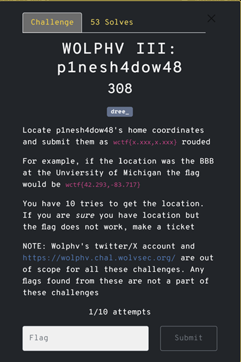
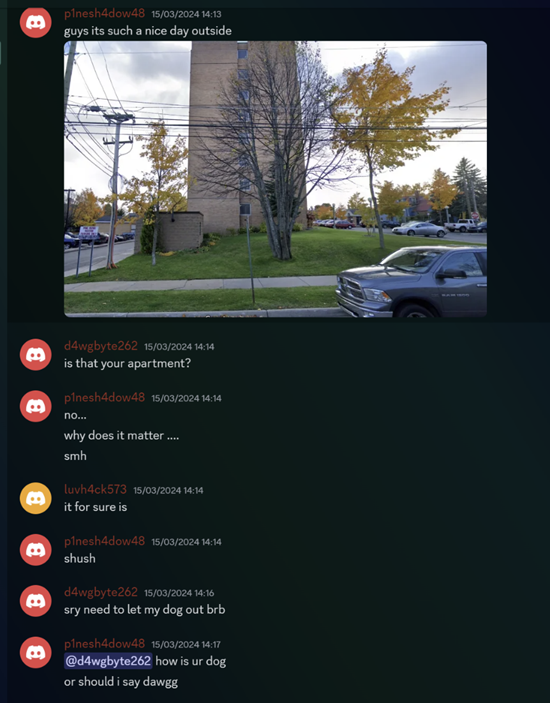
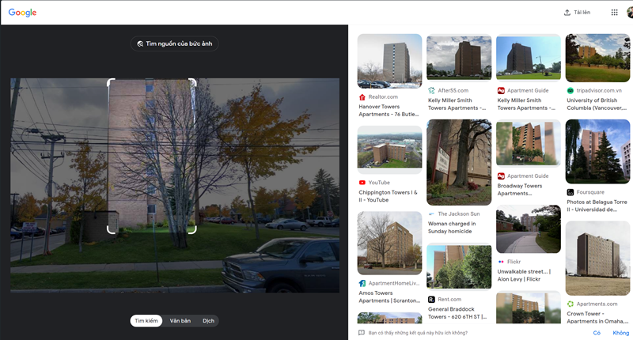
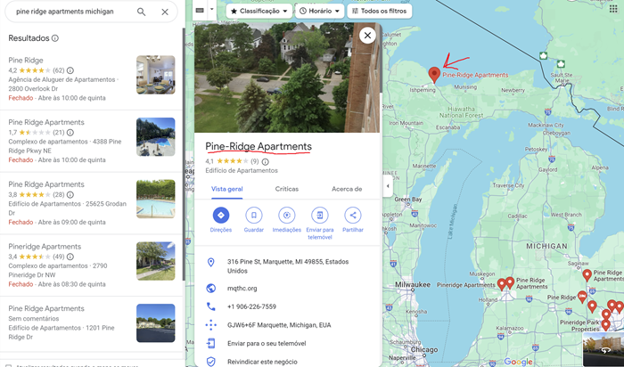

---
tags:
  - wctf
  - wctf-2024
  - Osint
  - image coordinates 
  - google map
---

# چالش WOLPHV-III: p1nesh4dow48   
---

<center>

</center>

## صورت مسئله
 این سوال در ادامه چالش قبلی یعنی WOLPHV-II است که در آن به توانستیم دیسکورد آن ها را بدست بیاوریم.


## راه‌حل چالش

بعد از اینکه تونستیم به سرور دیسکورد گروه در چالش قبلی وارد بشیم برای این سوال مختصات آدرس آپارتمان اکانت p1nesh4dow48 از ما میخواد که داخل سرور این گروه همین شخص عکس آپارتمانش رو گذاشته است.   
 
<center>

</center>

خب برای حل این چالش اولین چیزی که به ذهنم رسید این بود که داخل google image  دنبال این عکس بگردم که با حالت ها و تکه های مختلف عکس با google lenz جسجو کردم ولی فایده‌ای نداشت و آپارتمان ها هیچکدوم این اپارتمان نبود.

<center>

</center>

با دقت به عکس یک تابلو سمت چپ عکس می‌بینیم که نوشته شده```Pine Ridge visitor parking only``` که ذهنم برد به سمت اینکه ممکنه احتمالا ```Pine ridge```یک مکان دیدنی باید باشه که مردم برای بازدید به اونجا میان و این آپارتمان نزدیک اونه. پس توی اینترنت چند ساعت دنبال این مکان دیدنی گشتم ولی فایده نداشت. بعد از مدتی، داخل google Map کلمات کلیدی ```Pine Ridge apartments michigan``` چون حدس زدم اسم آپارتمان شاید این باشه و چون در رابطه دانشگاه میشگان بودن این افراد که نقاط عکس زیر به ما نشون داد یکی از اون‌ها شباهت به همین آپارتمان موردنظر داشت بعد که وارد [street view](https://www.google.com/maps/@46.546214,-87.388624,3a,75y,99.64h,72.87t/data=!3m6!1e1!3m4!1sYz6AgzjDcR_0Dy8VjBPX4w!2e0!7i16384!8i8192?hl=pt-PT&entry=ttu) شدم دیدم که بله خودشه :hand_with_index_finger_and_thumb_crossed:.   

<center>

</center>

پس جستجوی **کلمه کلیدی مناسب** خیلی مهمه

---
??? success "FLAG :triangular_flag_on_post:"
    <div dir="ltr">`wctf{46.546,-87.388}`</div>


!!! نویسنده
    [HIGHer](https://twitter.com/HIGH01012)