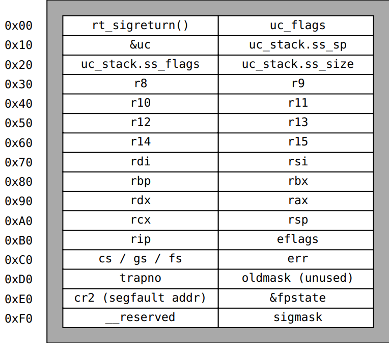

---
tags:
  - sigreturn oriented programming
  - SROP
  - ROP
---

# Sigreturn Oriented Programming

یکی از تکنیک‌های اکسپلویت که از مفهوم **ROP** و سیستم‌کال **Sigreturn** استفاده می‌کند، **Sigreturn-Oriented ROP** نام دارد.

## شناخت تکنیک SROP

در جهت شناخت عملکرد صحیح این تکنیک، نیاز است که نگاهی به manual بیندازیم و کمی در مورد ماهیت سیستم‌کال **Sigreturn** مطالعه کنیم.

### عملکرد سیستم‌کال Sigreturn

این سیستم‌کال پس از اجرای موفقیت‌آمیز یک signal handler اجرا خواهد شد و سعی در بازگردانی برنامه به جریان اجرایی سابق خود، قبل از اجرای signal handling را دارد.

#### فرآیند Signal Handling

در واقع زمانی که یک سیگنال از سمت سیستم‌عامل یا یک پروسه به سمت پروسه مقصد ارسال می‌شود:

1. کرنل در روال عادی پروسه مقصد **interrupt** ایجاد می‌کند
2. از همه موارد مورد نیاز برای از سرگیری دوباره جریان اجرایی برنامه، نسخه‌ای تهیه می‌کند:
   - تمامی رجیسترها و فلگ‌های پردازنده
   - `eip/rip` و `esp/rsp`
   - `CS` و `DS` و سایر رجیسترها
3. این اطلاعات را در یک **signal frame** ذخیره می‌کند
4. پس از اجرای signal handler، سیستم‌کال `sigreturn` فراخوانی می‌شود
5. از طریق اطلاعات موجود در signal frame، پروسه می‌تواند وضعیت اجرایی پیشین خود را ادامه دهد

*Sigreturn Frame*

### نقطه ضعف امنیتی

در واقع دلیل اصلی اینکه ما در تکنیک **SROP** و اکسپلویت خود می‌توانیم از این سیستم‌کال استفاده کنیم این است که **هیچ‌گونه بررسی در جهت حصول اطمینان از ارسال سیگنال به سمت برنامه انجام نمی‌شود**.

یعنی مشخص نمی‌شود که آیا اصلاً سیگنالی به سمت برنامه ارسال شده که پس از هندل کردن آن نیاز به استفاده از `sigreturn` باشد یا خیر.

## کاربرد عملی

حال که با چیستی و چرایی تکنیک **ROP Sigreturn** آشنا شدیم، به چگونگی استفاده از آن خواهیم پرداخت.

بدین منظور از (حداقل) یک چالش CTF در جهت انتقال مفاهیم بهره خواهیم برد:
- **چالش laconic** از مسابقه HTB 2025

## منابع
- [Unix Sigreturn Manual Page](https://man7.org/linux/man-pages/man2/sigreturn.2.html)
- [Framing Signals—A Return to Portable Shellcode](https://www.ieee-security.org/TC/SP2014/papers/FramingSignals-AReturntoPortableShellcode.pdf)
- [Sigreturn-oriented programming](https://en.wikipedia.org/wiki/Sigreturn-oriented_programming)