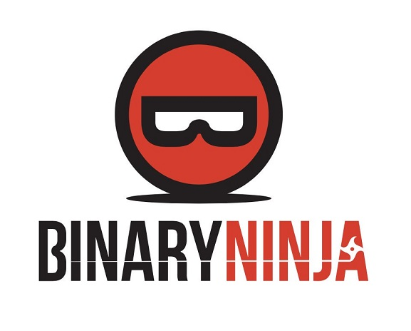

# ابزارهای جامع مهندسی معکوس

## دیکامپایلرها و دیس‌اسمبلرها

دیکامپایلرها و دیس‌اسمبلرها ابزارهای اساسی در مهندسی معکوس هستند که کد ماشین را به زبان‌های سطح بالاتر یا اسمبلی تبدیل می‌کنند.

### دیکامپایلرها

1. **[🌟IDA Pro](https://hex-rays.com/ida-free)**
    

    { align=left width="80" }
    - یکی از پیشرفته‌ترین دیکامپایلرهای تجاری
    - پشتیبانی از طیف گسترده‌ای از معماری‌ها و فرمت‌های فایل
    - قابلیت اسکریپت‌نویسی با Python و IDC
    

2. **[🌟Ghidra](https://ghidra-sre.org)**
    

    { align=left width="100" }
    - دیکامپایلر متن‌باز و رایگان از NSA
    - قابلیت تحلیل پیشرفته و ویژگی‌های همکاری تیمی
    - پشتیبانی از اسکریپت‌نویسی Java و Python
    

3. **[Binary Ninja](https://binary.ninja)**
    { align=left width="80" }
    - پلتفرم تحلیل باینری با API قدرتمند
    - قابلیت تحلیل در سه سطح: Low Level IL، Medium Level IL و High Level IL

4. **[Hopper](https://www.hopperapp.com)**
    - مناسب برای سیستم‌عامل‌های macOS، Linux و Windows
    - رابط کاربری بصری و قابلیت دیباگ

5. **[JEB](https://www.pnfsoftware.com)**
    - تخصص در دیکامپایل اندروید و تحلیل بدافزار
    - پشتیبانی از پلاگین‌های Python

6. **[🌟Cutter](https://cutter.re)**
    - دیکامپایلر خفنیه🔥

## دیباگرها

دیباگرها به محققان اجازه می‌دهند تا اجرای برنامه را در زمان واقعی بررسی و کنترل کنند.

1. **[🌟GDB (GNU Debugger)](https://www.sourceware.org/gdb)**
    - دیباگر متن‌باز و چند پلتفرمی
    - پشتیبانی از اکثر زبان‌های برنامه‌نویسی

2. **[WinDbg](https://learn.microsoft.com/en-us/windows-hardware/drivers/debugger)**
    - دیباگر قدرتمند برای ویندوز
    - مناسب برای دیباگ درایورها و تحلیل دامپ حافظه

3. **[x64dbg](https://x64dbg.com)**
    - دیباگر متن‌باز برای ویندوز
    - رابط کاربری گرافیکی و قابلیت اسکریپت‌نویسی

4. **[LLDB](https://lldb.llvm.org)**
    - بخشی از پروژه LLVM
    - یکپارچه با Xcode برای توسعه‌دهندگان Apple

## ابزارهای تحلیل دینامیک

این ابزارها برای بررسی رفتار برنامه در حین اجرا استفاده می‌شوند.

1. **[🌟frida](https://frida.re)**
    - فریم‌ورک تزریق کد دینامیک
    - قابلیت هوک کردن توابع و دستکاری رفتار برنامه

2. **[DynamoRIO](https://dynamorio.org)**
    - فریم‌ورک دستکاری باینری در زمان اجرا
    - مناسب برای ابزارسازی و تحلیل کد

## ابزارهای تحلیل استاتیک و سیمبولیک

این ابزارها برای تحلیل کد بدون اجرای آن و یا با استفاده از تکنیک‌های تحلیل سیمبولیک استفاده می‌شوند.

1. **[🌟Z3](https://github.com/Z3Prover/z3)**
    - حل‌کننده محدودیت و اثبات‌کننده قضیه از Microsoft Research
    - کاربرد در حل چالش‌های CTF و تحلیل برنامه

2. **[🌟angr](https://angr.io)**
    - فریم‌ورک تحلیل باینری با قابلیت‌های تحلیل سیمبولیک
    - مناسب برای تحلیل‌های پیچیده امنیتی و CTF

3. **[🌟Radare2](https://rada.re/n/radare2.html)**
    - مجموعه ابزار متن‌باز برای مهندسی معکوس
    - شامل دیس‌اسمبلر، دیباگر و تحلیلگر

4. **[🌟JADX](https://github.com/skylot/jadx)**
    - دیکامپایلر برای فایل‌های APK و DEX اندروید
    - تولید کد Java از باینری‌های اندروید

## پلتفرم‌های آنلاین

1. **[🌟dogbolt](https://dogbolt.org)**
    - ابزار آنلاین برای مقایسه خروجی دیکامپایلرهای مختلف
    - مفید برای یادگیری و مقایسه عملکرد دیکامپایلرها

2. **[ANY.RUN](https://app.any.run)**
    - سندباکس آنلاین برای تحلیل دینامیک بدافزار
    - ارائه گزارش‌های تعاملی و ویدیویی از رفتار نمونه

--- 

!!! نویسنده
    [تیم فلگ موتوری](https://github.com/flagmotori)

