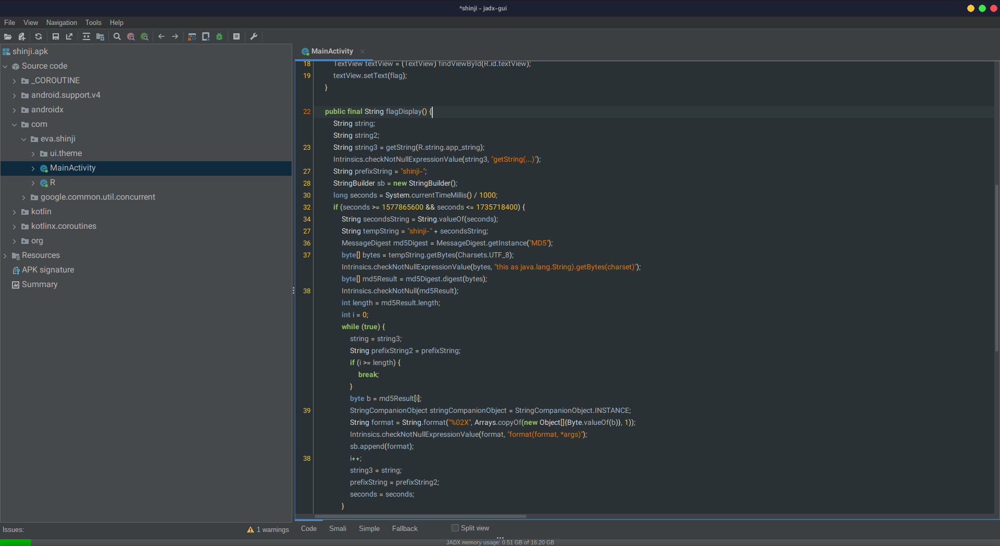

---
tags:
  - BSidesSF
  - BSidesSF-2024
  - Reverse
  - Android
---

# چالش Shinji

اولین کاری که در مواجهه با چلنج اندرویدی باید انجام بدیم چیه؟ همتون میگید اجرا اما نه!! باز کردنش تو JadX اولین کاریه که حرفه ای ها میکنن =)))

با یکم گشتن تو کلاس ها و توابع برنامه میرسیم به این تیکه کد



```java
    public final String flagDisplay() {
        String string;
        String string2;
        String string3 = getString(R.string.app_string);
        Intrinsics.checkNotNullExpressionValue(string3, "getString(...)");
        String prefixString = "shinji-";
        StringBuilder sb = new StringBuilder();
        long seconds = System.currentTimeMillis() / 1000;
        if (seconds >= 1577865600 && seconds <= 1735718400) {
            String secondsString = String.valueOf(seconds);
            String tempString = "shinji-" + secondsString;
            MessageDigest md5Digest = MessageDigest.getInstance("MD5");
            byte[] bytes = tempString.getBytes(Charsets.UTF_8);
            Intrinsics.checkNotNullExpressionValue(bytes, "this as java.lang.String).getBytes(charset)");
            byte[] md5Result = md5Digest.digest(bytes);
            Intrinsics.checkNotNull(md5Result);
            int length = md5Result.length;
            int i = 0;
            while (true) {
                string = string3;
                String prefixString2 = prefixString;
                if (i >= length) {
                    break;
                }
                byte b = md5Result[i];
                StringCompanionObject stringCompanionObject = StringCompanionObject.INSTANCE;
                String format = String.format("%02X", Arrays.copyOf(new Object[]{Byte.valueOf(b)}, 1));
                Intrinsics.checkNotNullExpressionValue(format, "format(format, *args)");
                sb.append(format);
                i++;
                string3 = string;
                prefixString = prefixString2;
                seconds = seconds;
            }
            String sb2 = sb.toString();
            Intrinsics.checkNotNullExpressionValue(sb2, "toString(...)");
            String md5String = sb2.toLowerCase(Locale.ROOT);
            Intrinsics.checkNotNullExpressionValue(md5String, "this as java.lang.String).toLowerCase(Locale.ROOT)");
            MessageDigest sha1Digest = MessageDigest.getInstance("SHA-1");
            byte[] bytes2 = md5String.getBytes(Charsets.UTF_8);
            Intrinsics.checkNotNullExpressionValue(bytes2, "this as java.lang.String).getBytes(charset)");
            byte[] sha1Result = sha1Digest.digest(bytes2);
            StringBuilder sb22 = new StringBuilder();
            Intrinsics.checkNotNull(sha1Result);
            int length2 = sha1Result.length;
            int i2 = 0;
            while (i2 < length2) {
                byte b2 = sha1Result[i2];
                StringCompanionObject stringCompanionObject2 = StringCompanionObject.INSTANCE;
                byte[] sha1Result2 = sha1Result;
                String format2 = String.format("%02X", Arrays.copyOf(new Object[]{Byte.valueOf(b2)}, 1));
                Intrinsics.checkNotNullExpressionValue(format2, "format(format, *args)");
                sb22.append(format2);
                i2++;
                length2 = length2;
                sha1Result = sha1Result2;
            }
            String sb3 = sb22.toString();
            Intrinsics.checkNotNullExpressionValue(sb3, "toString(...)");
            String sha1String = sb3.toLowerCase(Locale.ROOT);
            Intrinsics.checkNotNullExpressionValue(sha1String, "this as java.lang.String).toLowerCase(Locale.ROOT)");
            if (Intrinsics.areEqual(sha1String, "75b1d234851cdc94899eae8c97adce769e8ddb26")) {
                Intrinsics.checkNotNullExpressionValue(getString(R.string.part_one), "getString(...)");
                return (string2 + secondsString) + getString(R.string.part_three);
            }
            return string;
        }
        return string3;
    }
```

تیکه اول کد که واضحا در حال ساخت یک فرمت `shinji-1577865600` هست.
اما عددی که جلوش قرار میگیره تایم استمپ اون لحظه اس (اگه نمیدونین تایم استمپ چیه، [اینجا رو بخونید](https://fa.wikipedia.org/wiki/%D8%A8%D8%B1%DA%86%D8%B3%D8%A8_%D8%B2%D9%85%D8%A7%D9%86))

در ادامه میاد ازش md5 میگیره و بعدش هگز اون رو درمیاره و از هگز اون sha1 میگیره و با `75b1d234851cdc94899eae8c97adce769e8ddb26` مقایسش میکنه
اگه برابر باشه، تایم اون لحظه رو به صورت فلگ بهمون نشون میده

کار ساده و روشنه
یه اسکریپت میخوایم که اون تایم رو بروت فورس کنه و اگه هش صدق میکرد، عدد رو به ما برگردونه
```py
from hashlib import sha1, md5

for i in range(1577865600, 1735718400):
    if sha1(md5("shinji-{}".format(i).encode()).hexdigest().encode()).hexdigest().lower() == "75b1d234851cdc94899eae8c97adce769e8ddb26":
        break

print("CTF{{{}}}".format(i))
```

بعد از چند دقیقه اجرا، فلگ به نمایش در میاد

---
??? success "FLAG :triangular_flag_on_post:"
    <div dir="ltr">`CTF{1615212000}`</div>


!!! نویسنده
    [SafaSafari](https://twitter.com/SafaSafari3)

