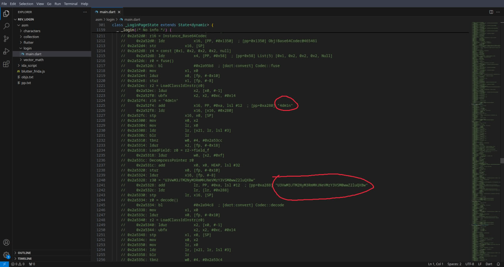
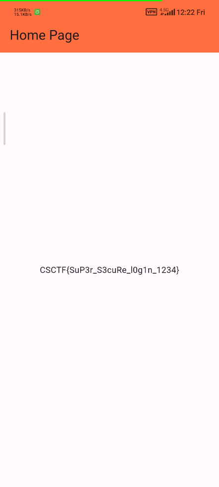

---
tags:
  - CyberSpace
  - CyberSpace-2024
  - Reverse
  - Android
  - Flutter
---

این چالش ریورس اندروید با فلاتر طراحی شده

فلاتر یجورایی آخرین سنگر طراح چلنجه برای این که چلنج سختی طراحی کرده باشه
اما ما به سادگی آب خوردن حلش میکنیم =))

اول از همه با نصب استفاده از این ابزار، به disassembly از فلاتر دست پیدا میکنیم که کارمون رو تا حد زیادی راحت میکنه
[blutter](https://github.com/worawit/blutter)

```bash
python ../tools/blutter/blutter.py login/lib/arm64-v8a rev_login
```

بعد از باز کردن فایل main.dart تو پوشه asm و سر و کله زدن باهاش و خوندن جاهای مختلف به یوزرنیم و پسورد بصورت بیس ۶۴ انکد شده میرسیم



```
4dm1n
U3VwM3JTM2NyM3RmMHJNeVMzY3VSM0wwZ2luQXBw (Sup3rS3cr3tf0rMyS3cuR3L0ginApp)
```

با وارد کردن یوزرنیم و پسورد در اپلیکیشن، فلگ رو دریافت میکنیم



پ.ن: اگه براتون سوال شد که چرا فلگ رو از داخل خود سورس نخوندیم، باید بهتون بگم که میشد، اما چون فلگ از substr پسورد ساخته میشد، یکم اذیتمون میکرد و ترجیح دادیم ساده ترین روش رو برای رایتاپ بنویسیم

??? success "FLAG :triangular_flag_on_post:"
    <div dir="ltr">`CSCTF{SuP3r_S3cuRe_l0g1n_1234}`</div>
---
!!! نویسنده
    [SafaSafari](https://twitter.com/SafaSafari3)

