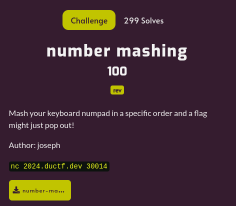

---
tags:
  - DownUnderCTF
  - DownUnderCTF-2024
  - Reverse
---

# چالش number mashing
---

<center>

</center>

فایل باینری ضمیمه‌شده رو به دیکامپایلر میدیم و خروجی رو چک می‌کنیم. با حذف قسمتای غیر مهم و فقط نگه داشتن منطق اصلی برنامه، شبه کد زیر رو می‌بینیم.

```C
undefined8 main(void)

{
  int local_11c;
  int local_118;
  int local_114;
  FILE *local_110;
  setvbuf(_stdout,(char *)0x0,2,0);
  setvbuf(_stdin,(char *)0x0,2,0);
  printf("Give me some numbers: ");
  __isoc99_scanf("%d %d",&local_11c,&local_118);
  if (((local_11c == 0) || (local_118 == 0)) || (local_118 == 1)) {
    puts("Nope!");
    exit(1);
  }
  local_114 = 0;
  if (local_118 != 0) {
    local_114 = local_11c / local_118;
  }
  if (local_114 != local_11c)
    puts("Nope!");
  local_110 = fopen("flag.txt","r");
  fread(&local_108,1,0x100,local_110);
  printf("Correct! %s\n",&local_108);
  return 0;
}
```

در واقع این برنامه، دو عدد int32 را از کاربر ورودی می‌گیرد و چک می‌کند که آیا حاصل تقسیم عدد اول بر عدد دوم، برابر عدد اول می‌شود یا خیر. همچنین برای سخت‌تر کردن کار و جلوگیری از خطای تقسیم صفر، بررسی می‌کنه که صورت برابر 0 و یا مخرج برابر 0 یا 1 نباشه و در غیر این صورت از برنامه خارج می‌شه. از دید ریاضی و در تقسیم اعداد صحیح و با فرض اینکه پاسخ همیشه به سمت 0 گرد می‌شود، به نظر میاد پیدا کردن همچین جفت عددی باید ناممکن باشه. اما نکته اینجاست که ما در دنیای باینری کامپیوترها، تعداد محدودی بیت داریم و از قواعد خاصی برای نمایش اعداد پیروی می‌کنیم. در سیستم complement 2's تعداد اعداد منفی یکی بیشتر از اعداد مثبت است و بنابراین کوچک‌ترین عدد ۳۲ بیتی منفی یعنی 2147483648 - در این سیستم نقیض ندارد و نقیضش خودش است. دلیل این موضوع این است که در نمایش باینری این عدد، با ارزش‌ترین بیت 1 و بقیه بیت‌ها 0 هستند. حال هنگام نقیض کردن، همه بیت‌ها را عکس و سپس عدد را با 1 جمع کنیم، مجددا با همان نمایش عددی می‌رسیم. بنابراین اگر این عدد را در ۱- ضرب و یا بر آن تقسیم کنیم، همچنان حاصل برابر خودش است. با دادن این ورودی‌ها به برنامه ریموت روی سرور، مقدار فلگ با موفقیت به دست می‌آید. 

---
??? success "FLAG :triangular_flag_on_post:"
    <div dir="ltr">`DUCTF{w0w_y0u_just_br0ke_math!!}`</div>


!!! نویسنده
    [Sadegh](https://github.com/sadegh-majidi)

