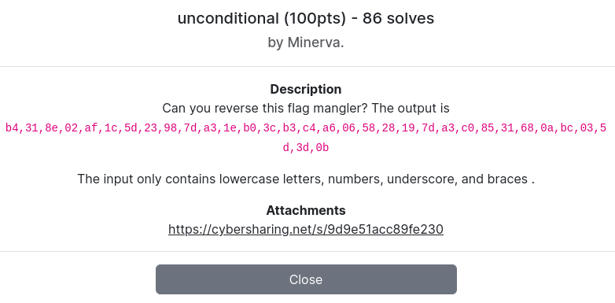

---
tags:
  - ImaginaryCTF
  - ImaginaryCTF-2024
  - Reverse
---

# unconditional
---

<center>

</center>

فایل باینری ضمیمه‌شده رو به دیکامپایلر میدیم و خروجی رو چک می‌کنیم. با حذف قسمتای غیر مهم و فقط نگه داشتن منطق اصلی برنامه، شبه کد زیر رو می‌بینیم.

```C
#include <stdio.h>


char flag[33] = "nothing_here_lmao";
unsigned char table1[6] = { 82, 100, 113, 81, 84, 118 };
unsigned char table2[6] = { 1, 3, 4, 2, 6, 5 };
int counter1;
int counter2;


int iterate(int a1)
{
    lala[39] = 0;
    char v1;
    unsigned char v3;
    char v4;

    v3 = flag[a1];
    v4 = (a1 & 1) != 0; // odd -> True , even -> False
    v1 = v3 > 0x60u && v3 <= 0x7Au;
    flag[a1] = ((((int)v3 >> table2[counter2]) | (v3 << (8 - table2[counter2]))) * v1
                + !v1 * (((v3 << 6) | (v3 >> 2)) ^ table1[counter1]))
               * ((a1 & 1) == 0)
               + ((v3 ^ table1[counter1]) * v1 + !v1 * ((v3 << 2) | (v3 >> 6))) * ((a1 & 1) != 0);
    counter1 = (v4 + counter1) % 6;
    counter2 = (v4 + counter2) % 6;
    printf("%02x,", (unsigned char)flag[a1]);
    return (unsigned int)(a1 + 1);
}


int main()
{
    int v3;
    int v4;
    int v5;
    int v6;
    int v7;
    int v8;
    int v9;
    int v10;
    int v11;
    int v12;
    int v13;
    int v14;
    int v15;
    int v16;
    int v17;
    int v18;
    int v19;
    int v20;
    int v21;
    int v22;
    int v23;
    int v24;
    int v25;
    int v26;
    int v27;
    int v28;
    int v29;
    int v30;
    int v31;
    int v32;
    int v33;
    int v34;

    v3 = iterate(0);
    v4 = iterate(v3);
    v5 = iterate(v4);
    v6 = iterate(v5);
    v7 = iterate(v6);
    v8 = iterate(v7);
    v9 = iterate(v8);
    v10 = iterate(v9);
    v11 = iterate(v10);
    v12 = iterate(v11);
    v13 = iterate(v12);
    v14 = iterate(v13);
    v15 = iterate(v14);
    v16 = iterate(v15);
    v17 = iterate(v16);
    v18 = iterate(v17);
    v19 = iterate(v18);
    v20 = iterate(v19);
    v21 = iterate(v20);
    v22 = iterate(v21);
    v23 = iterate(v22);
    v24 = iterate(v23);
    v25 = iterate(v24);
    v26 = iterate(v25);
    v27 = iterate(v26);
    v28 = iterate(v27);
    v29 = iterate(v28);
    v30 = iterate(v29);
    v31 = iterate(v30);
    v32 = iterate(v31);
    v33 = iterate(v32);
    v34 = iterate(v33);
    iterate(v34);
    return 0;
}
```

این برنامه در واقع به ترتیب روی تک تک حرف‌های فلگ یکسری عمل بیتی انجام میده. این اعمال به این صورت هستند که بسته به اینکه اندیس حرف (مکان حرف در رشته) عددی فرد یا زوج باشه و یا اینکه حرفی بین a تا z باشه و یا خارج از آن از بین حروف 0123456789_{} باشه، مقادیر مختلفی رو محاسبه و اون مقدار را به صورت یک عدد هگزادسیمال دو رقمی به ازای اون حرف نمایش می‌ده. میشه این دسته‌بندی اعمال انجام‌شده رو به صورت شبه‌کد زیر نوشت:

```txt
if index is odd and char is alphabet:
		out(hex(char ^ table1[counter1]))
if index is odd and char is not alphabet:
		out(hex((char << 2) | (char >> 6)))
if index is even and char is alphabet:
		out(hex((char >> table2[counter2]) | (char << (8 - table2[counter2]))))
if index is even and char is not alphabet:
		out(hex(((v3 << 6) | (v3 >> 2)) ^ table1[counter1]))
```

میشه دید که اعمال انجام‌شده منطقا بازگشت‌پذیر هستند. جدای از xor های انجام‌شده که ذاتا بازگشت‌پذیرن، ترکیب اعمال شیفت بیتی و or های انجام‌شده در واقع به این صورت هستند که i بیت کم ارزش را از مقدار اسکی حرف برداشته و قبل از 8 - i بیت پر ارزش قرار می‌دهند و حال آن i بیت پرارزش‌تر هستند. به زبان ساده‌تر این عمل یک شیفت دورانی است. پس باید قابل بازگشت باشند. همچنین توجه میکنم مقدار شمارنده‌های counter فقط در اندیس‌های فرد آپدیت می‌شن و باید در ریورس کردن این رو هم لحاظ کنیم. حالا با این فرایض، یک کد پایتونی می‌نویسیم که معکوس این اعمال را روی رشته هگز خروجی که در صورت سوال اومده از آخر به اول اجرا کنه.

```python
result = 'b4,31,8e,02,af,1c,5d,23,98,7d,a3,1e,b0,3c,b3,c4,a6,06,58,28,19,7d,a3,c0,85,31,68,0a,bc,03,5d,3d,0b'.split(',')
length = len(result)
flag = ''
counter1 = (length // 2) % 6
counter2 = (length // 2) % 6
table1 = [82, 100, 113, 81, 84, 118]
table2 = [1, 3, 4, 2, 6, 5]

def is_alpha(c):
    return c in 'abcdefghijklmnopqrstuvwxyz'

def is_other(c):
    return c in '0123456789_{}'

for i in range(length-1, -1, -1):
    x = int(result[i], 16)

    if i % 2 == 0:
        a1 = chr(((x << table2[counter2]) & 0xFF) | (x >> (8 - table2[counter2])))
        x2 = table1[counter1] ^ x
        a2 = chr(((x2 << 2) & 0xFF) | (x2 >> 6))
        if is_alpha(a1) and (not is_other(a2)):
            flag = a1 + flag
        elif (not is_alpha(a1)) and is_other(a2):
            flag = a2 + flag
        elif is_alpha(a1) and is_other(a2):
            flag = '?' + flag
        else:
            flag = '+' + flag
    else:
        a1 = chr(x ^ table1[counter1])
        a2 = chr(((x << 6) & 0xFF) | (x >> 2))
        if is_alpha(a1) and (not is_other(a2)):
            flag = a1 + flag
        elif (not is_alpha(a1)) and is_other(a2):
            flag = a2 + flag
        elif is_alpha(a1) and is_other(a2):
            flag = '?' + flag
        else:
            flag = '+' + flag

    if i % 2 == 0:
        counter1 = (counter1 - 1) % 6
        counter2 = (counter2 - 1) % 6

print(flag)
```

بعد از ران کردن این کد خروجی زیر به دست می‌آید:
`ictf{m?r3_than_1?way5_t0_c0n7r?l}`
دلیل این که حالت‌هایی مثل ? در این جواب وجود داره اینه که ممکنه در مسیر معکوس، حروفی که بازسازی میشن هم یک حرف الفبایی قابل‌قبول و هم یک عدد یا نماد قابل قبول (طبق صورت سوال) باشند و بنابراین ما علامت سوال گذاشتیم که بعدا با دیباگر به صورت دستی چک کنیم که کدوم از جواب‌ها به یک فلگ منطقی و درست منجر میشه و به کانتکست تعلق بیشتری داره. اول مسیر فقط دو حالت اول شرط‌هارو لحاظ کرده بودم ولی با برخوردن به ارور و فلگ‌های ناخوانا و بعد از دیباگ مشخص شد نیازه که شرایط ۳ و ۴ هم برای مشکلات احتمالی هندل کنم. البته شرط ۴ به خاطر اینکه از لحاظ تئوری اعمال انجام‌شده بازگشت‌پذیر هستن و هیچ موقع به حالتی نمیخوریم که نتونیم یک کاراکتر درست رو بازسازی کنیم، اجرا نمیشه.

نهایتا بعد از انتخاب دستی حروف مناسب برای علامت سوال‌ها به فلگ نهایی می‌رسیم.


---
??? success "FLAG :triangular_flag_on_post:"
    <div dir="ltr">`ictf{m0r3_than_1_way5_t0_c0n7r0l}`</div>


!!! نویسنده
    [Sadegh](https://github.com/sadegh-majidi)

