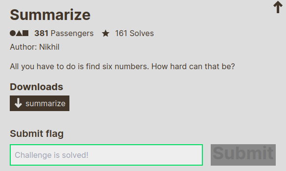

---
tags:
  - UIUCTF
  - UIUCTF-2024
  - Reverse
---

#  چالش Summarize 
---

<center>

</center>

فایل باینری ضمیمه‌شده رو به دیکامپایلر میدیم و خروجی رو چک می‌کنیم. با حذف قسمتای غیر مهم و فقط نگه داشتن منطق اصلی برنامه، شبه کد زیر رو می‌بینیم.

```C
#include <stdio.h>

int main(int a1, char **a2)
{
  unsigned int v4;
  unsigned int v5;
  unsigned int v6;
  unsigned int v7;
  unsigned int v8;
  unsigned int v9;
  char s[56];

  puts("To get the flag, you must correctly enter six 9-digit positive integers: a, b, c, d, e, and f.");
  putchar(10);
  printf("a = ");
  scanf("%d", &v4);
  printf("b = ");
  scanf("%d", &v5);
  printf("c = ");
  scanf("%d", &v6);
  printf("d = ");
  scanf("%d", &v7);
  printf("e = ");
  scanf("%d", &v8);
  printf("f = ");
  scanf("%d", &v9);
  if ( sub_40137B(v4, v5, v6, v7, v8, v9) )
  {
    puts("Correct.");
    sprintf(s, "uiuctf{%x%x%x%x%x%x}", v4, v5, v6, v7, v8, v9);
    puts(s);
  }
  else
  {
    puts("Wrong.");
  }
  return 0LL;
}


char sub_40137B(
        unsigned int a1,
        unsigned int a2,
        unsigned int a3,
        unsigned int a4,
        unsigned int a5,
        unsigned int a6)
{
  unsigned int v7;
  int v8;
  unsigned int v9;
  unsigned int v10
  unsigned int v11;
  unsigned int v12;
  unsigned int v18;
  unsigned int v19;
  unsigned int v20;
  unsigned int v21;
  unsigned int v22;
  unsigned int v23;
  unsigned int v24;
  unsigned int v25;

  if ( a1 <= 0x5F5E100 || a2 <= 0x5F5E100 || a3 <= 0x5F5E100 || a4 <= 0x5F5E100 || a5 <= 0x5F5E100 || a6 <= 0x5F5E100 )
    return 0LL;
  if ( a1 > 0x3B9AC9FF || a2 > 0x3B9AC9FF || a3 > 0x3B9AC9FF || a4 > 0x3B9AC9FF || a5 > 0x3B9AC9FF || a6 > 0x3B9AC9FF )
    return 0LL;
    
  v7 = sub_4016D8(a1, a2);
  v18 = (unsigned int) sub_40163D(v7, a3) % 0x10AE961;
  v19 = (unsigned int) sub_40163D(a1, a2) % 0x1093A1D;
  v8 = sub_4016FE(2u, a2);
  v9 = sub_4016FE(3u, a1);
  v10 = sub_4016D8(v9, v8);
  v20 = v10 % (unsigned int) sub_40174A(a1, a4);
  v11 = sub_40163D(a3, a1);
  v21 = (unsigned int) sub_4017A9(a2, v11) % 0x6E22;
  v22 = (unsigned int) sub_40163D(a2, a4) % a1;
  v12 = sub_40163D(a4, a6);
  v23 = (unsigned int) sub_40174A(a3, v12) % 0x1CE628;
  v24 = (unsigned int) sub_4016D8(a5, a6) % 0x1172502;
  v25 = (unsigned int) sub_40163D(a5, a6) % 0x2E16F83;
  return v18 == 4139449
      && v19 == 9166034
      && v20 == 556569677
      && v21 == 12734
      && v22 == 540591164
      && v23 == 1279714
      && v24 == 17026895
      && v25 == 23769303;
}
```

تا اینجای برنامه، از ما ۶ عدد ۹ رقمی به عنوان ورودی گرفته میشه و  بعدش یک تابعی برای انجام یکسری چک شرطی روی این مقادیر صدا زده میشه. در این تابع اول چک میشه که همه عددا ۹ رقمی باشن حتما و بعدش با صدا زدن یکسری از توابع دیگه و انجام اعمال ریاضی، تعدادی متغیر رو حساب میکنه و نهایتا مقدار اونارو چک میکنه و درست یا نادرست رو برمی‌گردونه. حالا ببینیم این یکسری تابع هر کدوم دارن چکار میکنن:

```C
int sub_40163D(unsigned int a1, unsigned int a2)
{
  unsigned int v5;
  char v6;
  int v7;
  int v8;
  long v9;

  v9 = 0LL;
  v5 = 0;
  v6 = 0;
  while ( a1 || a2 )
  {
    v7 = a1 & 1;
    v8 = a2 & 1;
    a1 >>= 1;
    a2 >>= 1;
    v9 += (v5 ^ v8 ^ v7) << v6;
    v5 = v5 & v7 | v8 & v7 | v5 & v8;
    ++v6;
  }
  return ((unsigned __int64)v5 << v6) + v9;
}
```

اولش به نظر میاد که یکسری عمل بیتی پیچیده در حال انجام هست ولی اگر بیشتر دقت کنیم، این کد در واقع شبیه‌ساز یک مدار adder بیتی هست که با یک full-adder و برای تمامی بیت‌ها عمل جمع رو انجام میده و نهایتا نتیجه این تابع، جمع دو عدد ورودی با رعایت carry در محاسبات هست. برای مطالعه بیشتر درباره اعمال محاسباتی بیتی باینری، می‌تونید از [لینک ۱](https://www.tutorialspoint.com/digital_circuits/digital_arithmetic_circuits.htm) و [لینک ۲](https://pastebin.com/raw/tjZbAkJS) استفاده کنید.

```C
int sub_4016D8(unsigned int a1, int a2)
{
  return sub_40163D(a1, -a2);
}
```
این تابع ورودی دوم رو منفی کرده و بعد اون دو رو به همون تابع قبلی می‌ده. بنابراین عمل تفریق بیتی در این تابع انجام می‌شه.

```C
int sub_4016FE(unsigned int a1, int a2)
{
  unsigned int v4;
  int v5;

  v4 = 0;
  v5 = 0;
  while ( a1 )
  {
    v4 += (a1 & 1) * (a2 << v5);
    a1 >>= 1;
    ++v5;
  }
  return v4;
}
```
این تابع عمل ضرب بیتی رو به روش shift & add برای دو عدد انجام می‌ده.

```C
int sub_40174A(unsigned int a1, unsigned int a2)
{
  unsigned int v5;
  int v6;
  int v7;
  int v8;

  v5 = 0;
  v6 = 0;
  while ( a1 || a2 )
  {
    v7 = a1 & 1;
    v8 = a2 & 1;
    a1 >>= 1;
    a2 >>= 1;
    v5 += (v8 ^ v7) << v6++;
  }
  return v5;
}
```
این تابع دو عدد رو به صورت بیت به بیت xor می‌کنه.

```C
int sub_4017A9(unsigned int a1, unsigned int a2)
{
  unsigned int v5;
  int v6;
  int v7;
  int v8;

  v5 = 0;
  v6 = 0;
  while ( a1 || a2 )
  {
    v7 = a1 & 1;
    v8 = a2 & 1;
    a1 >>= 1;
    a2 >>= 1;
    v5 += (v8 & v7) << v6++;
  }
  return v5;
}
```
این تابع هم دو عدد رو به صورت بیت به بیت And می‌کنه.

حالا با این دانش میریم سراغ جایگذاری این اعمال به جای اسم تابع‌ها و تشکیل دستگاه معادلات و مجهولاتی که باید حل کنیم تا به اعداد مورد نظر برسیم:
```txt
((a1 - a2) + a3) % 0x10AE961 == 4139449
(a1 + a2) % 0x1093A1D == 9166034
(3 * a1 - 2 * a2) % (a1 ^ a4) == 556569677
(a2 & (a3 + a1)) % 0x6E22 == 12734
(a2 + a4) % a1 == 540591164
(a3 ^ (a4 + a6)) % 0x1CE628 == 1279714
(a5 - a6) % 0x1172502 == 17026895
(a5 + a6) % 0x2E16F83 == 23769303
```
برای حل این دستگاه نسبتا پیچیده به جای روش های دستی، میایم از یک کتابخونه پایتون به نام [z3](https://ericpony.github.io/z3py-tutorial/guide-examples.htm) که مخصوص حل معادلات و پیدا کردن مجموعه‌ای از assignment ها که یک سیستم خطی از شرایط رو ارضا کنه هست، استفاده می‌کنیم و اسکریپت زیر رو برای حل می‌نویسیم.

```python
from z3 import *

a1 = BitVec('a1', 64)
a2 = BitVec('a2', 64)
a3 = BitVec('a3', 64)
a4 = BitVec('a4', 64)
a5 = BitVec('a5', 64)
a6 = BitVec('a6', 64)

s = Solver()

s.add(a1 >= 100000000, a1 <= 999999999)
s.add(a2 >= 100000000, a2 <= 999999999)
s.add(a3 >= 100000000, a3 <= 999999999)
s.add(a4 >= 100000000, a4 <= 999999999)
s.add(a5 >= 100000000, a5 <= 999999999)
s.add(a6 >= 100000000, a6 <= 999999999)

s.add(((a1 - a2) + a3) % 0x10AE961 == 4139449)
s.add((a1 + a2) % 0x1093A1D == 9166034)
s.add((3 * a1 - 2 * a2) % (a1 ^ a4) == 556569677)
s.add((a2 & (a3 + a1)) % 0x6E22 == 12734)
s.add((a2 + a4) % a1 == 540591164)
s.add((a3 ^ (a4 + a6)) % 0x1CE628 == 1279714)
s.add((a5 - a6) % 0x1172502 == 17026895)
s.add((a5 + a6) % 0x2E16F83 == 23769303)

if s.check() == sat:
    model = s.model()
    print("Solution found:")
    print(f"a1 = {model[a1]}")
    print(f"a2 = {model[a2]}")
    print(f"a3 = {model[a3]}")
    print(f"a4 = {model[a4]}")
    print(f"a5 = {model[a5]}")
    print(f"a6 = {model[a6]}")
else:
    print("No")
```

بعد از ران کردن این کد خروجی زیر به دست می‌آید:
```txt
Solution found:
a1 = 705965527
a2 = 780663452
a3 = 341222189
a4 = 465893239
a5 = 966221407
a6 = 217433792
```
با اجرا و دادن این ورودی‌ها به فایل باینری، می‌بینیم که برنامه فلگ رو برای ما چاپ می‌کنه.

---
??? success "FLAG :triangular_flag_on_post:"
    <div dir="ltr">`uiuctf{2a142dd72e87fa9c1456a32d1bc4f77739975e5fcf5c6c0}`</div>


!!! نویسنده
    [Sadegh](https://github.com/sadegh-majidi)

