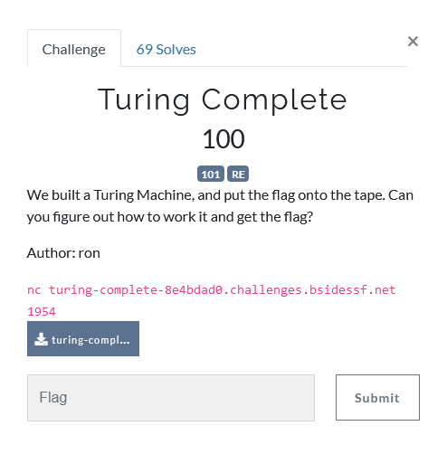

---
tags:
  - BSidesSF
  - BSidesSF 2024
  - Reverse  
---

# چالش Turing Complete [:material-cloud-download-outline:](https://github.com/BSidesSF/ctf-2024-release/blob/main/turing-complete/challenge/src/turing-complete)


<center>
 
</center>


## نگاه اولیه به سوال


در این سوال به ما یک فایل با نام `turing-complete` داده شده بود.
در ابتدا برای اینکه بفهمیم با چه چیزی روبرو هستیم دستور `file` رو روش اجرا میکنیم

```bash
$ file turing-complete
turing-complete: ELF 32-bit LSB pie executable, Intel 80386, version 1 (SYSV), dynamically linked, interpreter /lib/ld-linux.so.2, BuildID[sha1]=4ee6521fff97311d5d2736f93b082d22538be8f3, for GNU/Linux 3.2.0, not stripped
```
خب بهمون یک فایل باینری 32بیتی داده شده , و طبق معمول در ابتدا میریم سراغ تحلیل استاتیک


## تحلیل استاتیک


به کمک سایت دوست داشتنی [dogbolt](https://dogbolt.org/?id=5d7f6457-9ce2-4dcf-87bf-dabbf6730db0#Hex-Rays=247) سعی میکنیم برنامه رو دیکامپایل کنیم و بفهمیم برنامه مدنظر چه کاری انجام میده.  
معمولا طبق تجربه Hex-Rays دیکامپایل های بهتری میده، در نتیجه بیاید ابتدا به خروجی اون نگاهی بندازیم:


??? Note "خروجی دیکامپایلر Hex-Rays"
    ```c
    int r()
    {
      int v1;
      do
      {
        v1 = getchar();
        if ( v1 == -1 || !v1 || v1 == 113 )
          return 2;
        if ( v1 == 48 )
          return 0;
      }
      while ( v1 != 49 );
      return 1;
    }

    int __cdecl main(int argc, const char **argv, const char **envp)
    {
      size_t v3; // eax
      int v4; // esi
      int v5; // esi
      int v6; // esi
      int v7; // esi
      int v8; // esi
      int v9; // esi
      int v10; // esi
      char s[128]; // [esp+1h] [ebp-A3h] BYREF
      unsigned __int8 v13; // [esp+81h] [ebp-23h]
      char v14; // [esp+82h] [ebp-22h]
      char v15; // [esp+83h] [ebp-21h]
      FILE *stream; // [esp+84h] [ebp-20h]
      unsigned __int8 *v17; // [esp+88h] [ebp-1Ch]
      int *p_argc; // [esp+98h] [ebp-Ch]

      p_argc = &argc;
      setvbuf(stdout, 0, 2, 0);
      setvbuf(stderr, 0, 2, 0);
      strcpy(s, "Hi, thanks for reading me! The flag is: ");
      v17 = (unsigned __int8 *)s;
      stream = fopen("flag.txt", "r");
      if ( !stream )
      {
        puts("Flag file not found!");
        exit(1);
      }
      v3 = strlen(s);
      fgets(&s[v3], 32, stream);
      fclose(stream);
      puts("01010000 01110010 01101111 01100111 01110010 01100001 01101101 00100000 01101101 01100101 00100001");
      while ( 1 )
      {
        v15 = r();
        if ( v15 == 2 )
          break;
        v14 = r();
        if ( v14 == 2 )
          break;
        if ( v15 || v14 )
        {
          if ( v15 || v14 != 1 )
          {
            if ( v15 != 1 || v14 )
            {
              if ( v15 == 1 && v14 == 1 )
              {
                v4 = (unsigned __int8)r() << 7;
                v5 = ((unsigned __int8)r() << 6) | v4;
                v6 = (32 * (unsigned __int8)r()) | v5;
                v7 = (16 * (unsigned __int8)r()) | v6;
                v8 = (8 * (unsigned __int8)r()) | v7;
                v9 = (4 * (unsigned __int8)r()) | v8;
                v10 = (2 * (unsigned __int8)r()) | v9;
                v13 = v10 | r();
                *v17 = v13;
              }
            }
            else
            {
              printf("%08b", *v17);
            }
          }
          else
          {
            --v17;
          }
        }
        else
        {
          ++v17;
        }
        fflush(stdout);
      }
      fflush(stdout);
      return 0;
    }
    ```


با نگاهی اجمالی پی میبریم که پوینتر `v17` به رشته‌ای حاوی فلگ اشاره میکند و این برنامه با گرفتن دستوراتی از کاربر عمل خوندن و نوشتن و ... روی پوینتر انجام میدهد  
- `00`:  آدرس ذخیره شده در پوینتر یکی زیاد میشود(میشه گفت به خونه بعدی اون حافظه اشاره میکنه)  
- `01`: آدرس ذخیره شده در پوینتر رو یکی کم میکنه  
- `10`: نمایش باینری مقدار ذخیره شده در ادرس ذخیره شده در پوینتر  
- `11`: نوشتن در آدرس ذخیره شده در پوینتر  


## حل چالش

خب حالا که با روند برنامه اشنا شدیم کافیست حرف حرف بخوانیم و پوینتر را به جلو ببریم تا فلگ برایمان نمایش داده شود.


```python
from pwn import *

context.log_level = "critical"
# ncat --proxy-type socks5 --proxy 127.0.0.1:2080 turing-complete-8e4bdad0.challenges.bsidessf.net 1954
context.proxy = (socks.SOCKS4, "127.0.0.1", 2080)

RIGHT = '00'
LEFT  = '01'
PRINT = '10'
WRITE = '11'

p = remote(*'turing-complete-8e4bdad0.challenges.bsidessf.net 1954'.split())
p.sendline(((PRINT+RIGHT)*60).encode())

flag = p.clean(2).split()[-1]
for i in range(0, len(flag), 8):
    print(chr(int(flag[i:i+8], 2)), end='')
```


---
??? success "FLAG :triangular_flag_on_post:"
    <div dir="ltr">`CTF{rip-1912-1954}`</div>


!!! نویسنده
    [mheidari98](https://github.com/mheidari98)


