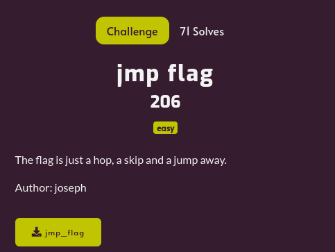

---
tags:
  - DownUnderCTF
  - DownUnderCTF-2024
  - Reverse
---

# چالش jmp flag
---

<center>

</center>

فایل باینری ضمیمه‌شده رو اول یکسری بررسی ابتدایی مثل strings و file و ... می‌کنیم  و نتیجه خاصی نداره. در مرحله بعد خروجی decompiler رو برای این باینری از hex ray با استفاده از این سایت می‌گیریم. بررسی کلی نشون میده که  این برنامه یک ورودی ۶۴ کاراکتری از کاربر دریافت می‌کنه و بسته به هر کاراکتر ورودی، تابع‌های مختلفی رو صدا میزنه و مقدار یک متغیر رو در دیتا سگمنت به طور مداوم تغییر می‌ده. و در نهایت چک میکنه که اگر مقدار اون متغیر برابر صفر بود جواب ما درست بوده و ورودی همون فلگ سوال هست. برخی قسمت‌های مهم کد در زیر آورده شده.

```C
__int64 qword_9010 = -1LL;


_BOOL8 sub_1200()
{
  return qword_9010 == 0;
}

void __fastcall sub_1280(char a1)
{
  __asm { jmp     rax }
}

void sub_2300()
{
  qword_9010 = -1;
}

__int64 sub_5000()
{
  __int64 result; // rax

  result = qword_9010 & 0x77FFD7ECCEEFDFFELL;
  if ( (qword_9010 & 0x77FFD7ECCEEFDFFELL) == 0 )
  {
    qword_9010 ^= 0x80000000000uLL;
    return qword_9010;
  }
  return result;
}

__int64 __fastcall main(int a1, char **a2, char **a3)
{
  int i; // [rsp+Ch] [rbp-54h]
  __int64 v5[8]; // [rsp+10h] [rbp-50h] BYREF
  char v6; // [rsp+50h] [rbp-10h]
  unsigned __int64 v7; // [rsp+58h] [rbp-8h]

  v7 = __readfsqword(0x28u);
  memset(v5, 0, sizeof(v5));
  v6 = 0;
  __isoc99_scanf("%64s", v5);
  for ( i = 0; i <= 63; ++i )
    sub_1280(*((_BYTE *)v5 + i));
  if ( sub_1200() )
    printf("Correct! DUCTF{%s}\n", (const char *)v5);
  else
    puts("Incorrect!");
  return 0LL;
}
```

خروجی دیکامپایلر برای تابع sub_1280 کمی غیر قابل‌فهم هست. با مرور اسمبلی این تابع متوجه می‌شیم که این تابع بسته به اینکه مقدار اسکی کاراکتر ورودی چی هست، یک آفست ولید که آدرس شروع یک تابع هست را تولید می‌کند و اونو کال می‌کنه. 

<center>

</center>

همچنین اگه به آدرس تابع‌ها توجه کنین میبینین که یک نظم خیلی خاصی دارن و در فاصله‌های برابر قرار گرفتن. اگر این تابع‌ها رو با جدول اسکی تطبیق بدین، می‌بینید که اکثر این توابع مقدار اون متغیر qword_9010 رو برابر ۱- قرار می‌دن و فقط توابع متناظر با کاراکتر‌های a تا z و A تا Z و 0 تا 1 و ! و ? کار متفاوتی رو انجام میدن. اگر باز هم بیشتر به داخل این تابع‌ها نگاه کنید، می‌بینید که هر کدوم (به جز تابع متناظر با t) اگر یک شرط خاص روی مقدار qword_9010 برقرار باشه، یک بیت خاص ازون عدد ۶۴ بیتی رو تبدیل به 0 می‌کنه. چون مقدار این عدد اولش ۱- هست و تمام بیت‌هاش 1 عه و هر کدوم ازین توابع فقط یک بیت خاص رو 0 می‌کنن و ما نیاز داریم آخر برنامه همه بیت‌های عدد 0 باشه، پس هر کدوم ازین تابع‌ها دقیقا یک بار و با یک ترتیب خاصی کال بشن تا شرط‌های همدیگر رو رعایت کنن و در نهایت عدد رو صفر کنن.با نگاه ساده و یا با اسکریپت میتونیم این شرط‌هارو به ترتیب دربیاریم و در نهایت ورودی مناسب رو پیدا کنیم. 

---
??? success "FLAG :triangular_flag_on_post:"
    <div dir="ltr">`DUCTF{tAb1HFK5h3ZgEX7UTMQfsivcPOaJ?nRy8jrYLVB9Ilempw6xWq2zC0d!SDukG4No}`</div>


!!! نویسنده
    [Sadegh](https://github.com/sadegh-majidi)

