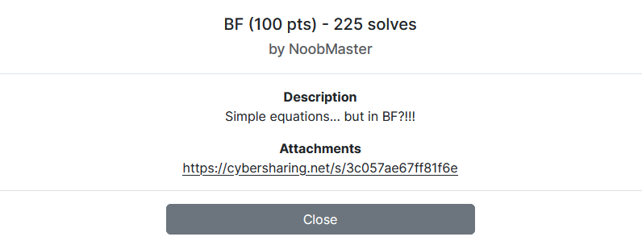

---
tags:
  - ImaginaryCTF
  - ImaginaryCTF 2024
  - Reverse
  - brainfuck
---

# چالش BF [:material-cloud-download-outline:](https://github.com/ImaginaryCTF/ImaginaryCTF-2024-Challenges-Public/blob/main/Reversing/bf/challenge/bf.txt)


<center>
 
</center>


## آشنایی با مساله


این سوال به ما فایل `bf.txt` داده شده است. بیایید نگاهی به محتویات فایل بیندازیم


```raw title="bf.txt" linenums="1"
,>>+++++++++++[<+++>-]<[-<+>]<------------------------------------------------------------------------------------------------------------------------------------------[><],>>++++++++++[<+++++++>-]<[-<+>]<-------------------------------------------------------------------------------------------------------------------------------------------------------------------------[><],>>+++++++++++[<++++>-]<[-<+>]<----------------------------------------------------------------------------------------------------------------------------------------------------------------[><],>>++++++++++[<+++++++>-]<[-<+>]<----------------------------------------------------------------------------------------------------------------------------------------------------------------------------[><],>>+++++++++++++++++[<+++>-]<[-<+>]<------------------------------------------------------------------------------------------------------------------------------------------------------------------------------[><],>>++++++++[<++++++++>-]<[-<+>]<-----------------------------------------------------------------------------------------------------------------[><],>>+++++++++++++[<+++++>-]<[-<+>]<----------------------------------------------------------------------------------------------------------------------------------------------------------------[><],>>+++++++++++[<++++>-]<[-<+>]<----------------------------------------------------------------------------------------------------------------------------------------------------[><],>>++++++[<+++++>-]<[-<+>]<----------------------------------------------------------------------------------[><],>>+++++++++++[<+++++>-]<[-<+>]<---------------------------------------------------------------------------------------------------------------------------------------------------------------------------[><],>>+++++++++[<+++++++>-]<[-<+>]<------------------------------------------------------------------------------------------------------------------[><],>>+++++++++++[<+++>-]<[-<+>]<--------------------------------------------------------------------------------------------------------------------------------[><],>>+++++++++++++++++[<+++>-]<[-<+>]<------------------------------------------------------------------------------------------------------[><],>>+++++++++++[<+++++>-]<[-<+>]<--------------------------------------------------------------------------------------------------------------------------------------------------------------------------[><],>>++++++++[<+++++++>-]<[-<+>]<--------------------------------------------------------------------------------------------------------[><],>>++++++[<+++++>-]<[-<+>]<------------------------------------------------------------------------------------------------------------------------------------------[><],>>++++++++[<+++++++>-]<[-<+>]<------------------------------------------------------------------------------------------------------------[><],>>+++++++++[<+++++++>-]<[-<+>]<-----------------------------------------------------------------------------------------------------------------------------------------------------------------------------[><],>>++++++[<+++++>-]<[-<+>]<-------------------------------------------------------------------------------------------------------------------------------------[><],>>+++++++++[<+++++>-]<[-<+>]<--------------------------------------------------------------------------------------------------[><],>>++++++++++[<+++++>-]<[-<+>]<-------------------------------------------------------------------------------------------------------------------------------------------------[><],>>++++++++++[<+++++++>-]<[-<+>]<-----------------------------------------------------------------------------------------------------------------------------[><],>>++++++++++[<+++++++>-]<[-<+>]<--------------------------------------------------------------------------------------------------------------------------------------------------------------------------[><],>>++++++++++[<++++++>-]<[-<+>]<----------------------------------------------------------------------------------------------------------------[><],>>+++++++++++++++++[<+++>-]<[-<+>]<---------------------------------------------------------------------------------------------------------------------------------------------------------[><],>>+++++++++++[<++++>-]<[-<+>]<-----------------------------------------------------------------------------------------------[><],>>+++++++++++++++++++++++[<++>-]<[-<+>]<-----------------------------------------------------------------------------------------------------------------------------------------------[><],>>+++++++++++++++++++++++[<+++>-]<[-<+>]<----------------------------------------------------------------------------------------------------------------------[><],>>+++++++++++++++++++[<+++>-]<[-<+>]<-----------------------------------------------------------------------------------------------------------------------------------------------------------[><],>>++++++[<+++++>-]<[-<+>]<-----------------------------------------------------------------------------------------------------------------------------------------------------------[><]
```

خب بخاطر آشنایی قبلی با زبان `brainfuck` و اسم سوال و محتویات فایل چالش، درجا پی میبریم که با یک کد به زبان `brainfuck` روبرو هستیم.


??? Info "زبان برنامه نویسی Brainfuck"
    یک زبان برنامه‌نویسی رمزی است که دستورهای بسیار کمی دارد و با هدف طراحی یک زبان برنامه‌نویسی با کوچک‌ترین کامپایلر ممکن طراحی شده است.  
    همان‌گونه که از نام این زبان برمی‌آید، فهم دستورهای برین‌فاک عمدتاً دشوار است. در ادامه لیست دستورات این زبان به همراه توضیحات مختصری نوشته شده است.   

    <center>

    | Description                     | Command |
    |:--------------------------------|:-------:|
    | Pointer value - 1               |    -    |
    | Pointer value + 1               |    +    |
    | Pointer position - 1            |    <    |
    | Pointer position + 1            |    >    |
    | Loop while pointer > 0          |    ]    |
    | End loop                        |    ]    |
    | Store input in pointer position |    ,    |
    | Output ASCII value of pointer   |    .    |

    </center>

    برای آشنایی بیشتر با این زبان خواندن 
    [این مطلب](https://fa.wikipedia.org/wiki/%D8%A8%D8%B1%DB%8C%D9%86%E2%80%8C%D9%81%D8%A7%DA%A9)
    و 
    [این مطلب](https://gist.github.com/roachhd/dce54bec8ba55fb17d3a)
    میتواند مفید باشد.


## راه حل

در ابتدا سعی کردم با بعضی از مفسرهای آنلاین این زبان نظیر سایت 
[dcode.fr](https://www.dcode.fr/brainfuck-language)
 ، کد رو اجرا کنم تا ببینم خروجی خاصی بم میده یا نه، که متاسفانه خروجی خاصی بهم نمایش داده نشد.  
در ادامه با دستورات این زبان بیشتر آشنا شدم تا ببینم این کد داره چیکار انجام میده

کد داده شده در هر گام میاد یک ورودی از کاربر میگیره(`,`) و میریزه تو خونه اول استکمون  
در ادامه میاد یکسری تفریق رو خونه اول استکمون اعمال میکنه و درصورتیکه مقدار خونه اول استکمون برابر `0` نشه، تو لوپ بی نهایت(`[><]`) میوفتیم.

پس یجورایی این برنامه حروف فلگ رو از ما میگیره و درصورتیکه درست حدس زده باشیم، حروف بعدی رو بررسی میکنه


در ادامه من یک مفسر برای این زبان با پایتون نوشتم و کد برنامه رو به بخش هایی که هر بخش یک حرف رو بررسی میکنه تقسیم کردم. ( هرجا لوپ بینهایت(`[><]`) بود یعنی قبلش داشته یک حرف رو بررسی میکرده و براساس اون رشته رو تقسیم بندی کردم)   
حال هر بخش رو به مفسرم دادم درحالیکه مقدار اولیه خونه های استکم `0` هستش، به این ترتیب میتونم پی ببرم چه میزان از خونه اول استکم کم شده و من باید چ حرفی بدم تا تو لوپ بی نهایت نیوفته  

کد نهایی راه حل بصورت زیر خواهد بود:


```python title="solve.py" linenums="1"
def runBF(code):
    stack, loop = [], {}
    for i, cmd in enumerate(code):
        if cmd == '[':
            stack.append(i)
        if cmd == ']':
            start = stack.pop()
            loop[start], loop[i] = i, start
    
    pointer, memory = 0, [0] * 30000
    i = 0
    while i < len(code):
        match code[i]:
            case '>':
                pointer += 1
            case '<':
                pointer -= 1
            case '+':
                memory[pointer] = (memory[pointer] + 1) % 256
            case '-':
                memory[pointer] = (memory[pointer] - 1) % 256
            case '.':
                print(chr(memory[pointer]))
            case ',':
                memory[pointer] = ord(input('input: ')[0])  # ord(sys.stdin.read(1))
            case '[':
                if not memory[pointer]: i = loop[i]
            case ']':
                if memory[pointer]: i = loop[i]
        i += 1
    return memory[0]

code = open('bf.txt').read()
for line in code.split('[><]'):
    print(chr(256-runBF(line[1:])), end='')
```

دو سایت زیر نظیر برای حل این مساله میتوانند کمک کننده باشند  


- [brainfuck visualizer](https://ashupk.github.io/Brainfuck/brainfuck-visualizer-master)
- [brainfuck debugger](https://bxt.gitlab.io/brainfuck-debugger)


---
??? success "FLAG :triangular_flag_on_post:"
    <div dir="ltr">`ictf{1_h4t3_3s0l4ng5_7d4f3a1b}`</div>


!!! نویسنده
    [mheidari98](https://github.com/mheidari98)


