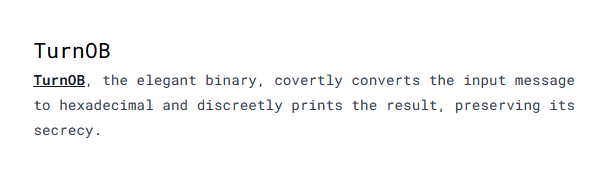

---
tags:
  - SnappCTF
  - SnappCTF-2024
  - Reverse  
---


# چالش TurnOB

<center> 

</center>

## نگاه اولیه به سوال

در این سوال به ما دو فایل داده شده. یک متن رمز شده فلگ و یک فایل باینری رمزکننده که طبق گفته سوال ظاهرا از کاربر ورودی میگیره و رمز شدش رو برامون پرینت میکنه.
```bash
> file *
flag.enc: ASCII text, with no line terminators
turnob:   ELF 64-bit LSB pie executable, x86-64, version 1 (SYSV), dynamically linked, interpreter /lib64/ld-linux-x86-64.so.2, BuildID[sha1]=60dbfb0af3f9c3f987d055cfc11f6da40cdbcf75, for GNU/Linux 3.2.0, stripped

> cat flag.enc
5c:1b:72:35:35:64:5c:6d:95:ef:69:a6:d6:09:f8:6d:bc:9d:f8:99:16:0e:d5:f8:16:f0:7a:a1:d2:09:aa:f8:a2:bb:f8:8c:d2:7e:a7:%
```

## روش حل
با چندبار اجرا کردن برنامه و دادن ورودی های مختلف میشه مشاهده کرد که هر کارکتر ورودی کاربر، به یک رشته منحصر به فرد مپ شده. 
برای مثال در دستور زیر مشاهده میکنیم که حرف `a` به رشته `12`، حرف `b` به رشته `1f` و حرف `c` به رشته `2c` انکد میشن.
```bash
> echo -n 'abc' | ./turnob
12:1f:2c:%
```

در ادامه کافیه یک اسکریپت پایتونی بنویسیم و دیکشنری از تمام کارکترها و متن رمز متناظرشون بسازیم و متن رمز شده فلگ رو رمزگشایی کنیم و به فلگ برسیم

```py
from string import printable
from subprocess import Popen, PIPE, STDOUT

p = Popen(['./turnob'], stdout=PIPE, stdin=PIPE, stderr=STDOUT)
ans = p.communicate(input=printable.encode())[0].decode()


d = {j:i for i, j in zip(printable, ans.split(':'))}

with open("flag.enc") as f:
    s = f.read()

for i in s.split(':')[:-1]:
    print(d[i], end='')
```


---
??? success "FLAG :triangular_flag_on_post:"
    <div dir="ltr">`SNAPP{Sh0rTE5t_h3X_DuMp_u7il!tY_1n_C!}`</div>


!!! نویسنگان
    [mheidari98](https://github.com/mheidari98)
