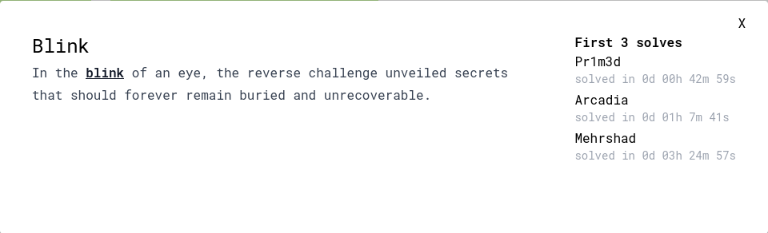
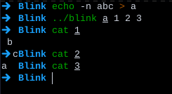
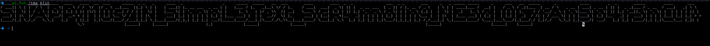

---
tags:
  - SnappCTF
  - SnappCTF-2023
  - Reverse
---



با این که این چالش تو دسته بندی ریورسه، اما خو کی حال داره کاکو؟ :joy:

فقط تیکه اولش رو ریورس کردیم و فهمیدیم که یه ورودی میگیره و یه خروجی

یه فایل سمپل ساختیم و طبق تصویر فهمیدیم این بلاگرفته داره چیکار میکنه



```python linenums="1"
import os
for i in os.scandir('/tmp/Blink'):
    print()
    print(open("/tmp/Blink/" + i.name, 'r').read().replace('\n', ''), end='')
```

بعد با این اسکریپت میتونیم این فایلا رو زیر هم چاپ کنیم و در نهایت فلگ ساخته میشه


---
!!! نویسنده
    [SafaSafari](https://twitter.com/SafaSafari3)$~~~~~~~~~~~~~~~~~~~~~~~~~~~~~~~~~~~~~~~~~~~~~~~~~~~~~~~~~~~~~~~~~~~~~~~~~~~~~~~~~~~~~~~~~~~~~~~~~~~~~~~~~~~~~~~~~~~~~~~~~~~$تاریخ نگارش ۱۴۰۲/۱۲/۴