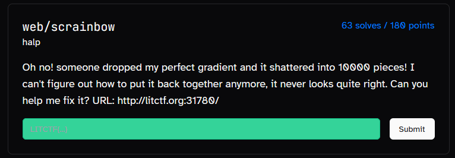
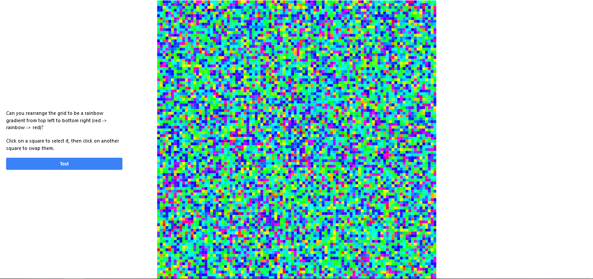
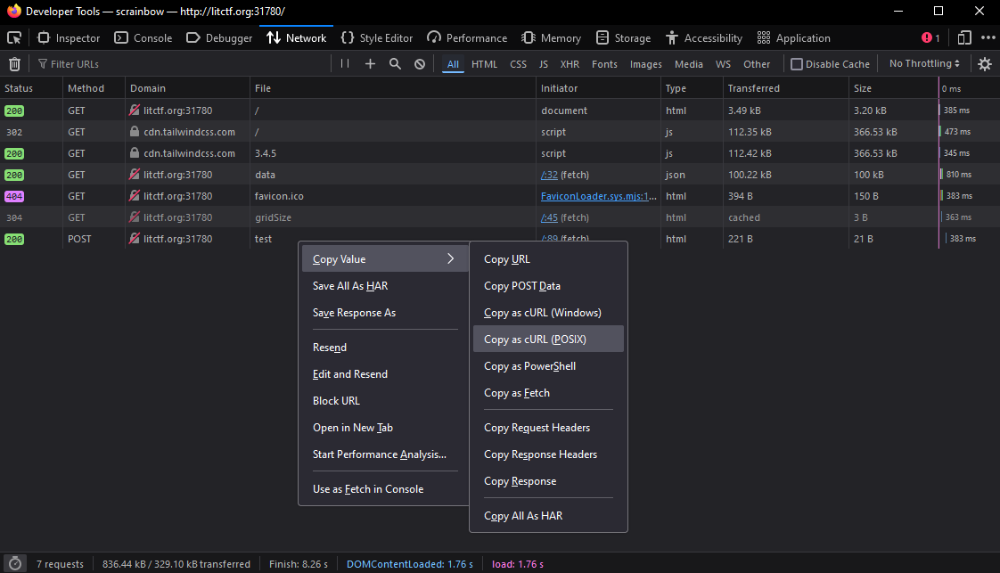
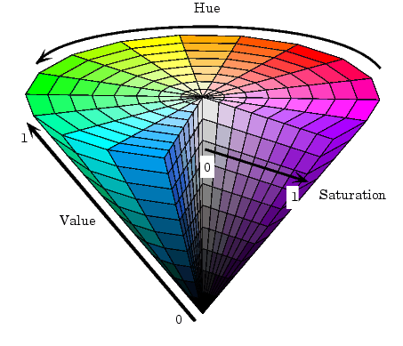
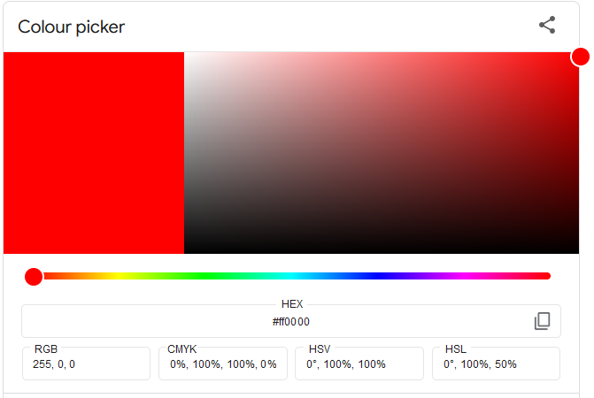

---
tags:
  - LITCTF
  - LITCTF-2024
  - Web
  - programming
---

# چالش scrainbow

<center>
 
</center>

## آشنایی با مساله

در این سوال به ما یک 
[آدرس](http://litctf.org:31780/)
داده شده است که وقتی وارد آدرس داده شده میشویم، صفحه زیر برای ما نمایش داده میشود:


<center>
 
</center>

!!! info ""
    <div dir="ltr" markdown>
    Can you rearrange the grid to be a rainbow gradient from top left to bottom right (red -> rainbow -> red)?  
    Click on a square to select it, then click on another square to swap them. 
    </div>

این سوال بیشتر مهارت های برنامه نویسی مورد نیاز هستش تا دانش وب و شاید تو دسته متفرقه مناسب تر بود قرار بگیره، ولی به هرحال  

تو سوال از ما خواسته شده تا روی مربع های رنگی کلیک کنیم و جابجاشون کنیم تا ترتیب رنگ، رنگین کمانی از بالا سمت چپ به پایین سمت راست قرار بگیرن.

<figure markdown="span">
  
  <figcaption>ترتیب رنگ رنگین کمانی</figcaption>
</figure>


## مسیر حل مساله

در ابتدا برای اینکه ببینیم چه پکت هایی بین ما و سرور رد و بدل میشه، اومدیم از بخش `Web Developer Tools` مرورگرمون، سربرگ `Network` را باز کردیم.(در فایرفاکس کافیست میانبر `Ctrl` + `Shift` + `E` را فشار دهید)  


متوجه میشویم برای دریافت رنگ خانه های این مربع `100*100`، یک درخواست به مسیر `data` زده میشود و یک آرایه یک بعدی به سایز `10,000` دریافت میشود .  

<center>
 
</center>

کافیست روی درخواست ارسال شده راست کلیک کنید، سپس از بخش `Copy Value` گزینه `Copy as cURL (POSIX)` را انتخاب کرده و با استفاده از سایت
[curlconverter](https://curlconverter.com)
درخواست `curl` را به `requests` پایتون تبدیل میکنیم.

```py
import requests

r = requests.get("http://litctf.org:31780/data").json()
# ['#00ffba', '#05ff00', ..., '#c400ff', '#fa00ff']
```


همچنین متوجه میشویم با جابجایی خانه‌های اول سطر اول و دوم درخواست زیر ارسال میشود
```py
import requests

json_data = {
    'data': [
        [0, 100]
    ]
}
requests.post('http://litctf.org:31780/test', json=json_data).text
# 'Incorrect! try again!'
```

???+ note "توجه"
    شماره خانه های جابجا شده، ارسال میشود.  
    خانه اول سطر اول صفرمین بلوک و خانه اول سطر دوم صدمین بلوک هستش.

---

در ادامه با اندکی جستجو پی بردیم برای مرتب سازی این خانه ها به ترتیب رنگ رنگین کمانی، میتوان آنها را از فرمت
[RGB](https://fa.wikipedia.org/wiki/%D9%85%D8%AF%D9%84_%D8%B1%D9%86%DA%AF%DB%8C_%D8%A2%D8%B1%D8%AC%DB%8C%E2%80%8C%D8%A8%DB%8C)
 به 
[HSV](https://fa.wikipedia.org/wiki/%D8%A7%DA%86%E2%80%8C%D8%A7%D8%B3%E2%80%8C%D8%A7%D9%84_%D9%88_%D8%A7%DA%86%E2%80%8C%D8%A7%D8%B3%E2%80%8C%D9%88%DB%8C)
 تبدیل کنیم و بر اساس مقدار `hue` مرتبشان کنیم.


<div class="grid cards" markdown>

- 
- <figure markdown="span"><figcaption>ابزار Colour picker گوگل<figcaption></figure>

</div>

## کد نهایی

=== "کد حل"
    ```py
    import json
    import requests
    import colorsys
    import numpy as np

    def rgb_to_hsv(rgb):
        r, g, b = int(rgb[1:3],16), int(rgb[3:5],16), int(rgb[5:7],16)
        return colorsys.rgb_to_hsv(r/255.0, g/255.0, b/255.0)

    colors = np.array(requests.get("http://litctf.org:31780/data").json())
    sorted_color = sorted(colors, key=lambda x: rgb_to_hsv(x)[0])

    n = 100
    index = 0
    sol = np.zeros((100, 100), dtype=object)
    for s in range(2*n-1):
        for i in range(max(0, s-n+1), min(s+1, n)):
            sol[i][s-i] = sorted_color[index]
            index += 1

    data = []
    for i, j in np.ndindex((100, 100)):
        cur = 100*i+j
        if colors[cur] == sol[i][j]:
            continue
        for idx in np.where(colors == sol[i][j])[0]:
            if colors[idx] != sol[idx//100][idx%100]:
                break
        else:
            print(f'Nooo @ [{i}, {j}]')
        data.append([cur, int(idx)])
        colors[cur], colors[idx] = colors[idx], colors[cur]

    requests.post('http://litctf.org:31780/test', json={'data': data}).text
    ```

=== "ویدئو اجرا کد"
    <center>
    <video width="480" controls>
        <source src="../asset/scrainbow.mp4" type="video/mp4">
        Your browser does not support the video tag.
    </video>
    </center>


---
??? success "FLAG :triangular_flag_on_post:"
    <div dir="ltr">`LITCTF{yAy_y0u_fixed_e9DS93a}`</div>


!!! نویسنده
    [mheidari98](https://github.com/mheidari98)

