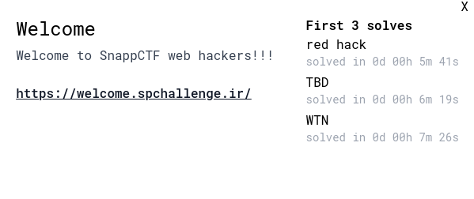
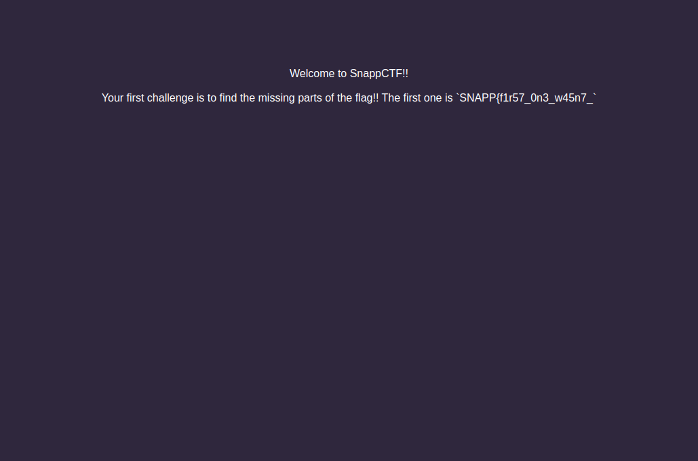

---
tags:
  - SnappCTF
  - SnappCTF-2024
  - HTTP
  - Web
---


<h1 dir="ltr">Welcome</h1>

برای حل این چالش به ما یه آدرس وب دادن

<center>



</center>

خب بعد از باز کردن آدرس تو وبسایت با این صفحه روبرو میشویم
<center>



</center>

برای حل این چالش ما باید دنبال بخش های مختلف فلگ بگردیم ، که بخش اولش تو صفحه اول نمایش داده شده ، برای بخش دوم کافیه که page source رو یه نگاهی بندازیم ، پس وارد آدرس زیر میشیم

`view-source:https://welcome.spchallenge.ir`

بعد از وارد شدن به این آدرس ، بخش دوم فلگ رو به صورت کامنت شده میبینین:

‍‍```<!-- 2nd part: `700_h4rd_1` -->```

در نهایت بخش سوم هم توی هدر های ریسپانس ریکویست GET هستش که اگه با مرورگر هستین تو بخش network میتونین اون رو پیدا کنین یا اگه با Burp هستین تو بخش Intercept میتونین اونو پیدا کنین (اگه با curl ریکویست رو بزنیم میتونیم از -v استفاده کنیم که verbose میکنه و هدر های ریسپانس رو میتونیم مشاهده کنیم):

```sh
$ curl https://welcome.spchallenge.ir/ -v
< HTTP/2 200 
< date: Sat, 24 Feb 2024 07:57:33 GMT
< content-type: text/html;charset=utf-8
< flag-3rd-part: 6_4b3784621} <<< HERE
< cf-cache-status: DYNAMIC
< report-to: {"endpoints":[{"url":"https:\/\/a.nel.cloudflare.com\/report\/v3?s=slO0vKYP8RNvjabK9LpwO%2F7ZTHZpdbktAHJRyNVGg2t5yrVDelM8b7EYMNYNoOYTxPiKkQ%2FVLTKn5I7mQXGYoPdgV%2F9XpLVo8Sx0Oa6pRP4PK%2Bh2IXnxAmXQ0Kja2lgyvO%2BE9ugAyfY5"}],"group":"cf-nel","max_age":604800}
< nel: {"success_fraction":0,"report_to":"cf-nel","max_age":604800}
< server: cloudflare
< cf-ray: 85a628897d7741ac-EWR
< alt-svc: h3=":443"; ma=86400
...
```

میبینین که بخش سوم هم با اسم `flag-3rd-part` توی هدر ها ارسال شده است

??? success "FLAG :triangular_flag_on_post:"
    <div dir="ltr">`SNAPP{f1r57_0n3_w45n7_700_h4rd_16_4b3784621}`</div>


!!! نویسنده
    [amir303](https://x.com/amir3O3)

