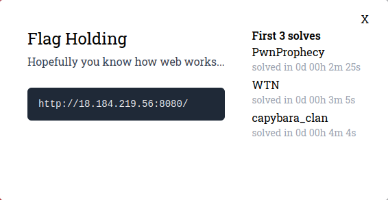

---
tags:
  - Mapna CTF
  - MapnaCTF-2024
  - Web
---

 
زمان مطالعه: ۳ دقیقه $~~~~~~~~~~~~~~~~~~~~~~~~~~~~~~~~~~~~~~~~~~~~~~~~~~~~~~~~~~~~~~~~~~~~~~~~~~~~~~~~~~~~~~~~~~$  <a href="https://tools.pdf24.org/en/webpage-to-pdf" target="_blank">دانلود PDF :closed_book:</a> 

---


# چالش Flag holding
این یک چالش دست گرمی در بخش وب بود که حل های زیادی داشت ، همونطور که در توضیحات  چالش گفته شده ، کافیه بدونیم وب چطور کار میکنه xd 
<center>



</center>

اولین کاری که خب انتظار میره انجام بدیم ، اینه که آدرس داده شده رو باز کنیم و ببینیم چی به چیه

> توجه: برای حل این سوال من از curl استفاده میکنم تا اگه در طول چالش نیازی به ست کردن هدر خاصی یا کاره خاصی بود راحت تر باشم ولی الزامی به استفاده از curl نیست

```html
$ curl http://18.184.219.56:8080/
<!DOCTYPE html>
<html>
<head>
	<meta charset="utf-8">
	<meta name="viewport" content="width=device-width, initial-scale=1">
	<title>Flag holding</title>
	<style>
		body {
			background-color: #1a4a5e;
		}
		.msg {
			text-align: center;
			font-family: sans-serif;
			color: white;
			font-size: 40px;
			line-height: 500px;
		}
	</style>
</head>
<body>
	<div class="msg" style="">
		You are not coming from "http://flagland.internal/".
    </div>
</body>
</html>
```
همونطور که میبینین توی ریسپانس به ما گفته **You are not coming from "http://flagland.internal/"**
همونطور که چالش از ما انتظار داره که بدونیم وب چطور کار میکنه ، اگه یه نگاهی به [HTTP HEADERS](https://developer.mozilla.org/en-US/docs/Web/HTTP/Headers) بندازیم با هدر *Referer* مواجه میشیم که توی توضیحات این هدر گفته شده:
```
The address of the previous web page from which a link to the currently requested page was followed.
```
پس بریم تست کنیم ببینیم اگه آدرس `http://flaglang.internal/` رو بزاریم تو هدر **Referer** چه اتفاقی میوفته:

```html
$ curl http://18.184.219.56:8080/ -H "Referer: http://flagland.internal/"
<!DOCTYPE html>
<html>
<head>
	<meta charset="utf-8">
	<meta name="viewport" content="width=device-width, initial-scale=1">
	<title>Flag holding</title>
	<style>
		body {
			background-color: #1a4a5e;
		}
		.msg {
			text-align: center;
			font-family: sans-serif;
			color: white;
			font-size: 40px;
			line-height: 500px;
		}
	</style>
</head>
<body>
	<div class="msg" style="">
		Unspecified "secret".	</div>
</body>
</html>
```

خب مثله اینکه جواب داد ، حالا بهمون گفته **Unspecified "secret".** ، احتمالا باید یه کلیدی به اسم `secret` رو یجا ست کنیم تا ببینیم چواب میده یا نه

خب ما میتونیم این کلید رو توی کوکی ها ، هدر ها یا توی URL ست کنیم ؛ بعد از تست کردم کوکی و هدر جواب نگرفیتم ولی اگه توی  url به عنوان یه query parameter این رو تنظیم کنیم ، میبینیم که:

```html
$ curl http://18.184.219.56:8080/?secret -H "Referer: http://flagland.internal/"
<body>
	<div class="msg" style="">
		Incorrect secret. <!-- hint: secret is ____ which is the name of the protocol that both this server and your browser agrees on... -->
    </div>
</body>
```

مثله اینکه کوئری که ست کردیم درست نیست. ولی از اونجایی که ما از curl برای ریکویست ها استفاده میکنیم ، قسمت کامنت برای ما دیده میشه که بهمون هینت داده ولی اگه این رو توی مرورگر باز کنین تو صفحه بهتون نشون نمیده و باید source صفحه رو مشاهده کنین

مقدار secret اسم پروتکل هست که سرور و مرورگر روش توافق کردن؟
بیاین http رو تست کنیم:

```html
$ curl http://18.184.219.56:8080/?secret=http -H "Referer: http://flagland.internal/"
<body>
	<div class="msg" style="">
		Sorry we don't have "GET" here but we might have other things like "FLAG".
    </div>
</body>
```

همونطور که ممکنه بدونین توی http یکسری متد هایی هست که GET, POST, PUT, DELETE, ... از معروف هاش هستند.
ولی ما میتونیم هر متدی که میخوایم سمت سرور بفرستیم (ممنکه سرور یک متد خاصی رو هندل کنه)  به هر حال اینجا به ما گفته باید از متد FLAG استفاده کنیم
پس:

```html
$ curl http://18.184.219.56:8080/?secret=http \
        -H "Referer: http://flagland.internal/" \
        -X FLAG
<body>
	<div class="msg" style="">
		MAPNA{533m5-l1k3-y0u-kn0w-h77p-1836a2f}	</div>
</body>
```

و بعد از اینکه از متد FLAG استفاده کنین فلگ رو بهمون میده

همونطور که دیدین این یکی از سوال های دست گرمی وب هستش و خیلی سخت نبود ولی جابب بود و شاید باعث بشه برای کسایی که وب رو نمیشناسن یه نگاهی به داکیومنت http بندازن

---
??? success "FLAG :triangular_flag_on_post:"
    <div dir="ltr">`MAPNA{533m5-l1k3-y0u-kn0w-h77p-1836a2f}`</div>


!!! نویسنده
    [amir303](https://x.com/amir3O3)

